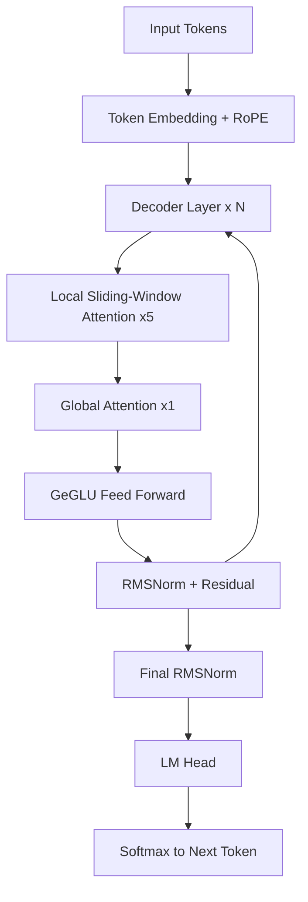
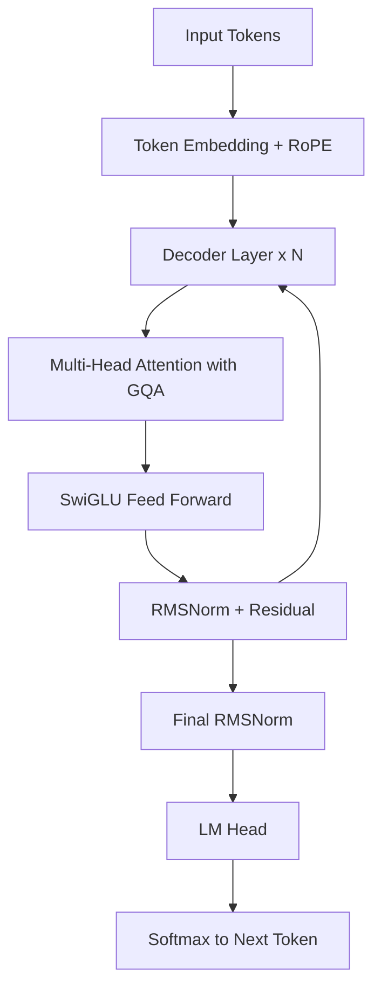
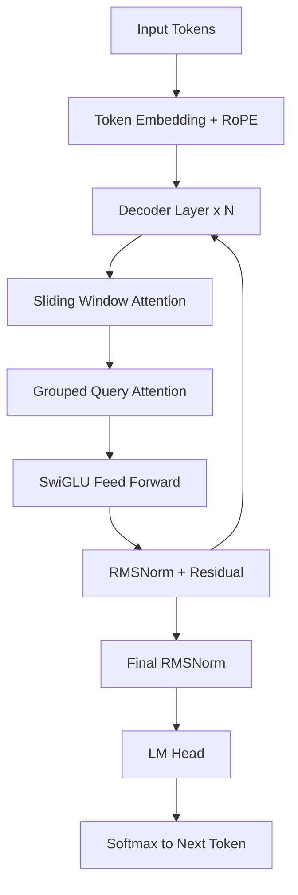
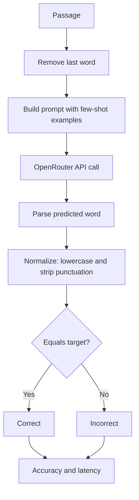
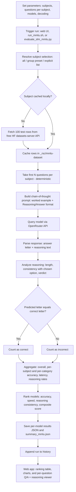
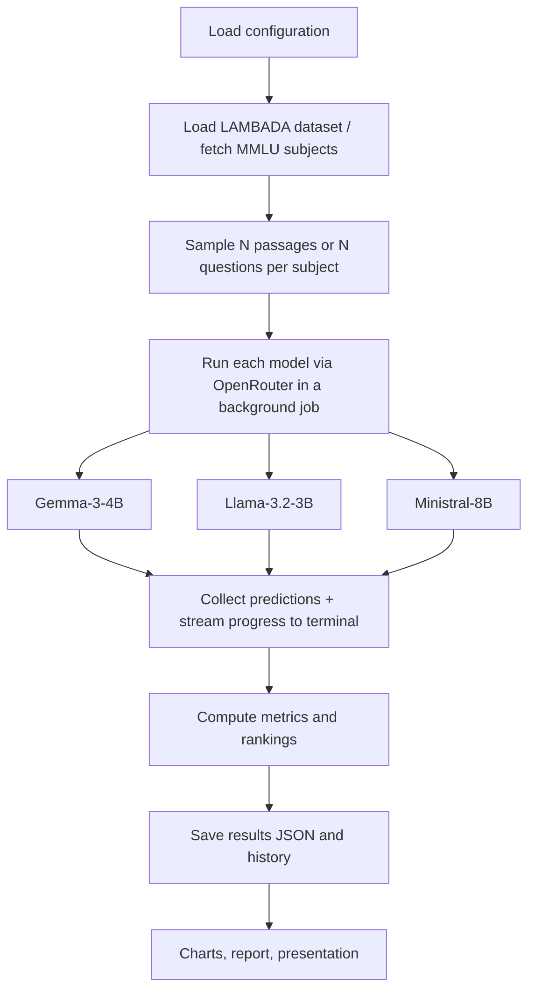
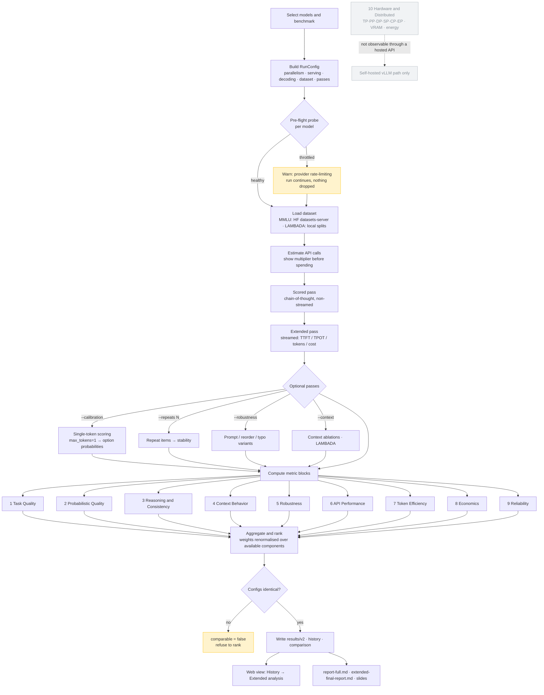

# LAMBADA & MMLU — Extended Final Report

Small language models evaluated across a nine-stage benchmark: task quality, probabilistic quality, consistency, context behaviour, robustness, API performance, token efficiency, economics and reliability.

Submitted to: Prof. Anna Corazza  
Submitted by: Francesco Ventimiglia, Danilo Rodriguez, Rohan Baidya  
GitHub: https://github.com/ronvoy/gen-ai  
Site: https://unina.cc/gen-ai  
Generated: 2026-09-09 17:30

---

## 1. Research Question

Among three small language models built with different compression strategies and attention mechanisms, which one best balances accuracy, reasoning quality, and latency — on long-range context prediction (LAMBADA) and broad knowledge & reasoning (MMLU)?

In particular: does a larger, non-distilled model (Ministral-8B) outperform smaller distilled/pruned models (Gemma-3-4B, Llama-3.2-3B) across both benchmarks — or does compression cost more in one dimension (accuracy, reasoning, speed) than another?

## 2. Experimental Protocol

**Dataset**

- LAMBADA: 5,153-passage test split from BookCorpus (English, ACL 2016).
- MMLU: 57 subjects × 5 questions/subject = 285 questions per model, fetched from the free HF datasets-server API and cached locally.

**Preprocessing**

- LAMBADA: predictions normalized (lowercase, punctuation stripped) before exact-match comparison.
- MMLU: chain-of-thought prompt with one worked example enforcing a strict `Reasoning:` / `Answer: <letter>` format.

**Decoding setup (no training)**

- No model weights are changed — only decoding parameters (temperature, top-p, max tokens, few-shot count) vary.
- Shared presets — Optimal, Normal, Best Performance — apply identically to both benchmarks and all three models for a like-for-like comparison.

**Evaluation strategy**

- All models queried through the OpenRouter API for a hardware-neutral comparison.
- Deterministic sampling — fixed subject/question order, no randomness — for reproducible runs.
- Metrics captured live in one shared web app: terminal streaming, run history, charts.

## 3. Benchmark

**Baseline task**

LAMBADA: predict the single next word of a passage, guessable only from full context. MMLU: choose the correct option (A–D) after writing short step-by-step reasoning. No fine-tuning either way — every model is evaluated purely on its pretrained + instruction-tuned weights.

**Reference criteria — LAMBADA**

| Metric | Better |
|--------|--------|
| Exact-match accuracy | Higher |
| Average response time | Lower |
| Error rate | Lower |
| Throughput | Higher |

**Reference criteria — MMLU**

| Metric | Definition |
|--------|------------|
| Accuracy | Correct letters / total (exact match) |
| Category accuracy | Per STEM / Humanities / Social Sciences / Other |
| Reasoning consistency | Reasoning supports the chosen option |
| Composite score | 0.70·accuracy + 0.15·reasoning + 0.15·speed |

Ground truth for both benchmarks comes directly from the source datasets (the target word / the official answer key) — never inferred.

## 4. Involved Approaches

| # | Model | Developer | Parameters | OpenRouter id | Architecture | Key Technique |
|---|-------|-----------|------------|---------------|--------------|---------------|
| 1 | Gemma-3-4B | Google | 4B | `google/gemma-3-4b-it` | Dense decoder-only transformer with interleaved local/global attention | Knowledge distillation + local/global attention interleaving |
| 2 | Llama-3.2-3B | Meta | 3B | `meta-llama/llama-3.2-3b-instruct` | Dense decoder-only transformer with Grouped Query Attention | Compact dense transformer |
| 3 | Ministral-8B | Mistral AI | 8B | `mistralai/ministral-8b-2512` | Decoder-only transformer with Sliding Window Attention | Sliding Window Attention + GQA |

- Gemma-3-4B: dense decoder-only transformer with interleaved local/global attention, distilled from a larger teacher, 128k-token context.
- Llama-3.2-3B: standard dense transformer recipe — RoPE, Grouped Query Attention, SwiGLU — pruned and distilled from larger Llama 3.1 models.
- Ministral-8B: sliding window attention + GQA for efficient long-context inference at the edge — trained at its native 8B size, not distilled down from a larger checkpoint.

## 5. Considered Model(s)

### 5.1 Gemma-3-4B (Google)

- 4B instruction-tuned dense decoder-only transformer from Google, built with the same research that powers Gemini.
- Interleaves several local sliding-window attention layers with an occasional global attention layer, keeping memory low while information still flows across a long context (up to 128k tokens).
- The small Gemma 3 models are trained with knowledge distillation from larger teacher models.

**Working technique - Knowledge distillation + local/global attention interleaving:**

- Most layers only look at a local window of nearby tokens (cheap); every few layers one global layer lets any token attend to the whole context (expressive).
- Distillation teaches the small model to match a larger teacher's output distribution rather than raw text alone, delivering strong quality per parameter at edge-friendly cost.

Key properties:

- Dense decoder-only transformer, no expert routing.
- 5:1 interleaving of local sliding-window and global attention layers.
- Grouped Query Attention with QK-norm; 128k-token context window.
- Distilled from larger Gemma/Gemini-family teacher models.

#### Process flow - Gemma-3-4B inference



- Local sliding-window attention x5: cheap, restricted to nearby tokens.
- Global attention x1: the one layer per block where every token can see the full passage — this is how long-range context (LAMBADA's whole point) actually gets used.
- GeGLU feed forward: a gated variant of the MLP block used after attention.

### 5.2 Llama-3.2-3B (Meta)

- 3B instruction-tuned model from Meta for on-device, low-cost use.
- Standard Llama recipe: dense transformer with RoPE, GQA, and SwiGLU layers.
- Built by pruning and distilling from larger Llama 3.1 models.

**Working technique - Compact dense transformer:**

- Takes the proven dense transformer design and shrinks it — no architectural novelty, the standard Llama recipe simply scaled down to 3B parameters rather than a smaller model with new efficiency tricks.
- Predictable and easy to serve on modest hardware.

Key properties:

- Dense decoder-only transformer.
- RoPE position embeddings for length generalisation.
- Grouped Query Attention and SwiGLU layers.

#### Process flow - Llama-3.2-3B inference



- Multi-head attention (GQA): full attention over the whole context, but with grouped key/value heads to shrink the KV cache.
- SwiGLU feed forward: a gated MLP block, used in place of a plain ReLU/GeLU MLP.
- No local/global split, no sliding window — the simplest of the three designs.

### 5.3 Ministral-8B (Mistral AI)

- 8B model from Mistral AI, built for edge use.
- Interleaved sliding window attention keeps memory and compute low on long inputs.
- Grouped query attention further shrinks the KV cache.

**Working technique - Sliding Window Attention + GQA:**

- Each layer attends only to a local window instead of every token.
- Stacked layers carry context further than any single window.
- GQA shares key-value heads for fast decoding on long passages.
- Unlike the other two models in this study, Ministral-8B is not described as distilled or pruned from a larger checkpoint — it is trained at its native 8B size, very likely the single biggest reason it leads both benchmarks (see Section 8).

Key properties:

- Sliding window attention for local context.
- Grouped Query Attention for a smaller KV cache.
- Efficient long-context inference at the edge.

#### Process flow - Ministral-8B inference



- Sliding window attention: local context only, per layer — same trick Gemma uses for its "local" layers, but used on every layer here, not just 4 in 5.
- Grouped Query Attention: shrinks the KV cache for fast decoding on long passages.
- No global-attention layer at all — depth (stacking many windowed layers) substitutes for it.

## 6. Comments and Discussion before Results

This section walks through every fine-tuning parameter, preset, metric, dataset detail, and workflow used in this study — the "how and why" behind the numbers in Section 7.

### 6.1 Fine-Tuning Parameters, explained

The Fine Tune panel exposes six decoding parameters, shared by both benchmarks. None of them change model weights — they only control how the next token is sampled at inference time.

**Temperature** (range 0.0 – 2.0, used here: **0.0**)

Scales the logits before the softmax that turns the model's raw output scores into a probability distribution over the vocabulary — the next token is then sampled from that distribution. At 0.0 the distribution collapses to argmax — the single highest-probability token is always chosen (greedy decoding): fully deterministic, same input always gives the same output. Higher values flatten the distribution, letting lower-probability tokens get picked sometimes — more variety, but more risk of drifting off the one correct word or letter. Both LAMBADA (one correct word) and MMLU (one correct letter) have exactly one right answer — no reward for creative variation, only downside risk. This is why every model in this study, regardless of size or architecture, was run at temperature 0.0.

**Top-p / nucleus sampling** (range 0.0 – 1.0, used here: **1.0**)

Restricts sampling to the smallest set of tokens whose cumulative probability reaches p — the "nucleus". Anything outside that set is discarded before a token is sampled. At 1.0 the nucleus includes the entire distribution — no tokens are excluded. Combined with temperature 0.0, top-p has no practical effect here: greedy decoding already picks one token deterministically regardless of how large the candidate pool is. Lower values would only matter at temperature > 0, where they'd narrow sampling to the most confident tokens. It is set to its neutral value here rather than doing any real work in this evaluation.

**Max tokens** (range 1 – 128 on the LAMBADA panel, used here: **32 for LAMBADA, 384 for MMLU**)

A hard cap on how many tokens the model is allowed to generate before the API cuts it off. Every output token is one more sequential decoding step, so this parameter is also a direct lever on latency, not just on answer length. LAMBADA needs only a single word plus a little slack for stray punctuation or formatting — 32 tokens is generous headroom. MMLU needs far more: the model must write a full chain-of-thought explanation before its final "Answer: <letter>" line. Setting it too low truncates the model mid-reasoning before it reaches the answer line — recorded as a "no-answer" verdict, not a wrong answer. This budget difference is a major reason MMLU latency (0.6–2.5s) runs systematically higher than LAMBADA latency (0.6–1.2s) for the same models.

**Few-shot examples** (range 0 – 5 on LAMBADA, used here: **3 worked examples**)

Prepends worked (context → answer) examples from a fixed pool before the real passage, showing the model the exact input/output format expected — a prompting technique, not a change to the model's weights. Instruction-tuned models sometimes answer in full sentences ("The next word is likely...") unless shown the expected bare-word format; a few worked examples anchor that format without touching the model's weights. MMLU instead uses one fixed worked example baked into the prompt template, rather than a tunable count. Trade-off: each example adds prompt tokens, so more few-shot examples cost a little extra latency per call, even though the model's own output doesn't get any longer.

**Frequency penalty** (range -2.0 – 2.0, used here: **0.0**)

Subtracts a penalty proportional to how many times a token has already appeared in the output so far — the more it repeats, the less likely it is to repeat again.

**Presence penalty** (range -2.0 – 2.0, used here: **0.0**)

Applies a flat penalty to any token the moment it appears at least once, regardless of count — encourages introducing new words/topics rather than staying on the same ones.

Both penalties are set to neutral (0.0) for every model, on both benchmarks: both tasks produce a single short answer — one word, or one letter plus brief reasoning — so there's no room for the kind of repetitive looping these penalties are designed to prevent in long-form, open-ended generation.

### 6.2 Parameter Set Used in This Evaluation

| Parameter | LAMBADA | MMLU |
|-----------|---------|------|
| Temperature | 0.0 | 0.0 |
| Top-p | 1.0 | 1.0 |
| Max tokens | 32 | 384 |
| Frequency penalty | 0.0 | — |
| Presence penalty | 0.0 | — |
| Few-shot examples | 3 | — |

This is a hand-set configuration close to, but not identical to, any single named preset (it mixes Optimal's greedy decoding with a different max-token / few-shot budget). It was applied identically to Gemma-3-4B, Llama-3.2-3B, and Ministral-8B — none of the three received special treatment, such as a larger reasoning-token budget. `config.py` reserves a separate `MAX_TOKENS_REASONING = 8096` budget for models flagged in `REASONING_MODELS` — that list is empty for this study, so none of the three models used it. Any differences in the results in Section 7 come from the models themselves, not from unequal evaluation conditions.

### 6.3 Fine-Tuning Presets

Both benchmark pages expose one-click presets over the decoding parameters. They control decoding, not model weights.

**LAMBADA Presets (`PRESETS` in config.py)**

| Preset | Temperature | Top-p | Max tokens | Few-shot | Intent |
|--------|-------------|-------|------------|----------|--------|
| Optimal | 0.0 | 1.0 | 16 | 5 | Greedy decoding with the most worked examples - most reliable accuracy |
| Normal | 0.3 | 0.9 | 32 | 3 | Balanced default |
| Best Performance | 0.0 | 1.0 | 8 | 2 | Trimmed token and example budget - fastest, cheapest runs |

Optimal is theoretically the strongest preset for LAMBADA specifically: the task has exactly one correct token, so greedy decoding removes sampling risk entirely, and more worked examples further anchor the one-word output format. Normal reintroduces randomness (temp 0.3, top-p 0.9) — useful for exploring variability, but with no upside on an exact-match task like this one. Best Performance trims both the token cap and the example budget for the cheapest, fastest runs, at some risk of losing the format anchor. The actual saved runs (Section 6.2) used a nearby but distinct hand-set configuration rather than one of these three presets exactly.

**MMLU Presets (`MMLU_PRESETS` in config.py)**

| Preset | Temperature | Top-p | Max tokens | Intent |
|--------|-------------|-------|------------|--------|
| Optimal | 0.0 | 1.0 | 512 | Most reasoning room - most reliable accuracy |
| Normal | 0.2 | 0.95 | 384 | Matches the defaults |
| Best Performance | 0.0 | 1.0 | 192 | Caps the reasoning budget so runs finish faster |

Optimal gives the most room (512 tokens) for multi-step reasoning before the model commits to a letter — useful for subjects needing longer derivations (e.g. `formal_logic`, `college_mathematics`). Best Performance risks truncating longer reasoning chains before the model reaches its "Answer:" line, which would surface as a "no-answer" verdict. The actual saved runs used 384 tokens — matching Normal's budget — with greedy decoding (temperature 0.0, top-p 1.0) borrowed from Optimal.

### 6.4 Metrics Explained — LAMBADA

| Metric | Explanation |
|--------|-------------|
| Exact-match accuracy | correct / total, after lowercasing and stripping punctuation from both the prediction and the true target word. Example: target "Zane." vs. prediction "zane" — different strings, but identical after normalization → counted correct. |
| Average response time | Mean wall-clock seconds per API call, start to finish — not just model compute time. Includes network round-trip and OpenRouter's provider routing/queueing, which is why it can spike heavily under provider congestion. |
| Error rate | errors / total — API calls that failed outright (timeouts, malformed responses) even after retries were exhausted. All three models finished at 0 errors in the saved runs — every request eventually succeeded, even ones needing multiple retries. |
| Throughput | total / total wall-clock time — samples graded per second. Requests are sent one at a time here (no batching), so throughput is essentially the reciprocal of latency: Llama ≈1.73/s, Ministral ≈1.37/s, Gemma ≈0.84/s. |

### 6.5 Metrics Explained — MMLU

| Metric | Explanation |
|--------|-------------|
| Accuracy | Correct letters / total questions (exact match) — judges only the final answer, not the reasoning behind it. |
| Category accuracy | The same accuracy computed separately per STEM / Humanities / Social Sciences / Other. Reveals blind spots the headline number hides — e.g. Llama-3.2-3B: 43.3% STEM vs. 63.3% Social Sciences, a 20-point spread. |
| Reasoning rate | Share of answers with a non-trivial explanation (≥5 words). All three models wrote substantive reasoning on effectively every question (≈100% reasoning rate) — the differentiator is never whether they explained, but whether the explanation held up. |
| Reasoning consistency & avg. words | Consistency = share of answers whose reasoning text actually supports the chosen letter. Ministral-8B writes the shortest reasoning (54.1 words) yet the highest consistency (69.1%); Llama-3.2-3B writes the most (61.8 words) yet is least consistent (59.7%) — length and quality of explanation are not the same thing. |

**Composite score, worked example**

```
Composite = 0.70 x accuracy + 0.15 x reasoning consistency + 0.15 x relative speed
Relative speed = fastest model's avg time / this model's avg time
```

| Model | Accuracy term (0.70×) | Reasoning term (0.15×) | Speed term (0.15×) | Composite |
|-------|------------------------|--------------------------|----------------------|-----------|
| Ministral-8B | 0.789 × 0.70 = 0.552 | 0.691 × 0.15 = 0.104 | 0.500 × 0.15 = 0.075 | 0.731 |
| Llama-3.2-3B | 0.558 × 0.70 = 0.391 | 0.597 × 0.15 = 0.090 | 1.000 × 0.15 = 0.150 | 0.630 |
| Gemma-3-4B | 0.639 × 0.70 = 0.447 | 0.646 × 0.15 = 0.097 | 0.307 × 0.15 = 0.046 | 0.590 |

The speed term uses Llama-3.2-3B's 0.768s as the fastest reference time: Ministral 0.768/1.537=0.500, Llama 0.768/0.768=1.000, Gemma 0.768/2.502=0.307. These figures reconcile exactly with the composite scores reported in Section 7.3. Accuracy dominates the weighting (70%), so Ministral's large accuracy lead carries it to #1 even though it is not the fastest model.

### 6.6 LAMBADA: Dataset, Properties & Scoring Flow

- LAMBADA is drawn from the BookCorpus.
- Each passage is chosen so the final word is predictable from the full passage but not from the last sentence alone.

**Properties**

| Property | Value |
|----------|-------|
| Source corpus | BookCorpus (unpublished novels) |
| Language | English |
| Task type | Word prediction |
| Curation criterion | Target guessable from full context only |
| First published | ACL 2016 (Paperno et al.) |

**Scoring flow**



Normalization is what makes exact-match accuracy fair — without it, capitalization or a trailing period would wrongly count a correct guess as wrong. Latency is recorded for every call — correct, incorrect, or (after retries) failed — so the average reflects real-world response time, not just successful guesses.

### 6.7 LAMBADA: Dataset Splits

| Split | File | Passages | Purpose |
|-------|------|----------|---------|
| Test | lambada_test_plain_text.txt | 5,153 | Primary evaluation |
| Development | lambada_development_plain_text.txt | 4,869 | Validation and tuning |
| Control Test | lambada_control_test_data_plain_text.txt | 5,000 | Baseline, unfiltered |
| Rejected | rejected_plain_text.txt | 11,941 | Passages cut during curation |
| Training Novels | train-novels/ (16 genres) | 2,662 novels | Pre-training material |
| Vocabulary | lambada-vocab-2.txt | 112,746 entries | Reference vocabulary |

This evaluation uses only the Test split (5,153 passages, sampled down to 1,000 for the saved runs) — the other splits exist in the released dataset but aren't used for scoring here.

### 6.8 MMLU: How a Run Works

How the MMLU benchmark runs in this project, from a click on "Run MMLU" (or `./run_mmlu.sh`) to the ranking table, charts, and per-question reasoning shown in the web app. For every question the model must first write short step-by-step reasoning and then commit to one of four options (A-D); both the final letter and the reasoning text are parsed and evaluated.



**Chronological steps**

| #   | Step               | What happens                                                                                                                                         | Where (file / function)                                    |
|-----|--------------------|------------------------------------------------------------------------------------------------------------------------------------------------------|--------------------------------------------------------------|
| 1   | Parameters         | Read subjects, questions per subject, models, decoding params (all documented at the top of the script and shell runner)                             | `evaluate_slm_mmlu.py` (RUN PARAMETERS), `run_mmlu.sh`     |
| 2   | Trigger            | User clicks Run MMLU, runs `./run_mmlu.sh`, or `python evaluate_slm_mmlu.py`                                                                         | `app.py` (`/mmlu/run`) or `run_mmlu_evaluation` |
| 3   | Resolve subjects   | Turn "all", a group preset, or a list into valid subject names                                                                                       | `resolve_subjects`                                         |
| 4   | Fetch questions    | Download the first 100 test rows per subject from the free Hugging Face datasets-server API (cais/mmlu, fallback tasksource/mmlu); no API key needed | `_download_subject`                                        |
| 5   | Cache              | Store rows in `_rsc/mmlu-dataset/<subject>.json` so reruns are offline and repeatable                                                                | `fetch_subject_questions`                                  |
| 6   | Sample             | Take the first N questions per subject (deterministic, no randomness)                                                                                | `fetch_subject_questions`, `load_mmlu_tasks`               |
| 7   | Build prompt       | Chain-of-thought prompt: one worked example, strict `Reasoning:` then `Answer: <letter>` output format                                               | `build_mmlu_prompt`, `WORKED_EXAMPLE`                      |
| 8   | Query model        | Send the prompt to the chosen model through OpenRouter                                                                                               | `query_model_mmlu` (HTTP POST)                             |
| 9   | Parse              | Extract the answer letter AND the reasoning text (handles `Reasoning:/Answer:`, `<think>` blocks, "the answer is (B)", bare letters, truncation)     | `parse_mmlu_response`                                      |
| 10  | Evaluate reasoning | Score the reasoning: is it present, how long, does it actually support the chosen option; assign a verdict                                           | `analyze_reasoning`                                        |
| 11  | Compare            | Exact match: predicted letter equals the correct letter                                                                                              | `evaluate_model_mmlu`                                      |
| 12  | Aggregate          | Overall / per-subject / per-category accuracy, latency, errors, reasoning rates                                                                      | `evaluate_model_mmlu`                                      |
| 13  | Rank               | Per-dimension ranks and composite score across all evaluated models                                                                                  | `build_mmlu_summary`                                       |
| 14  | Save               | Write `results/<model>_mmlu.json` and `results/summary_mmlu.json`                                                                                    | `run_mmlu_evaluation` / `run_mmlu_benchmark`               |
| 15  | History            | Append the run (models, subjects, question count, params) to history                                                                                 | `app.append_history`                            |
| 16  | Present            | Ranking table, accuracy charts, and the per-question Q/A + reasoning accordion                                                                       | `templates/mmlu.html` (Chart.js)                           |

### 6.9 MMLU: Components

| Component          | File                                                                        | Role                                                                                                                                                 |
|--------------------|-----------------------------------------------------------------------------|------------------------------------------------------------------------------------------------------------------------------------------------------|
| Run parameters     | `evaluate_slm_mmlu.py` (top), `run_mmlu.sh` (top)                           | Subject selection ("all", group presets, or explicit list), questions per subject (1-100), models, decoding params - every option listed in comments |
| Subject catalogue  | `MMLU_SUBJECTS`, `SUBJECT_GROUPS`, `CATEGORY_LABELS`                        | The 57 subjects mapped to their official categories; group presets derived from the mapping                                                          |
| Dataset fetcher    | `fetch_subject_questions`, `_download_subject`                              | Free HF datasets-server API client with source fallback and local JSON cache                                                                         |
| Task loader        | `load_mmlu_tasks`                                                           | Flattens subjects x questions into one ordered task list                                                                                             |
| Prompt builder     | `build_mmlu_prompt`, `WORKED_EXAMPLE`                                       | Chain-of-thought prompt with a worked example enforcing a parseable format                                                                           |
| Model client       | `query_model_mmlu`                                                          | OpenRouter chat-completions call with timing and error capture                                                                                       |
| Response parser    | `parse_mmlu_response`                                                       | Splits a raw response into (answer letter, reasoning text)                                                                                           |
| Reasoning analyzer | `analyze_reasoning`                                                         | Heuristic quality check: presence, word count, consistency, verdict                                                                                  |
| Evaluator          | `evaluate_model_mmlu`                                                       | Runs all tasks for one model; aggregates accuracy and reasoning metrics                                                                              |
| Ranker             | `build_mmlu_summary`                                                        | Per-dimension ranks + composite score across models                                                                                                  |
| CLI runner         | `run_mmlu_evaluation`, `_parse_cli`, `run_mmlu.sh`                          | One-shot terminal pipeline: setup, install, run, print ranking                                                                                       |
| Web routes         | `app.py`: `/mmlu`, `/mmlu/run`, `/mmlu/metrics`, `/mmlu/details`, `/progress/<job_id>` | Online runs, live progress feed, ranking JSON, and the per-question detail feed                                              |
| Web page           | `templates/mmlu.html`                                                       | Subject picker with presets, decoding sliders + presets, live terminal, ranking table, charts, Q/A + reasoning viewer                                |

### 6.10 MMLU: Reasoning Verdicts (per question)

| Verdict          | Meaning                                                                 |
|------------------|-------------------------------------------------------------------------|
| sound            | Correct answer, and the reasoning clearly supports it                   |
| right-weak-link  | Correct answer, reasoning present but does not clearly support the pick |
| lucky-guess      | Correct answer with no real reasoning                                   |
| flawed-reasoning | Reasoned its way to a wrong answer                                      |
| blind-guess      | Wrong answer and no reasoning                                           |
| no-answer        | No A-D letter could be parsed (API error or malformed output)           |

### 6.11 Project Workflow — End to End



### 6.12 Benchmark Architecture - Ten Stages, Nine of Them Measurable

The evaluation is organised into ten stages. **Stages 1-9 form the OpenRouter
benchmark; stage 10 is excluded from it entirely** and documented as a separate
self-hosted study. The definition lives in `metrics/taxonomy.py`, which the
runner, the web UI and this report all read, so there is one statement of what
is measured and one statement of what is not.

| Stage | Layer | Purpose | MMLU | LAMBADA | OpenRouter |
|---|---|---|---|---|---|
| 1 | **Task Quality** | Measure model capability | yes | yes | **yes** |
| 2 | **Probabilistic Quality** | Confidence and probability quality | yes | yes | **conditional** |
| 3 | **Reasoning & Consistency** | Stability and reasoning reliability | yes | yes | **yes** |
| 4 | **Context Behavior** | Context usage and dependency | experimental | yes | **yes** |
| 5 | **Robustness** | Resistance to prompt/input changes | yes | yes | **yes** |
| 6 | **API Performance** | Inference-service performance | yes | yes | **yes** |
| 7 | **Token Efficiency** | Token consumption and efficiency | yes | yes | **yes** |
| 8 | **Economics** | Monetary efficiency | yes | yes | **yes** |
| 9 | **Reliability** | Operational stability | yes | yes | **yes** |
| 10 | ~~Hardware & Distributed~~ | Inference infrastructure | - | - | **no - excluded** |

#### Stage detail

| Stage | Subsections | Primary metrics |
|---|---|---|
| **1 Task Quality** | Core performance | Accuracy, Exact Match, Error Rate, Normalised Accuracy, Parse-Failure Rate |
| | MMLU domain | Macro Accuracy, Subject Accuracy, Category Accuracy, Wilson CI |
| | LAMBADA word prediction | Last-Word Accuracy, Exact Target Match, Stem Match |
| | Language modeling *(conditional)* | Perplexity, NLL, Cross Entropy |
| **2 Probabilistic** | Probability | Correct-Option Probability, Target Probability, Log Probability, Target Rank, MRR |
| | Uncertainty | Entropy, Normalised Entropy |
| | Calibration | Confidence, ECE, MCE, Brier Score, Confidence-Accuracy Correlation |
| **3 Consistency** | Answer stability | Prediction Stability, Answer Agreement |
| | Self-consistency | Majority-Vote Accuracy, Self-Consistency Gain |
| | Reproducibility | Seed Stability, Run-to-Run Variance |
| **4 Context** | Utilization / dependency | Context Utilization, Context Sensitivity, Ablation Drop |
| | Position / length | Position Sensitivity, Context-Length Sensitivity |
| **5 Robustness** | Prompt / semantic | Prompt Variation, Paraphrase Consistency |
| | Perturbation | Typographical, Formatting, Noise, Case |
| | MMLU choice | Option-Order Robustness, Answer-Position Bias |
| **6 API Performance** | Latency | TTFT, TPOT, E2E, P50/P95/P99 |
| | Throughput | Output tok/s, Prompt tok/s, Total tok/s, Requests/s |
| **7 Token Efficiency** | Usage | Prompt, Completion, Reasoning, Cached tokens |
| | Aggregate | Total Tokens, Tokens/Item, Tokens/Correct Answer |
| **8 Economics** | Cost | Cost/Request, Cost/1K tokens, Cost/1M tokens |
| | Quality-adjusted | Cost/Correct Answer, Correct Answers per Dollar |
| **9 Reliability** | API | Failure Rate, Timeout Rate, Rate-Limit (429) Rate |
| | Output | Invalid Output Rate |
| | Operational | Retry Rate, Provider Failover |

#### Priority bands

| Band | Stages | When produced |
|---|---|---|
| **P0** | 1 Task Quality, 6 API Performance, 7 Token Efficiency, 8 Economics, 9 Reliability | every run, no extra API calls |
| **P1** | 2 Probabilistic, 3 Consistency, 4 Context, 5 Robustness | needs an extra pass (calibration / repeats / ablation / perturbation) |

#### What was corrected against measurement

The architecture above differs from the first draft in four places, each because
a live probe contradicted the assumption:

| Item | Assumed | Measured | Consequence |
|---|---|---|---|
| LAMBADA perplexity / NLL | unconditional (stage 1) | derived from log-probabilities | moved to **conditional**; it inherits stage 2's provider dependency and cannot be promised per run |
| LAMBADA target probability / rank | doubtful | **works** - target "number" returned at rank 1, logprob -0.01 | kept, via the same single-token scoring trick as MMLU |
| Reasoning-token accounting | conditional | returned in `completion_tokens_details` | promoted to **fully available**; 0 is a real answer for a non-reasoning model |
| Reliability (stage 9) | listed but unimplemented | 429s, retries and provider failover are all visible client-side | **implemented** - `metrics/reliability.py` |

#### Stage 10, and why it is not here

Nothing in stage 10 - TP/PP/DP/SP/CP/EP degrees, GPU utilisation, VRAM, KV
cache, memory bandwidth, FLOPs/MFU/HFU, communication overhead, pipeline
bubble, power and energy - can be observed through a hosted inference API. The
benchmark is one tenant on a shared, auto-scaled backend whose parallelism
layout and batch composition are chosen by the provider and never exposed to
the caller. Any number reported for those fields would be fabricated.

They remain in the schema (`benchmark_config.py`, `metrics/taxonomy.py`
`EXCLUDED_STAGE`) as **configuration variables and a documented exclusion**, so
the same suite can be re-run against a self-hosted vLLM backend where they
become settable and measurable. Sections 6.13-6.14 describe that path.

### 6.13 Configuration Variables vs Metrics

**TP, PP, DP, SP, CP and EP are configuration variables, not model-quality
scores.** This is enforced structurally rather than by convention:

| | Configuration variable | Metric |
|---|---|---|
| Nature | an input we **choose** | an output we **observe** |
| Examples | TP, PP, DP, SP, CP, EP, dtype, batch size, temperature | accuracy, ECE, TTFT, VRAM |
| Implemented in | `benchmark_config.py` → `RunConfig` | `metrics/` → result blocks |
| Role in analysis | independent variable | dependent variable |

Folding a parallelism degree into the same dictionary as an accuracy score
invites a category error — ranking models on a composite that silently blends a
hardware layout with a quality measurement. A parallelism degree is not a
virtue. The pipeline therefore keeps three things distinct:

```
RunConfig        →  independent variables (what we chose)
metrics/*        →  dependent variables   (what we observed)
analyse_sweep()  →  the relationship between them
```

Every result file is stamped with the full `RunConfig` that produced it, and
`build_comparison()` refuses to rank models whose configurations differ,
reporting `comparable: false` instead of publishing a confounded ranking.

The six degrees, as configuration:

| Degree | Splits | Helps | Costs | Communication |
|---|---|---|---|---|
| **TP** Tensor Parallel | each weight matrix across GPUs | latency; fits large models | all-reduce every layer | heavy — wants NVLink |
| **PP** Pipeline Parallel | layers across GPUs | memory; cheap comms | pipeline bubbles at low batch | light, point-to-point |
| **DP** Data Parallel | requests across replicas | throughput | memory ×N, no latency gain | none at inference |
| **SP** Sequence Parallel | sequence dim in the regions TP leaves replicated | activation memory | only meaningful with TP>1 | moderate |
| **CP** Context Parallel | sequence dim inside attention (ring/Ulysses) | very long contexts | complexity | heavy |
| **EP** Expert Parallel | MoE experts across GPUs | MoE capacity | inert for dense models | all-to-all |

All three models here are dense, so EP is recorded as `1` — present in the
schema to state that explicitly rather than leave it absent. `world_size` is
`TP × PP × DP × CP`; SP and EP re-partition work already counted.

### 6.14 What a Parallelism Sweep Measures

`build_parallelism_sweep()` varies one degree with everything else pinned;
`analyse_sweep()` then separates two questions that must not be conflated:

| Expected to move | Expected to stay flat |
|---|---|
| TTFT, TPOT, E2E | overall and macro accuracy |
| prefill / decode throughput | NLL, ECE, Brier |
| VRAM, KV cache | last-word accuracy |
| communication overhead, energy, cost | |

Parallelism changes the order of arithmetic, not the semantics of the model, so
**quality should not move**. `analyse_sweep()` flags any quality drift beyond
0.5 percentage points as `unexpected` — that is a bug or serving
non-determinism to investigate, not a finding to report.

Illustrative output from a tensor-parallel sweep:

```
TP1  speedup=1.00  ideal=1.0  efficiency=1.00  comm_overhead=0.00
TP2  speedup=1.73  ideal=2.0  efficiency=0.87  comm_overhead=0.13
TP4  speedup=2.80  ideal=4.0  efficiency=0.70  comm_overhead=0.30

quality_drift: overall_accuracy spread = 0.004  →  flagged: []
```

Doubling to TP2 returns 1.73× (87% efficient); TP4 returns only 2.80× (70%),
the shortfall being all-reduce traffic. Accuracy moved 0.4 pp — within noise,
which is the correct outcome.

### 6.15 Measurability: What This Deployment Can and Cannot Observe

The benchmark runs against OpenRouter — third-party, auto-scaled GPUs. That
imposes a hard boundary, and the honest response is to record it rather than
fill the gap with plausible numbers.

| Metric family | Status | Reason |
|---|---|---|
| Accuracy family | measured | needs only the answer |
| Consistency, robustness, context, tokenization | measured | prompt manipulation and repeat calls |
| TTFT / TPOT / E2E, throughput | measured | from the streamed response, client-side |
| Token counts, monetary cost | provider-reported | returned in the API `usage` payload |
| Calibration (ECE, Brier, NLL, PPL) | **partial — 1 of 3 models** | only some upstream providers forward `logprobs` |
| VRAM, KV cache | analytic only | computed from published architecture, labelled `analytic_model` |
| Energy | unavailable | requires NVML/RAPL on the serving host |
| Communication overhead | unavailable | we do not own the interconnect |
| TP/PP/DP/SP/CP/EP effects | unavailable | the provider selects the layout; it is neither settable nor visible |

Every numeric field carries a `source` tag — `measured`, `provider_reported`,
`analytic_model`, or `unavailable` with a reason string. Unmeasurable blocks are
emitted as `{"available": false, "reason": "..."}` and never as zeros, because
a fabricated calibration figure is worse than a missing one.

To convert the bottom four rows into measurements, `local_vllm_config()`
provides the local-backend path, where the six degrees become real knobs and
VRAM, KV cache, energy and communication overhead become directly observable.

### 6.16 Obtaining Probabilities from a Chat API

Calibration needs token probabilities, which chat completions do not return by
default. Two obstacles were found empirically and both shape the design.

**First: `logprobs` support is provider-dependent, not model-dependent.**
Measured via `probe_capabilities()`:

| Model | Serving provider | `logprobs` |
|---|---|---|
| Llama-3.2-3B | Parasail | yes |
| Gemma-3-4B | DeepInfra | no |
| Ministral-8B | Mistral | no |

**Second — and subtler: with `max_tokens > 1` the provider returns
log-probabilities for the final token only**, which is the end-of-sequence
marker. Its distribution says nothing about the answer:

```
max_tokens = 2  → tok[0] = '<|eot_id|>'   top: eot −0.20, '.' −1.70, …    unusable
max_tokens = 1  → tok[0] = 'A'            top: A −0.00, B −10.13,
                                               C −10.50, D −11.13          usable
```

The resolution is **single-token constrained scoring** (`score_options()`): pose
the question with `max_tokens=1` so the single generated token *is* the answer
letter, and read P(A), P(B), P(C), P(D) from its `top_logprobs`. This is the
letter-scoring protocol used by `lm-evaluation-harness`.

The harness therefore runs two passes per question, because they answer
different questions and neither substitutes for the other:

| Pass | Prompt | Yields | Budget |
|---|---|---|---|
| Reasoning | chain-of-thought, then a letter | accuracy as the model would really be used | ~384 tokens |
| Scoring | direct answer, `max_tokens=1` | the option distribution → all calibration metrics | 1 token |

### 6.17 Composite Score, Revised

The original composite (§6.5) weighted accuracy, reasoning consistency and
speed. The extended framework replaces it with:

```
composite = 0.55 × quality
          + 0.15 × calibration   (1 − ECE)
          + 0.15 × robustness    (1 − mean relative accuracy drop)
          + 0.15 × efficiency    (fastest model's latency / this model's)
```

Weights are **renormalised over whichever components are actually available**,
so a model is never penalised for a study that was not run or for a provider
that withholds log-probabilities. Each ranking row lists its
`components_used`, making the basis of every score auditable.

Calibration is included because it is what makes a small model useful in
practice: an SLM that reliably knows when it is unsure can escalate those cases
to a larger model, which is the dominant deployment pattern for models of this
size.

---

## 7. End-to-End Workflow

The pipeline below is what one benchmark run actually executes. Stages 1-9 are
produced by every run; stage 10 is shown greyed because it is *excluded by
design* — nothing in it is observable through a hosted inference API.



### 7.1 The two measurement passes

A run makes two independent trips to the API per item, and the distinction
matters when reading any table below.

| Pass | Prompt | Streamed | Produces | Why it exists |
|---|---|---|---|---|
| **Scored** | chain-of-thought, then a letter/word | no | the headline accuracy and reasoning analysis | it is how the model would really be used |
| **Extended** | identical prompt | yes | TTFT, TPOT, throughput, tokens, cost, reliability | latency is unmeasurable without streaming |
| **Calibration** (optional) | direct answer, `max_tokens=1` | no | option probabilities → NLL, ECE, Brier, target rank | providers only return usable log-probabilities for a single generated token |

Because the scored and extended passes are separate API calls, their accuracies
differ slightly even at temperature 0. That residual is serving
non-determinism, and the web view states the delta explicitly rather than
showing two numbers and leaving the reader to notice.


---

## 8. MMLU — Results

**2,850 items per model · 3 models · 8,550 scored items.** Passes: scored, extended, calibration. Decoding: temperature 0.0, max_tokens 384.


### 8.1 Stage 1 — Task Quality

| Model | Accuracy | 95% CI | Macro (subject) | Normalised | Error rate | Parse fail |
|---|---|---|---|---|---|---|
| Gemma-3-4B | **60.4%** | 58.5–62.1% | 60.4% | 47.1% | 39.6% | 0.4% |
| Llama-3.2-3B | **54.7%** | 52.8–56.5% | 54.7% | 39.6% | 45.3% | 11.7% |
| Ministral-8B | **79.3%** | 77.8–80.8% | 79.3% | 72.4% | 20.7% | 0.6% |


### 8.2 Stage 2 — Probabilistic Quality

| Model | Provider | Available | Coverage | P(correct) | NLL | Perplexity | ECE | Brier |
|---|---|---|---|---|---|---|---|---|
| Gemma-3-4B | DeepInfra | no | - | - | - | - | - | - |
| Llama-3.2-3B | Cloudflare | no | - | - | - | - | - | - |
| Ministral-8B | Mistral | no | - | - | - | - | - | - |


Unavailable for: Gemma-3-4B, Llama-3.2-3B, Ministral-8B. Log-probability support is a property of the **provider** OpenRouter routed to, not of the model — the same model yields calibration on one run and none on the next. The provider is listed beside every row for exactly this reason.


### 8.6 Stage 6 — API Performance

| Model | TTFT mean | TTFT p95 | TPOT mean | E2E mean | E2E p95 | Decode tok/s |
|---|---|---|---|---|---|---|
| Gemma-3-4B | 0.582 s | 1.387 s | 0.0141 s | 1.750 s | 3.117 s | 80.0 |
| Llama-3.2-3B | 0.330 s | 0.734 s | 0.0040 s | 0.652 s | 1.171 s | 257.3 |
| Ministral-8B | 0.413 s | 0.989 s | 0.0105 s | 1.371 s | 2.738 s | 114.4 |


### 8.7 Stages 7 & 8 — Token Efficiency and Economics

| Model | Prompt tok | Completion tok | Reasoning tok | Tokens/item | Tokens/correct | Total cost | $/1M tok | $/correct |
|---|---|---|---|---|---|---|---|---|
| Gemma-3-4B | 731,647 | 238,841 | 0 | 340.5 | 564.2 | $0.079664 | $0.0821 | $0.000046 |
| Llama-3.2-3B | 676,638 | 213,957 | 0 | 312.5 | 571.6 | $0.129379 | $0.1453 | $0.000083 |
| Ministral-8B | 688,211 | 258,736 | 0 | 332.3 | 419.0 | $0.116086 | $0.1226 | $0.000051 |


### 8.8 Stage 9 — Reliability

| Model | Provider | Success | Failure | Invalid output | Timeout | 429 | Retries | Failover |
|---|---|---|---|---|---|---|---|---|
| Gemma-3-4B | DeepInfra | 99.9% | 0.1% | 0.2% | 0.0% | 0.1% | 40 | no |
| Llama-3.2-3B | Cloudflare | 100.0% | 0.0% | 11.7% | 0.0% | 0.0% | 0 | no |
| Ministral-8B | Mistral | 100.0% | 0.0% | 0.6% | 0.0% | 0.0% | 0 | no |


### 8.10 Composite Ranking

| # | Model | Quality | Efficiency | Reliability | Composite |
|---|---|---|---|---|---|
| 1 | Ministral-8B | 0.793 | 0.476 | 0.994 | **0.776** |
| 2 | Llama-3.2-3B | 0.547 | 1.000 | 0.883 | **0.659** |
| 3 | Gemma-3-4B | 0.604 | 0.373 | 0.996 | **0.627** |


all models share one run configuration - differences are attributable to the models


Weights are renormalised over the components a run actually produced, and each row lists which those were, so a model is never penalised for a study that was not run.


---

## 9. LAMBADA — Results

**1,000 items per model · 3 models · 3,000 scored items.** Passes: scored, extended, calibration. Decoding: temperature 0.0, max_tokens 8.


### 9.1 Stage 1 — Task Quality

| Model | Accuracy | 95% CI | Macro (subject) | Normalised | Error rate | Parse fail |
|---|---|---|---|---|---|---|
| Gemma-3-4B | **18.0%** | 15.7–20.5% | - | - | 82.0% | 0.1% |
| Llama-3.2-3B | **22.5%** | 20.0–25.2% | - | - | 77.5% | 0.0% |
| Ministral-8B | **39.9%** | 36.9–43.0% | - | - | 60.1% | 0.0% |


### 9.2 Stage 2 — Probabilistic Quality

| Model | Provider | Available | Coverage | P(correct) | NLL | Perplexity | ECE | Brier |
|---|---|---|---|---|---|---|---|---|
| Gemma-3-4B | DeepInfra | no | - | - | - | - | - | - |
| Llama-3.2-3B | Cloudflare | no | - | - | - | - | - | - |
| Ministral-8B | Mistral | no | - | - | - | - | - | - |


Unavailable for: Gemma-3-4B, Llama-3.2-3B, Ministral-8B. Log-probability support is a property of the **provider** OpenRouter routed to, not of the model — the same model yields calibration on one run and none on the next. The provider is listed beside every row for exactly this reason.


### 9.6 Stage 6 — API Performance

| Model | TTFT mean | TTFT p95 | TPOT mean | E2E mean | E2E p95 | Decode tok/s |
|---|---|---|---|---|---|---|
| Gemma-3-4B | 0.531 s | 1.335 s | 0.0071 s | 0.539 s | 1.336 s | 587.5 |
| Llama-3.2-3B | 0.345 s | 0.663 s | 0.0070 s | 0.354 s | 0.665 s | 673.9 |
| Ministral-8B | 0.537 s | 1.292 s | 0.0195 s | 0.569 s | 1.316 s | 816.3 |


### 9.7 Stages 7 & 8 — Token Efficiency and Economics

| Model | Prompt tok | Completion tok | Reasoning tok | Tokens/item | Tokens/correct | Total cost | $/1M tok | $/correct |
|---|---|---|---|---|---|---|---|---|
| Gemma-3-4B | 188,663 | 2,122 | 0 | 190.8 | 1059.9 | $0.019178 | $0.1005 | $0.000107 |
| Llama-3.2-3B | 211,997 | 2,586 | 0 | 214.6 | 953.7 | $0.022783 | $0.1062 | $0.000101 |
| Ministral-8B | 181,752 | 2,638 | 0 | 184.4 | 462.1 | $0.038396 | $0.2082 | $0.000096 |


### 9.8 Stage 9 — Reliability

| Model | Provider | Success | Failure | Invalid output | Timeout | 429 | Retries | Failover |
|---|---|---|---|---|---|---|---|---|
| Gemma-3-4B | DeepInfra | 100.0% | 0.0% | 0.1% | 0.0% | 0.0% | 0 | no |
| Llama-3.2-3B | Cloudflare | 100.0% | 0.0% | 0.0% | 0.0% | 0.0% | 0 | no |
| Ministral-8B | Mistral | 100.0% | 0.0% | 0.0% | 0.0% | 0.0% | 0 | no |


### 9.9 Tokenization

| Model | Tokenizer | Exact? | Tokens/word | Fragmented | 1 token | 2 tokens | 3+ tokens |
|---|---|---|---|---|---|---|---|
| Gemma-3-4B | `cl100k_base` | **no** | 1.446 | 40.6% | 23.6% | 10.6% | 2.6% |
| Llama-3.2-3B | `cl100k_base` | **no** | 1.446 | 40.6% | 29.5% | 13.4% | 2.6% |
| Ministral-8B | `mistralai/Ministral-8B-Instruct-2410` | yes | 1.520 | 45.8% | 44.3% | 34.8% | 34.5% |


> **Caveat.** Gemma-3-4B, Llama-3.2-3B fell back to `cl100k_base` because their Hugging Face tokenizers are gated. Their fragmentation *rates* therefore describe how a generic BPE vocabulary splits the targets, not their own. The accuracy trend across buckets remains valid within each model — each is bucketed consistently — but the rates are not comparable across models unless both are marked exact.


### 9.10 Composite Ranking

| # | Model | Quality | Efficiency | Reliability | Composite |
|---|---|---|---|---|---|
| 1 | Ministral-8B | 0.399 | 0.623 | 1.000 | **0.517** |
| 2 | Llama-3.2-3B | 0.225 | 1.000 | 1.000 | **0.446** |
| 3 | Gemma-3-4B | 0.180 | 0.657 | 0.999 | **0.365** |


all models share one run configuration - differences are attributable to the models


Weights are renormalised over the components a run actually produced, and each row lists which those were, so a model is never penalised for a study that was not run.


---

## 10. Statistical Significance and Variance

An accuracy table says Ministral scored 79.3% and Gemma 60.4%. It does not say whether that gap could be noise, nor which of the things that vary across items actually moves the result. Both are computed from the per-item records.


### 10.1 Method

| Test | Question it answers | Why this one | Reported |
|---|---|---|---|
| **Cochran's Q** | Do the models differ at all? | The omnibus. Running three pairwise tests and quoting the smallest p-value would be fishing; Q licenses the pairwise step. | Q, df, p |
| **McNemar** | Is the gap between two models real? | The models answered *identical* items, so the comparison is paired. An unpaired two-proportion test discards that pairing and inflates the variance. Only discordant items carry information. | b, c, χ², p, Δ ± CI, odds ratio |
| **Holm–Bonferroni** | Did we get a false positive from testing three pairs? | Controls the family-wise error rate like Bonferroni, but rejects at least as often, so it costs no power. | adjusted p |
| **χ² independence** | Does a factor change accuracy? | Tests whether correctness is independent of the level an item falls in. Reported with **Cramér's V**, because at thousands of items a trivial association is still significant. | χ², df, p, V, effect |
| **Variance decomposition** | Is the per-subject spread real? | 57 subjects × 50 questions: some spread is genuine difficulty, some is what 50 coin flips do. Subtracting the expected binomial variance leaves the real part. | observed SD, true SD, between-share |
| **Oracle ceiling** | What would picking the best model per item buy? | The gap between the best single model and any-model-correct is headroom that individual accuracies cannot show. | best, oracle, headroom |


All statistics are pure-stdlib implementations (`metrics/significance.py`), pinned against SciPy and statsmodels by `tests/test_significance.py` so the report can be regenerated on a host where SciPy cannot be installed.


### 10.2 Are the model differences real?


**MMLU** — Cochran's Q = 594.659 (df 2), p < 0.0001. The models differ; pairwise tests follow.

| Pair | Δ accuracy | 95% CI | Only A right | Only B right | Odds ratio | p (Holm) | Verdict |
|---|---|---|---|---|---|---|---|
| Gemma-3-4B vs Llama-3.2-3B | +0.0642 | +0.044 to +0.084 | 520 | 337 | 1.543 | < 0.0001 | **significant** |
| Gemma-3-4B vs Ministral-8B | -0.1821 | -0.201 to -0.163 | 163 | 682 | 0.239 | < 0.0001 | **significant** |
| Llama-3.2-3B vs Ministral-8B | -0.2463 | -0.266 to -0.227 | 136 | 838 | 0.162 | < 0.0001 | **significant** |


**LAMBADA** — Cochran's Q = 173.547 (df 2), p < 0.0001. The models differ; pairwise tests follow.

| Pair | Δ accuracy | 95% CI | Only A right | Only B right | Odds ratio | p (Holm) | Verdict |
|---|---|---|---|---|---|---|---|
| Gemma-3-4B vs Llama-3.2-3B | -0.0440 | -0.073 to -0.015 | 89 | 133 | 0.669 | 0.0039 | **significant** |
| Gemma-3-4B vs Ministral-8B | -0.2150 | -0.248 to -0.182 | 58 | 273 | 0.212 | < 0.0001 | **significant** |
| Llama-3.2-3B vs Ministral-8B | -0.1710 | -0.205 to -0.137 | 84 | 255 | 0.329 | < 0.0001 | **significant** |


### 10.3 Do the models fail on the same items?

High overlap means the items are hard; disjoint failures mean the models have different competences and routing would pay.

| Benchmark | Pair | Agreement | Both wrong | φ |
|---|---|---|---|---|
| MMLU | Gemma-3-4B vs Llama-3.2-3B | 69.9% | 27.0% | 0.389 |
| MMLU | Gemma-3-4B vs Ministral-8B | 70.3% | 14.9% | 0.350 |
| MMLU | Llama-3.2-3B vs Ministral-8B | 65.8% | 15.9% | 0.324 |
| LAMBADA | Gemma-3-4B vs Llama-3.2-3B | 77.8% | 68.7% | 0.316 |
| LAMBADA | Gemma-3-4B vs Ministral-8B | 66.9% | 54.7% | 0.271 |
| LAMBADA | Llama-3.2-3B vs Ministral-8B | 66.1% | 52.1% | 0.253 |

| Benchmark | Best single model | Best | Oracle (any correct) | Headroom | No model correct |
|---|---|---|---|---|---|
| MMLU | Ministral-8B | 79.4% | 87.8% | +8.4% | 12.2% |
| LAMBADA | Ministral-8B | 39.5% | 51.5% | +12.0% | 48.5% |


### 10.4 Which factors move the outcome?

Significance and size are different questions. At thousands of items almost any factor reaches p < 0.05, so Cramér's V decides whether it matters.

| Benchmark | Factor | Levels | Accuracy spread | χ² | p | V | Effect |
|---|---|---|---|---|---|---|---|
| MMLU | subject category | 4 | 11.3% | 74.819 | < 0.0001 | 0.0935 | negligible |
| MMLU | correct-option position | 4 | 7.0% | 26.694 | < 0.0001 | 0.0559 | negligible |
| LAMBADA | passage length (true) | 4 | 14.9% | 13.89 | 0.0031 | 0.068 | negligible |
| LAMBADA | target fragmentation — Gemma-3-4B | 3 | 21.0% | 32.295 | < 0.0001 | 0.1797 | small |
| LAMBADA | target fragmentation — Llama-3.2-3B | 3 | 26.7% | 42.351 | < 0.0001 | 0.2058 | small |
| LAMBADA | target fragmentation — Ministral-8B | 3 | 13.1% | 10.715 | 0.0047 | 0.1035 | small |

**MMLU — accuracy by subject category**

| humanities | other | social_sciences | stem |
|---|---|---|---|
| 65.7% | 68.1% | 70.2% | 58.9% |

**MMLU — accuracy by correct-option position**

| answer = A | answer = B | answer = C | answer = D |
|---|---|---|---|
| 66.7% | 64.8% | 68.1% | 61.1% |

**LAMBADA — accuracy by passage length (true)**

| Q1 <=72w | Q2 73-87w | Q3 88-102w | Q4 >102w |
|---|---|---|---|
| 25.4% | 26.8% | 37.1% | 22.2% |


### 10.5 How much of the MMLU subject spread is real?

| Quantity | Value | Reading |
|---|---|---|
| Subjects | 57 | ~50 questions each |
| Observed SD across subjects | 13.3 pp | raw spread |
| Sampling (binomial) variance | 0.00140 | what 50 draws do on their own |
| True between-subject SD | 12.8 pp | after removing that |
| Between-group share | **0.921** | share of spread that is real |


Under a null of identical subjects this share averages about 0.08 and rarely passes 0.3, so **0.92 is decisive**: subject difficulty is a real, large effect and the per-subject table can be read. Hardest: moral_scenarios (37%), abstract_algebra (39%), high_school_physics (41%). Easiest: high_school_psychology (87%), marketing (86%), high_school_government_and_politics (85%).


### 10.6 What this changes

- **Every pairwise gap survives correction on both benchmarks.** The ranking is not an artefact of sampling — at these item counts the differences are far larger than the paired intervals.
- **Tokenization matters; passage length barely does.** Length reaches significance (p = 0.0031) but with V = 0.068 — negligible, and the accuracy is not even monotonic in length. Target fragmentation reaches V = 0.2058 on the worst-affected model, two to three times the length effect. The LAMBADA gap is mostly a vocabulary handicap, not a context-window one.
- **Subject category is significant but small.** p < 0.0001 with V = 0.0935 (negligible) across an 11.3% spread — a good illustration of why V is reported: with 8,550 pooled items, significance alone would have overstated it.
- **A measurable option-position effect.** Accuracy varies with *where the correct answer sits*: answer = C scores 68.1%, answer = D 61.1% (p < 0.0001, V = 0.0559). Small, but it is a property of the harness, not the knowledge being tested — which is why the robustness stage permutes options.
- **MMLU: routing headroom of 8.4%.** Some model answers 87.8% of items correctly, against 79.4% for the best single model. The failures are only partly shared — 12.2% defeat all three.
- **LAMBADA: routing headroom of 12.0%.** Some model answers 51.5% of items correctly, against 39.5% for the best single model. The failures are only partly shared — 48.5% defeat all three.
- **One correction.** Section 3's context-behaviour table previously bucketed items by the length of a stored *preview* string, which is truncated to a fixed 203 characters — so it ranked items by mean word length and correlated −0.20 with true passage length. It has been recomputed from the reconstructed dataset split (verified target-by-target against the stored results), and `metrics/context.py` now refuses to compute the metric from a preview at all. The conclusion was unchanged, but it had been reached from the wrong variable.


---

## 11. Component Reference

Every metric the benchmark produces, what it means in plain terms, and how to read it. Stage numbers match `metrics/taxonomy.py`.


### 10.1 Stage 1 — Task Quality

*Measure model capability. Priority P0; OpenRouter observability: **yes**.*

| Subsection | Metrics | Observable |
|---|---|---|
| Core Task Performance | Accuracy, Exact Match, Error Rate, Normalised Accuracy, Parse-Failure Rate | yes |
| MMLU Domain Performance *(MMLU only)* | Macro Accuracy, Subject Accuracy, Category Accuracy, Wilson CI | yes |
| LAMBADA Word Prediction *(LAMBADA only)* | Last-Word Accuracy, Exact Target Match, Stem Match | yes |
| Language Modeling | Perplexity, NLL, Cross Entropy | conditional — derived from logprobs - same provider dependency as stage 2 |

### 10.2 Stage 2 — Probabilistic Quality

*Measure confidence and probability quality. Priority P1; OpenRouter observability: **conditional**; requires provider that returns token log-probabilities.*

| Subsection | Metrics | Observable |
|---|---|---|
| Probability | Correct-Option Probability, Target Probability, Log Probability, Target Rank, Probability Margin | conditional |
| Uncertainty | Entropy, Normalised Entropy, Prediction Entropy | conditional |
| Calibration | Confidence, ECE, MCE, Brier Score, Confidence-Accuracy Correlation | conditional |

### 10.3 Stage 3 — Reasoning & Consistency

*Measure stability and reasoning reliability. Priority P1; OpenRouter observability: **yes**; requires repeats > 1 and/or multiple seeds.*

| Subsection | Metrics | Observable |
|---|---|---|
| Answer Stability | Prediction Stability, Answer Agreement | yes |
| Self-Consistency | Self-Consistency Accuracy, Majority-Vote Accuracy | yes |
| Reproducibility | Seed Stability, Prediction Variance, Run-to-Run Variance | yes |

### 10.4 Stage 4 — Context Behavior

*Measure context usage and dependency. Priority P1; OpenRouter observability: **yes**; requires context ablation pass.*

| Subsection | Metrics | Observable |
|---|---|---|
| Context Utilization | Context Utilization, Context Sensitivity | yes |
| Context Dependency | Context Gain, Context Ablation Drop, Long-Range Dependency | yes |
| Context Position | Position Sensitivity, Lost-in-the-Middle Sensitivity | yes |
| Context Length | Context-Length Sensitivity, Long-Context Retention | yes |

### 10.5 Stage 5 — Robustness

*Measure resistance to prompt and input changes. Priority P1; OpenRouter observability: **yes**; requires robustness pass.*

| Subsection | Metrics | Observable |
|---|---|---|
| Prompt Robustness | Prompt Variation Accuracy, Prompt Stability | yes |
| Semantic Robustness | Paraphrase Accuracy, Paraphrase Consistency | yes |
| Input Perturbation | Typographical, Formatting, Noise, Case Robustness | yes |
| MMLU Choice Robustness *(MMLU only)* | Option-Order Robustness, Answer-Position Bias | yes |
| Distribution Robustness | OOD Accuracy, OOD Perplexity | yes — uses the LAMBADA control/rejected splits as the OOD set |

### 10.6 Stage 6 — API Performance

*Measure inference-service performance. Priority P0; OpenRouter observability: **yes**.*

| Subsection | Metrics | Observable |
|---|---|---|
| Initial Latency | TTFT | yes |
| Generation Latency | TPOT | yes |
| End-to-End Latency | E2E Latency | yes |
| Latency Distribution | P50, P95, P99 | yes |
| Throughput | Output Tokens/sec, Prompt Tokens/sec, Total Tokens/sec | yes |
| Request Throughput | Requests/sec, Items/sec | yes |

### 10.7 Stage 7 — Token Efficiency

*Measure token consumption and efficiency. Priority P0; OpenRouter observability: **yes**.*

| Subsection | Metrics | Observable |
|---|---|---|
| Input Usage | Prompt Tokens | yes |
| Output Usage | Completion Tokens | yes |
| Reasoning Usage | Reasoning Tokens | yes — returned in completion_tokens_details; 0 for non-reasoning models |
| Cached Input | Cached Prompt Tokens | yes — returned in prompt_tokens_details when the provider supports caching |
| Aggregate Usage | Total Tokens, Tokens/Question, Tokens/Correct Answer | yes |

### 10.8 Stage 8 — Economics

*Measure monetary efficiency. Priority P0; OpenRouter observability: **yes**.*

| Subsection | Metrics | Observable |
|---|---|---|
| Request Cost | Cost/Request | yes |
| Token Cost | Cost/1K Tokens, Cost/1M Tokens | yes |
| Quality-Adjusted Cost | Cost/Correct Answer, Quality per Dollar | yes |

### 10.9 Stage 9 — Reliability

*Measure operational stability. Priority P0; OpenRouter observability: **yes**.*

| Subsection | Metrics | Observable |
|---|---|---|
| API Reliability | Failure Rate, API Error Rate, Timeout Rate, Rate-Limit (429) Rate | yes |
| Output Reliability | Invalid Output Rate | yes |
| Reproducibility | Run Variance, Seed Variance, Reproducibility Score | yes |
| Operational Stability | Retry Rate, Provider Failover Count | yes — retries and provider identity are visible client-side; upstream OOM is not |

### 10.10 Stage 10 — Hardware & Distributed (excluded)

The benchmark is a client of a shared, auto-scaled third-party endpoint. Parallelism layout, GPU telemetry and power draw are chosen and held by the provider; none of them is exposed to the caller. Any figure reported here would be fabricated.

**To measure it:** Run the same suite against a self-hosted vLLM backend (benchmark_config.local_vllm_config), where TP/PP/DP/SP/CP/EP become settable variables and VRAM, KV cache, communication overhead and energy become directly measurable.

| Subsection | Metrics |
|---|---|
| Tensor Parallelism | TP Degree, TP Speedup |
| Pipeline Parallelism | PP Degree, PP Speedup |
| Data/Sequence/Context/Expert Parallelism | DP, SP, CP, EP |
| Hardware Telemetry | GPU Utilization, VRAM, KV Cache, Memory Bandwidth |
| Compute Efficiency | FLOPs, MFU, HFU |
| Distributed Scaling | Communication Overhead, Parallel Efficiency, Pipeline Bubble |
| Energy | Joules/token, Tokens/Watt, GPU Power |

---

## 12. Metric Glossary

Each metric in plain language, with the direction that counts as good.


### Accuracy family

| Metric | What it means | Good |
|---|---|---|
| **Overall accuracy** | Correct ÷ questions answered. The headline number. | higher |
| **Macro accuracy** | Average of per-subject accuracies, so a large subject cannot dominate. | higher |
| **Normalised accuracy** | (acc − chance) ÷ (1 − chance). Restates a score as distance above guessing. | higher |
| **Wilson 95% CI** | Confidence interval that stays inside [0,1] at small n, unlike the normal approximation. | narrower |
| **Error rate** | 1 − accuracy, framed as a budget. | lower |
| **Parse-failure rate** | Answers with no extractable letter. An instruction-following failure, not ignorance. | lower |
| **Option-position bias** | Distance between the letters the model picks and the letters that are correct. | lower |

### Probability & calibration

| Metric | What it means | Good |
|---|---|---|
| **P(correct option)** | Probability mass placed on the right answer. | higher |
| **NLL** | How surprised the model was by the truth. What language models are trained to minimise. | lower |
| **Perplexity** | exp(NLL). 1.0 = certain and right; 4.0 ≈ guessing among four options. | lower |
| **Entropy** | How spread out its belief was. High = unsure. | context |
| **ECE** | Expected Calibration Error — does stated confidence match observed accuracy? | lower |
| **MCE** | The worst single confidence bin. Tail miscalibration. | lower |
| **Brier score** | Squared error of confidence against outcome. A proper scoring rule: cannot be gamed by hedging. | lower |
| **Confidence↔accuracy correlation** | Whether its confidence carries any signal at all. | higher |
| **Target rank / MRR** | Where the right answer sat among ranked predictions; MRR rewards 'nearly right'. | higher |

### Consistency

| Metric | What it means | Good |
|---|---|---|
| **Answer stability** | Share of items where every repeat gave the identical answer. | higher |
| **Self-consistency gain** | Majority-vote accuracy minus single-sample accuracy. | higher |
| **Seed stability** | Accuracy spread across independent seeds. Compare against model gaps before ranking. | lower |

### Context (LAMBADA)

| Metric | What it means | Good |
|---|---|---|
| **Context utilisation** | Accuracy with the full passage minus accuracy with only the last sentence. | higher |
| **Utilisation ratio** | Share of the model's skill that depends on the wider passage. 1.0 = entirely. | higher |
| **Position sensitivity** | Accuracy bucketed by passage length — a 'lost in the middle' probe. | flat |

### Robustness

| Metric | What it means | Good |
|---|---|---|
| **Accuracy drop** | Baseline accuracy minus perturbed accuracy. | lower |
| **Flip rate** | Share of answers that changed at all. Catches offsetting errors that leave accuracy flat. | lower |
| **Broke / fixed** | Answers that went right→wrong and wrong→right. Both are instability. | lower |
| **Robustness score** | 1 − mean relative drop across all perturbations. | higher |

### Tokenization (LAMBADA)

| Metric | What it means | Good |
|---|---|---|
| **Tokens per target word** | How many tokens the tokenizer needs for the gold word, with its leading space. | lower |
| **Fragmentation rate** | Share of targets needing more than one token — mechanically harder to produce. | lower |
| **Accuracy by fragmentation** | Accuracy split by 1 / 2 / 3+ token targets. Separates tokenizer handicap from comprehension. | flat |

### API performance

| Metric | What it means | Good |
|---|---|---|
| **TTFT** | Time to first token. Prefill plus queueing plus network — what makes a chat feel responsive. | lower |
| **TPOT** | Time per output token after the first. The steady-state generation rate. | lower |
| **E2E latency** | Total wait for the complete answer. | lower |
| **p95 / p99** | Tail latency. For serving, the tail is the user experience; the mean hides it. | lower |
| **Decode throughput** | Generated tokens per second. | higher |

### Token efficiency & economics

| Metric | What it means | Good |
|---|---|---|
| **Prompt / completion tokens** | What was billed, as reported by the provider. | lower |
| **Reasoning tokens** | Tokens spent on hidden reasoning. 0 is a real answer for a non-reasoning model. | lower |
| **Cached prompt tokens** | Prompt tokens served from the provider's cache, and therefore cheaper. | higher |
| **Tokens per correct answer** | Token cost of a *useful* answer, not just any answer. | lower |
| **Cost per 1M tokens** | Blended price actually paid, comparable against list prices. | lower |
| **Cost per correct answer** | Money per useful answer. **The figure that should drive model choice** — a cheaper model that is wrong twice as often is not cheaper. | lower |

### Reliability

| Metric | What it means | Good |
|---|---|---|
| **Success / failure rate** | Requests that returned, versus those that errored even after retries. | higher / lower |
| **Invalid output rate** | A 200 response carrying nothing usable. A model problem, not a transport one. | lower |
| **Timeout / 429 rate** | Failures bucketed by class, separating 'provider overloaded' from 'provider broken'. | lower |
| **Retry rate** | How hard the client had to try. Invisible in an accuracy table. | lower |
| **Provider failover** | Whether more than one backend served the run — if so, latency and calibration mix two stacks. | no |

---

## 13. Figures

Screenshots live in `diagram-analysis/` and are referenced by exact filename. `diagram-analysis/README.md` records what each should show and where in the UI to capture it. A file that has not been added yet renders as a broken image; adding the PNG is the only step required.


*Fig. 1 — The History tab: one card per run, with metric-family chips, configuration chips and the ranking table*


*Fig. 2 — The extended-analysis container with its per-model tabs*


*Fig. 3 — All nine stages collapsed; families with no data carry an n/a badge*


*Fig. 4 — Stage 1 — accuracy, Wilson intervals, per-subject and per-category tables, option bias*


*Fig. 5 — Stage 2 where the provider returns log-probabilities: NLL, perplexity, ECE, Brier, reliability bins*


*Fig. 6 — Stage 2 where it does not: an explicit unavailability notice with its reason*


*Fig. 7 — Stage 3 — answer stability, majority-vote accuracy, self-consistency gain*


*Fig. 8 — Stage 4 — context ablation table and utilisation ratio (LAMBADA)*


*Fig. 9 — Stage 5 — per-variant accuracy drop with the broke/fixed split and flip rate*


*Fig. 10 — Stage 6 — TTFT, TPOT and E2E with p50/p95/p99, plus throughput*


*Fig. 11 — Stage 7 — prompt, completion, reasoning and cached tokens; tokens per correct answer*


*Fig. 12 — Stage 8 — spend per request, per million tokens and per correct answer*


*Fig. 13 — Stage 9 — success, failure, timeout and rate-limit rates; retries and failover*


*Fig. 14 — The run configuration, labelled as input, with TP/PP/DP/SP/CP/EP chips*


*Fig. 15 — The decoding panel: nine parameters, five presets, and the extended-pass selector with its live call estimate*


*Fig. 16 — Subject categories at phone width, two per row, each reporting its selected count*


*Fig. 17 — Navigation consolidated into a single modal from the hamburger control*


*Fig. 18 — The two-pass reconciliation banner: scored pass, extended pass, and the delta between them*


*Fig. 19 — The pre-flight probe warning that a provider is rate-limiting before a long run starts*


---

## 14. Discussion — What the Nine Stages Revealed

Each finding below is one that **accuracy alone could not have surfaced**. That is the argument for the extra stages.


### 13.1 Disobedience is not ignorance

**Llama-3.2-3B failed to emit a parseable answer on 11.7% of MMLU questions.** Its accuracy of 54.7% therefore understates what it knows: roughly one question in 9 was scored wrong because the output format was not followed, not because the answer was wrong. Stage 1 separates the two because the fixes differ — a better prompt or constrained decoding addresses the first; nothing addresses the second. The other models sit at Ministral-8B 0.6%, Gemma-3-4B 0.4%.


### 13.2 Serving failures hide inside an accuracy table

Stage 9 recorded conditions invisible to every other metric: **Gemma-3-4B** (0.1% transport failures, 40 retries). A run that silently retried dozens of requests produces the same accuracy figure as a clean one, so without this stage the difference between 'the model was wrong' and 'the provider refused' is unrecoverable after the fact.


### 13.3 Part of the LAMBADA gap is the tokenizer, not comprehension

Splitting LAMBADA accuracy by how many tokens the gold word needs:

| Model | 1-token targets | 3+-token targets | Collapse |
|---|---|---|---|
| Llama-3.2-3B | 29.5% | 2.6% | +26.9 pp |
| Gemma-3-4B | 23.6% | 2.6% | +21.0 pp |
| Ministral-8B | 44.3% | 34.5% | +9.8 pp |

A multi-token target must be produced correctly several times over, so this is a mechanical handicap rather than a comprehension one. Llama-3.2-3B loses 27 percentage points across the buckets; Ministral-8B loses 10. Comparing raw LAMBADA scores without this split treats a vocabulary difference as a capability difference.


### 13.4 Cheapest per token is not cheapest per answer

**Gemma-3-4B** has the lowest price per million tokens ($0.0821), but **Gemma-3-4B** delivers the lowest cost per *correct* answer ($0.000046 vs $0.000083 for Llama-3.2-3B — 1.8x more). Accuracy converts token price into value: a model that is wrong more often spends its savings on wrong answers. Cost per correct answer is the figure that should drive selection.


### 13.5 The speed/quality trade is not subtle

**Llama-3.2-3B** answers in 0.652s mean end-to-end at 54.7% accuracy; **Gemma-3-4B** takes 1.750s (2.7x longer) for 60.4%. Which is preferable is a deployment decision, not a benchmark one — which is why the composite exposes its components rather than collapsing them into a single verdict.


---

## 15. Limitations

Stated plainly, because a benchmark that hides its limits is worth less than
one that reports fewer numbers honestly.

| Limitation | Effect | Mitigation in place |
|---|---|---|
| **Stage 10 is unmeasurable** | TP/PP/DP/SP/CP/EP, VRAM, KV cache, energy and communication overhead cannot be observed through a hosted API | Recorded as configuration with `controlled: false`, excluded from every score, and reproducible on the self-hosted vLLM path |
| **Calibration depends on the provider** | Stage 2 yields numbers only when the routed provider returns log-probabilities — and routing changes between runs | Provider printed beside every row; blocks marked `available: false` with a reason rather than zero-filled |
| **Two API passes per item** | Scored and extended passes differ slightly at temperature 0 | The delta is displayed explicitly in the web view and attributed to serving non-determinism |
| **Tokenizer fallback** | Gated Hugging Face repos force a generic BPE vocabulary for some models | `tokenizer_exact: false` recorded; cross-model fragmentation rates flagged as not comparable |
| **Sample size** | 2,850 MMLU questions and 1,000 LAMBADA passages give roughly ±2 pp and ±3 pp at 95% confidence | Wilson intervals reported beside every accuracy; differences inside the interval are not claimed as findings |
| **Optional stages not always run** | consistency, probability, robustness were unavailable in this run | Each costs an extra pass over the dataset; the runner prints the multiplier before spending, and absent stages are marked, never inferred |
| **Deterministic paraphrasing** | Robustness paraphrases are rule-based, not model-generated | Keeps the benchmark reproducible; a learned paraphraser would make it non-repeatable |

## 16. Conclusions

**Does a larger, non-distilled model beat smaller compressed ones?**

On task quality, yes and consistently: Ministral-8B leads both benchmarks. But
the nine-stage view shows the answer is not one-dimensional — the smaller models
win on latency and, in one case, on cost per correct answer, and the ranking
between second and third place changes depending on whether reliability is
counted.

**What the extra stages bought.** Five findings in §13 are invisible to
accuracy alone: an instruction-following failure mistaken for ignorance, serving
failures hidden inside a clean-looking score, a tokenizer handicap mistaken for
a comprehension gap, a token price that inverts once accuracy is accounted for,
and a speed/quality trade that no single number can adjudicate.

**The methodological point.** Configuration and measurement are kept apart
throughout: parallelism degrees and decoding settings are inputs recorded in a
run manifest, never folded into a score. That separation is what allows the
comparison layer to refuse a ranking when two runs are not comparable — and
refusing is the correct output in that case.
