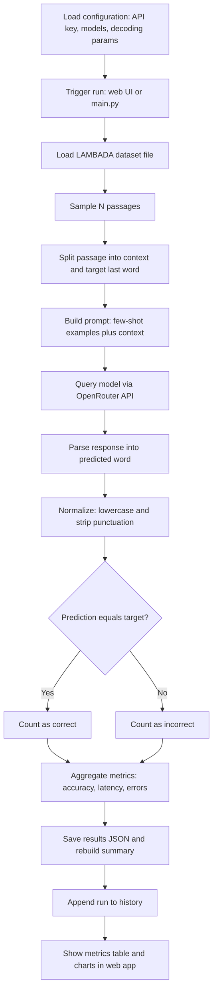

# LAMBADA Process Flow

How the benchmark runs in this project, from a click on "Run Benchmark" to the
metrics and charts shown in the web app. LAMBADA is a last-word prediction task:
the model reads a passage with the final word removed and must predict that word,
which is then compared to the target by exact match.

## Workflow diagram

## Chronological steps

| # | Step | What happens | Where (file / function) |
|---|------|--------------|-------------------------|
| 1 | Configuration | Read API key, model list, decoding params, dataset paths | `config.py` |
| 2 | Trigger | User clicks Run Benchmark (single or all) or runs the pipeline | `passenger_wsgi.py` (`/run`, `/run_all`) or `main.py` |
| 3 | Load dataset | Read the LAMBADA plain-text split; one passage per line | `evaluate_lambada.load_dataset` |
| 4 | Sample | Randomly select N passages (seeded for repeatability) | `evaluate_lambada.load_dataset` |
| 5 | Split | Separate each passage into context and the target last word | `load_dataset` (rsplit on last space) |
| 6 | Build prompt | Prepend few-shot worked examples, then the context | `build_few_shot`, `query_model` |
| 7 | Query model | Send the prompt to the chosen model through OpenRouter | `query_model` (HTTP POST) |
| 8 | Parse | Extract the single predicted word from the raw response | `extract_prediction` |
| 9 | Normalize | Lowercase and strip surrounding punctuation, both sides | `normalize_word` |
| 10 | Compare | Exact match: predicted word equals target word | `evaluate_model` |
| 11 | Aggregate | Tally correct, accuracy, average latency, and errors | `evaluate_model` |
| 12 | Save | Write per-model results JSON and rebuild the summary | `run_single_benchmark`, `rebuild_summary` |
| 13 | History | Append the run (models, samples, params) to history | `append_history` |
| 14 | Present | Render the metrics table and accuracy/latency charts | `index.html` (Chart.js); Docs tab renders `report.md` |

## Metrics produced

| Metric | Definition |
|--------|------------|
| Accuracy | correct / total after normalization (exact match) |
| Average response time | Mean wall-clock seconds per API call |
| Errors | Count of failed or timed-out API calls |
| Throughput | total / total wall-clock time (samples per second) |

**ELI5:** Take a story with the last word hidden, ask the model to guess that word,
clean up the guess, and check if it matches. Do this for many stories, count how
often it is right and how fast it answers, then show the score as a table and bars.
