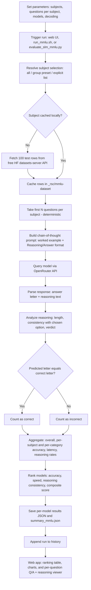

# MMLU Process Flow

How the MMLU benchmark runs in this project, from a click on "Run MMLU" (or `./run_mmlu.sh`) to the ranking table, charts, and per-question reasoning shown in the web app. MMLU (Massive Multitask Language Understanding) is a multiple-choice knowledge and reasoning test spanning 57 subjects grouped into four categories (STEM, Humanities, Social Sciences, Other). For every question the model must first write short step-by-step reasoning and then commit to one of four options (A-D); both the final letter and the reasoning text are parsed and evaluated.

## Workflow diagram

## Chronological steps

| #   | Step               | What happens                                                                                                                                         | Where (file / function)                                    |
|-----|--------------------|------------------------------------------------------------------------------------------------------------------------------------------------------|------------------------------------------------------------|
| 1   | Parameters         | Read subjects, questions per subject, models, decoding params (all documented at the top of the script and shell runner)                             | `evaluate_slm_mmlu.py` (RUN PARAMETERS), `run_mmlu.sh`     |
| 2   | Trigger            | User clicks Run MMLU, runs `./run_mmlu.sh`, or `python evaluate_slm_mmlu.py`                                                                         | `passenger_wsgi.py` (`/mmlu/run`) or `run_mmlu_evaluation` |
| 3   | Resolve subjects   | Turn "all", a group preset, or a list into valid subject names                                                                                       | `resolve_subjects`                                         |
| 4   | Fetch questions    | Download the first 100 test rows per subject from the free Hugging Face datasets-server API (cais/mmlu, fallback tasksource/mmlu); no API key needed | `_download_subject`                                        |
| 5   | Cache              | Store rows in `_rsc/mmlu-dataset/<subject>.json` so reruns are offline and repeatable                                                                | `fetch_subject_questions`                                  |
| 6   | Sample             | Take the first N questions per subject (deterministic, no randomness)                                                                                | `fetch_subject_questions`, `load_mmlu_tasks`               |
| 7   | Build prompt       | Chain-of-thought prompt: one worked example, strict `Reasoning:` then `Answer: <letter>` output format                                               | `build_mmlu_prompt`, `WORKED_EXAMPLE`                      |
| 8   | Query model        | Send the prompt to the chosen model through OpenRouter                                                                                               | `query_model_mmlu` (HTTP POST)                             |
| 9   | Parse              | Extract the answer letter AND the reasoning text (handles `Reasoning:/Answer:`, `<think>` blocks, "the answer is (B)", bare letters, truncation)     | `parse_mmlu_response`                                      |
| 10  | Evaluate reasoning | Score the reasoning: is it present, how long, does it actually support the chosen option; assign a verdict                                           | `analyze_reasoning`                                        |
| 11  | Compare            | Exact match: predicted letter equals the correct letter                                                                                              | `evaluate_model_mmlu`                                      |
| 12  | Aggregate          | Overall / per-subject / per-category accuracy, latency, errors, reasoning rates                                                                      | `evaluate_model_mmlu`                                      |
| 13  | Rank               | Per-dimension ranks and composite score across all evaluated models                                                                                  | `build_mmlu_summary`                                       |
| 14  | Save               | Write `results/<model>_mmlu.json` and `results/summary_mmlu.json`                                                                                    | `run_mmlu_evaluation` / `run_mmlu_benchmark`               |
| 15  | History            | Append the run (models, subjects, question count, params) to history                                                                                 | `passenger_wsgi.append_history`                            |
| 16  | Present            | Ranking table, accuracy charts, and the per-question Q/A + reasoning accordion                                                                       | `templates/mmlu.html` (Chart.js)                           |

## Components

| Component          | File                                                                        | Role                                                                                                                                                 |
|--------------------|-----------------------------------------------------------------------------|------------------------------------------------------------------------------------------------------------------------------------------------------|
| Run parameters     | `evaluate_slm_mmlu.py` (top), `run_mmlu.sh` (top)                           | Subject selection ("all", group presets, or explicit list), questions per subject (1-100), models, decoding params - every option listed in comments |
| Subject catalogue  | `MMLU_SUBJECTS`, `SUBJECT_GROUPS`, `CATEGORY_LABELS`                        | The 57 subjects mapped to their official categories; group presets derived from the mapping                                                          |
| Dataset fetcher    | `fetch_subject_questions`, `_download_subject`                              | Free HF datasets-server API client with source fallback and local JSON cache                                                                         |
| Task loader        | `load_mmlu_tasks`                                                           | Flattens subjects x questions into one ordered task list                                                                                             |
| Prompt builder     | `build_mmlu_prompt`, `WORKED_EXAMPLE`                                       | Chain-of-thought prompt with a worked example enforcing a parseable format                                                                           |
| Model client       | `query_model_mmlu`                                                          | OpenRouter chat-completions call with timing and error capture                                                                                       |
| Response parser    | `parse_mmlu_response`                                                       | Splits a raw response into (answer letter, reasoning text)                                                                                           |
| Reasoning analyzer | `analyze_reasoning`                                                         | Heuristic quality check: presence, word count, consistency, verdict                                                                                  |
| Evaluator          | `evaluate_model_mmlu`                                                       | Runs all tasks for one model; aggregates accuracy and reasoning metrics                                                                              |
| Ranker             | `build_mmlu_summary`                                                        | Per-dimension ranks + composite score across models                                                                                                  |
| CLI runner         | `run_mmlu_evaluation`, `_parse_cli`, `run_mmlu.sh`                          | One-shot terminal pipeline: setup, install, run, print ranking                                                                                       |
| Web routes         | `passenger_wsgi.py`: `/mmlu`, `/mmlu/run`, `/mmlu/metrics`, `/mmlu/details` | Online runs, ranking JSON, and the per-question detail feed                                                                                          |
| Web page           | `templates/mmlu.html`                                                       | Subject picker with presets, decoding sliders, ranking table, charts, Q/A + reasoning viewer                                                         |

## Models evaluated

| Model        | Developer  | Params | OpenRouter id                    | Signature technique                                   |
|--------------|------------|--------|----------------------------------|-------------------------------------------------------|
| Gemma-3-4B   | Google     | 4B     | `google/gemma-3-4b-it`           | Knowledge distillation + local/global attention mix   |
| Llama-3.2-3B | Meta       | 3B     | `meta-llama/llama-3.2-3b-instruct` | Compact dense transformer, pruned/distilled from 3.1 |
| Ministral-8B | Mistral AI | 8B     | `mistralai/ministral-8b-2512`    | Sliding window attention + GQA                        |

Gemma-3-4B replaced Phi-4-Mini, which no longer has any active endpoints on OpenRouter (every request returned 404 and scored 0%).

## Metrics produced

| Metric                | Definition                                                                                                               |
|-----------------------|--------------------------------------------------------------------------------------------------------------------------|
| Accuracy              | correct letters / total questions (exact match)                                                                          |
| Category accuracy     | Accuracy aggregated over STEM / Humanities / Social Sciences / Other                                                     |
| Subject accuracy      | correct / total per individual subject                                                                                   |
| Average response time | Mean wall-clock seconds per API call                                                                                     |
| Errors                | Count of failed or timed-out API calls                                                                                   |
| Reasoning rate        | Share of answers that came with a non-trivial explanation (>= 5 words)                                                   |
| Reasoning consistency | Share of answers whose reasoning actually supports the chosen option (names the letter or reuses the choice's key words) |
| Avg reasoning words   | Mean length of the parsed reasoning text                                                                                 |
| Composite score       | 0.70 x accuracy + 0.15 x reasoning consistency + 0.15 x relative speed (fastest avg time / model's avg time)             |

## Reasoning verdicts (per question)

| Verdict          | Meaning                                                                 |
|------------------|-------------------------------------------------------------------------|
| sound            | Correct answer, and the reasoning clearly supports it                   |
| right-weak-link  | Correct answer, reasoning present but does not clearly support the pick |
| lucky-guess      | Correct answer with no real reasoning                                   |
| flawed-reasoning | Reasoned its way to a wrong answer                                      |
| blind-guess      | Wrong answer and no reasoning                                           |
| no-answer        | No A-D letter could be parsed (API error or malformed output)           |

## Ranking

Models are ranked per dimension (1 = best) on accuracy, speed, and reasoning consistency, then ordered by the composite score. Accuracy dominates the composite (70%); reasoning quality and latency (15% each) break ties, which mirrors how small language models are picked in practice: quality first, then cost and latency.

**ELI5:** Give the model a school quiz across 57 subjects. For every question it must "show its work" before circling A, B, C, or D. We check the circled letter against the answer key, read the shown work to see if it actually justifies the pick, time every answer, and then rank the models like a report card: mostly on how many they got right, with bonus points for honest working-out and for being quick.
