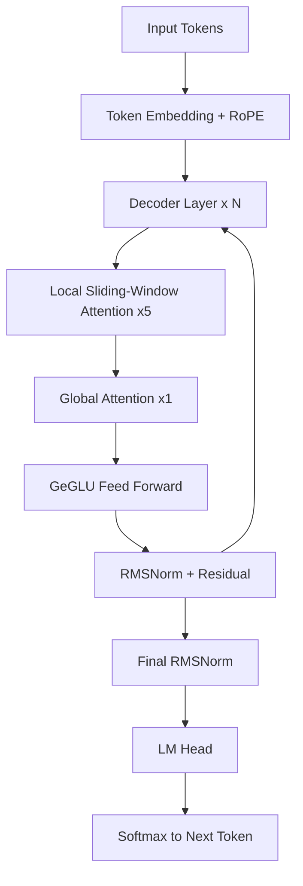
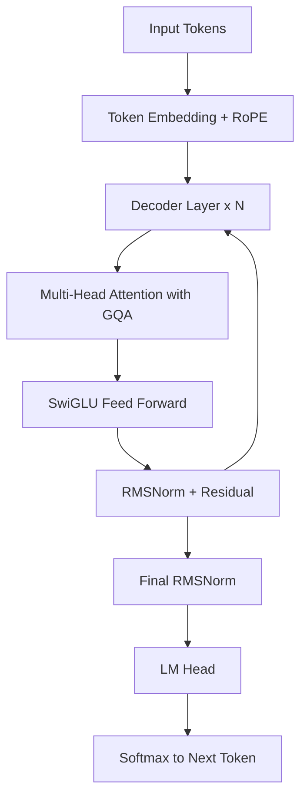
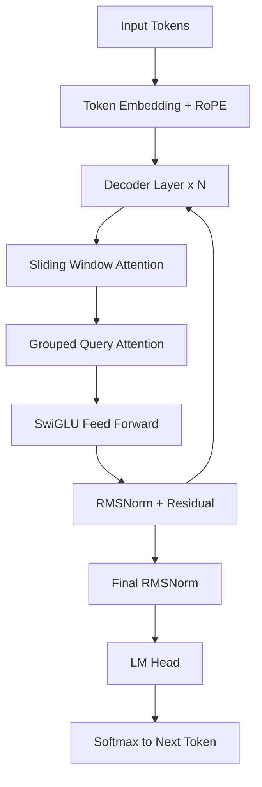
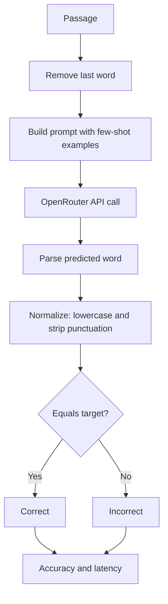
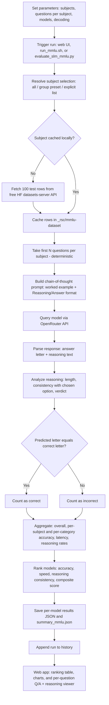
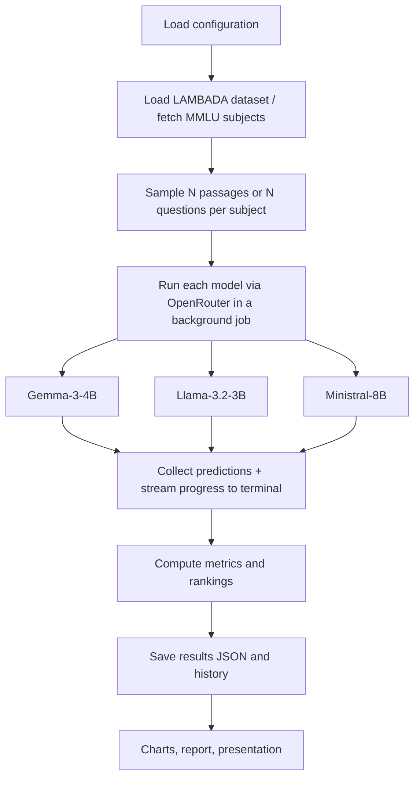

# LAMBADA & MMLU Benchmark Evaluation Report

Evaluating small language models on long-range word prediction (LAMBADA) and multi-subject knowledge & reasoning (MMLU) — architecture, fine-tuning parameters, metrics, and results explained in full.

Submitted to: Prof. Anna Corazza
Submitted by: Francesco Ventimiglia, Danilo Rodriguez, Rohan Baidya
Github link: https://github.com/ronvoy/gen-ai
Site Link: https://unina.cc/gen-ai

## 1. Research Question

Among three small language models built with different compression strategies and attention mechanisms, which one best balances accuracy, reasoning quality, and latency — on long-range context prediction (LAMBADA) and broad knowledge & reasoning (MMLU)?

In particular: does a larger, non-distilled model (Ministral-8B) outperform smaller distilled/pruned models (Gemma-3-4B, Llama-3.2-3B) across both benchmarks — or does compression cost more in one dimension (accuracy, reasoning, speed) than another?

## 2. Experimental Protocol

**Dataset**

- LAMBADA: 5,153-passage test split from BookCorpus (English, ACL 2016).
- MMLU: 57 subjects × 5 questions/subject = 285 questions per model, fetched from the free HF datasets-server API and cached locally.

**Preprocessing**

- LAMBADA: predictions normalized (lowercase, punctuation stripped) before exact-match comparison.
- MMLU: chain-of-thought prompt with one worked example enforcing a strict `Reasoning:` / `Answer: <letter>` format.

**Decoding setup (no training)**

- No model weights are changed — only decoding parameters (temperature, top-p, max tokens, few-shot count) vary.
- Shared presets — Optimal, Normal, Best Performance — apply identically to both benchmarks and all three models for a like-for-like comparison.

**Evaluation strategy**

- All models queried through the OpenRouter API for a hardware-neutral comparison.
- Deterministic sampling — fixed subject/question order, no randomness — for reproducible runs.
- Metrics captured live in one shared web app: terminal streaming, run history, charts.

## 3. Benchmark

**Baseline task**

LAMBADA: predict the single next word of a passage, guessable only from full context. MMLU: choose the correct option (A–D) after writing short step-by-step reasoning. No fine-tuning either way — every model is evaluated purely on its pretrained + instruction-tuned weights.

**Reference criteria — LAMBADA**

| Metric | Better |
|--------|--------|
| Exact-match accuracy | Higher |
| Average response time | Lower |
| Error rate | Lower |
| Throughput | Higher |

**Reference criteria — MMLU**

| Metric | Definition |
|--------|------------|
| Accuracy | Correct letters / total (exact match) |
| Category accuracy | Per STEM / Humanities / Social Sciences / Other |
| Reasoning consistency | Reasoning supports the chosen option |
| Composite score | 0.70·accuracy + 0.15·reasoning + 0.15·speed |

Ground truth for both benchmarks comes directly from the source datasets (the target word / the official answer key) — never inferred.

## 4. Involved Approaches

| # | Model | Developer | Parameters | OpenRouter id | Architecture | Key Technique |
|---|-------|-----------|------------|---------------|--------------|---------------|
| 1 | Gemma-3-4B | Google | 4B | `google/gemma-3-4b-it` | Dense decoder-only transformer with interleaved local/global attention | Knowledge distillation + local/global attention interleaving |
| 2 | Llama-3.2-3B | Meta | 3B | `meta-llama/llama-3.2-3b-instruct` | Dense decoder-only transformer with Grouped Query Attention | Compact dense transformer |
| 3 | Ministral-8B | Mistral AI | 8B | `mistralai/ministral-8b-2512` | Decoder-only transformer with Sliding Window Attention | Sliding Window Attention + GQA |

- Gemma-3-4B: dense decoder-only transformer with interleaved local/global attention, distilled from a larger teacher, 128k-token context.
- Llama-3.2-3B: standard dense transformer recipe — RoPE, Grouped Query Attention, SwiGLU — pruned and distilled from larger Llama 3.1 models.
- Ministral-8B: sliding window attention + GQA for efficient long-context inference at the edge — trained at its native 8B size, not distilled down from a larger checkpoint.

## 5. Considered Model(s)

### 5.1 Gemma-3-4B (Google)

- 4B instruction-tuned dense decoder-only transformer from Google, built with the same research that powers Gemini.
- Interleaves several local sliding-window attention layers with an occasional global attention layer, keeping memory low while information still flows across a long context (up to 128k tokens).
- The small Gemma 3 models are trained with knowledge distillation from larger teacher models.

**Working technique - Knowledge distillation + local/global attention interleaving:**

- Most layers only look at a local window of nearby tokens (cheap); every few layers one global layer lets any token attend to the whole context (expressive).
- Distillation teaches the small model to match a larger teacher's output distribution rather than raw text alone, delivering strong quality per parameter at edge-friendly cost.

Key properties:

- Dense decoder-only transformer, no expert routing.
- 5:1 interleaving of local sliding-window and global attention layers.
- Grouped Query Attention with QK-norm; 128k-token context window.
- Distilled from larger Gemma/Gemini-family teacher models.

#### Process flow - Gemma-3-4B inference



- Local sliding-window attention x5: cheap, restricted to nearby tokens.
- Global attention x1: the one layer per block where every token can see the full passage — this is how long-range context (LAMBADA's whole point) actually gets used.
- GeGLU feed forward: a gated variant of the MLP block used after attention.

### 5.2 Llama-3.2-3B (Meta)

- 3B instruction-tuned model from Meta for on-device, low-cost use.
- Standard Llama recipe: dense transformer with RoPE, GQA, and SwiGLU layers.
- Built by pruning and distilling from larger Llama 3.1 models.

**Working technique - Compact dense transformer:**

- Takes the proven dense transformer design and shrinks it — no architectural novelty, the standard Llama recipe simply scaled down to 3B parameters rather than a smaller model with new efficiency tricks.
- Predictable and easy to serve on modest hardware.

Key properties:

- Dense decoder-only transformer.
- RoPE position embeddings for length generalisation.
- Grouped Query Attention and SwiGLU layers.

#### Process flow - Llama-3.2-3B inference



- Multi-head attention (GQA): full attention over the whole context, but with grouped key/value heads to shrink the KV cache.
- SwiGLU feed forward: a gated MLP block, used in place of a plain ReLU/GeLU MLP.
- No local/global split, no sliding window — the simplest of the three designs.

### 5.3 Ministral-8B (Mistral AI)

- 8B model from Mistral AI, built for edge use.
- Interleaved sliding window attention keeps memory and compute low on long inputs.
- Grouped query attention further shrinks the KV cache.

**Working technique - Sliding Window Attention + GQA:**

- Each layer attends only to a local window instead of every token.
- Stacked layers carry context further than any single window.
- GQA shares key-value heads for fast decoding on long passages.
- Unlike the other two models in this study, Ministral-8B is not described as distilled or pruned from a larger checkpoint — it is trained at its native 8B size, very likely the single biggest reason it leads both benchmarks (see Section 8).

Key properties:

- Sliding window attention for local context.
- Grouped Query Attention for a smaller KV cache.
- Efficient long-context inference at the edge.

#### Process flow - Ministral-8B inference



- Sliding window attention: local context only, per layer — same trick Gemma uses for its "local" layers, but used on every layer here, not just 4 in 5.
- Grouped Query Attention: shrinks the KV cache for fast decoding on long passages.
- No global-attention layer at all — depth (stacking many windowed layers) substitutes for it.

## 6. Comments and Discussion before Results

This section walks through every fine-tuning parameter, preset, metric, dataset detail, and workflow used in this study — the "how and why" behind the numbers in Section 7.

### 6.1 Fine-Tuning Parameters, explained

The Fine Tune panel exposes six decoding parameters, shared by both benchmarks. None of them change model weights — they only control how the next token is sampled at inference time.

**Temperature** (range 0.0 – 2.0, used here: **0.0**)

Scales the logits before the softmax that turns the model's raw output scores into a probability distribution over the vocabulary — the next token is then sampled from that distribution. At 0.0 the distribution collapses to argmax — the single highest-probability token is always chosen (greedy decoding): fully deterministic, same input always gives the same output. Higher values flatten the distribution, letting lower-probability tokens get picked sometimes — more variety, but more risk of drifting off the one correct word or letter. Both LAMBADA (one correct word) and MMLU (one correct letter) have exactly one right answer — no reward for creative variation, only downside risk. This is why every model in this study, regardless of size or architecture, was run at temperature 0.0.

**Top-p / nucleus sampling** (range 0.0 – 1.0, used here: **1.0**)

Restricts sampling to the smallest set of tokens whose cumulative probability reaches p — the "nucleus". Anything outside that set is discarded before a token is sampled. At 1.0 the nucleus includes the entire distribution — no tokens are excluded. Combined with temperature 0.0, top-p has no practical effect here: greedy decoding already picks one token deterministically regardless of how large the candidate pool is. Lower values would only matter at temperature > 0, where they'd narrow sampling to the most confident tokens. It is set to its neutral value here rather than doing any real work in this evaluation.

**Max tokens** (range 1 – 128 on the LAMBADA panel, used here: **32 for LAMBADA, 384 for MMLU**)

A hard cap on how many tokens the model is allowed to generate before the API cuts it off. Every output token is one more sequential decoding step, so this parameter is also a direct lever on latency, not just on answer length. LAMBADA needs only a single word plus a little slack for stray punctuation or formatting — 32 tokens is generous headroom. MMLU needs far more: the model must write a full chain-of-thought explanation before its final "Answer: <letter>" line. Setting it too low truncates the model mid-reasoning before it reaches the answer line — recorded as a "no-answer" verdict, not a wrong answer. This budget difference is a major reason MMLU latency (0.6–2.5s) runs systematically higher than LAMBADA latency (0.6–1.2s) for the same models.

**Few-shot examples** (range 0 – 5 on LAMBADA, used here: **3 worked examples**)

Prepends worked (context → answer) examples from a fixed pool before the real passage, showing the model the exact input/output format expected — a prompting technique, not a change to the model's weights. Instruction-tuned models sometimes answer in full sentences ("The next word is likely...") unless shown the expected bare-word format; a few worked examples anchor that format without touching the model's weights. MMLU instead uses one fixed worked example baked into the prompt template, rather than a tunable count. Trade-off: each example adds prompt tokens, so more few-shot examples cost a little extra latency per call, even though the model's own output doesn't get any longer.

**Frequency penalty** (range -2.0 – 2.0, used here: **0.0**)

Subtracts a penalty proportional to how many times a token has already appeared in the output so far — the more it repeats, the less likely it is to repeat again.

**Presence penalty** (range -2.0 – 2.0, used here: **0.0**)

Applies a flat penalty to any token the moment it appears at least once, regardless of count — encourages introducing new words/topics rather than staying on the same ones.

Both penalties are set to neutral (0.0) for every model, on both benchmarks: both tasks produce a single short answer — one word, or one letter plus brief reasoning — so there's no room for the kind of repetitive looping these penalties are designed to prevent in long-form, open-ended generation.

### 6.2 Parameter Set Used in This Evaluation

| Parameter | LAMBADA | MMLU |
|-----------|---------|------|
| Temperature | 0.0 | 0.0 |
| Top-p | 1.0 | 1.0 |
| Max tokens | 32 | 384 |
| Frequency penalty | 0.0 | — |
| Presence penalty | 0.0 | — |
| Few-shot examples | 3 | — |

This is a hand-set configuration close to, but not identical to, any single named preset (it mixes Optimal's greedy decoding with a different max-token / few-shot budget). It was applied identically to Gemma-3-4B, Llama-3.2-3B, and Ministral-8B — none of the three received special treatment, such as a larger reasoning-token budget. `config.py` reserves a separate `MAX_TOKENS_REASONING = 8096` budget for models flagged in `REASONING_MODELS` — that list is empty for this study, so none of the three models used it. Any differences in the results in Section 7 come from the models themselves, not from unequal evaluation conditions.

### 6.3 Fine-Tuning Presets

Both benchmark pages expose one-click presets over the decoding parameters. They control decoding, not model weights.

**LAMBADA Presets (`PRESETS` in config.py)**

| Preset | Temperature | Top-p | Max tokens | Few-shot | Intent |
|--------|-------------|-------|------------|----------|--------|
| Optimal | 0.0 | 1.0 | 16 | 5 | Greedy decoding with the most worked examples - most reliable accuracy |
| Normal | 0.3 | 0.9 | 32 | 3 | Balanced default |
| Best Performance | 0.0 | 1.0 | 8 | 2 | Trimmed token and example budget - fastest, cheapest runs |

Optimal is theoretically the strongest preset for LAMBADA specifically: the task has exactly one correct token, so greedy decoding removes sampling risk entirely, and more worked examples further anchor the one-word output format. Normal reintroduces randomness (temp 0.3, top-p 0.9) — useful for exploring variability, but with no upside on an exact-match task like this one. Best Performance trims both the token cap and the example budget for the cheapest, fastest runs, at some risk of losing the format anchor. The actual saved runs (Section 6.2) used a nearby but distinct hand-set configuration rather than one of these three presets exactly.

**MMLU Presets (`MMLU_PRESETS` in config.py)**

| Preset | Temperature | Top-p | Max tokens | Intent |
|--------|-------------|-------|------------|--------|
| Optimal | 0.0 | 1.0 | 512 | Most reasoning room - most reliable accuracy |
| Normal | 0.2 | 0.95 | 384 | Matches the defaults |
| Best Performance | 0.0 | 1.0 | 192 | Caps the reasoning budget so runs finish faster |

Optimal gives the most room (512 tokens) for multi-step reasoning before the model commits to a letter — useful for subjects needing longer derivations (e.g. `formal_logic`, `college_mathematics`). Best Performance risks truncating longer reasoning chains before the model reaches its "Answer:" line, which would surface as a "no-answer" verdict. The actual saved runs used 384 tokens — matching Normal's budget — with greedy decoding (temperature 0.0, top-p 1.0) borrowed from Optimal.

### 6.4 Metrics Explained — LAMBADA

| Metric | Explanation |
|--------|-------------|
| Exact-match accuracy | correct / total, after lowercasing and stripping punctuation from both the prediction and the true target word. Example: target "Zane." vs. prediction "zane" — different strings, but identical after normalization → counted correct. |
| Average response time | Mean wall-clock seconds per API call, start to finish — not just model compute time. Includes network round-trip and OpenRouter's provider routing/queueing, which is why it can spike heavily under provider congestion. |
| Error rate | errors / total — API calls that failed outright (timeouts, malformed responses) even after retries were exhausted. All three models finished at 0 errors in the saved runs — every request eventually succeeded, even ones needing multiple retries. |
| Throughput | total / total wall-clock time — samples graded per second. Requests are sent one at a time here (no batching), so throughput is essentially the reciprocal of latency: Llama ≈1.73/s, Ministral ≈1.37/s, Gemma ≈0.84/s. |

### 6.5 Metrics Explained — MMLU

| Metric | Explanation |
|--------|-------------|
| Accuracy | Correct letters / total questions (exact match) — judges only the final answer, not the reasoning behind it. |
| Category accuracy | The same accuracy computed separately per STEM / Humanities / Social Sciences / Other. Reveals blind spots the headline number hides — e.g. Llama-3.2-3B: 43.3% STEM vs. 63.3% Social Sciences, a 20-point spread. |
| Reasoning rate | Share of answers with a non-trivial explanation (≥5 words). All three models wrote substantive reasoning on effectively every question (≈100% reasoning rate) — the differentiator is never whether they explained, but whether the explanation held up. |
| Reasoning consistency & avg. words | Consistency = share of answers whose reasoning text actually supports the chosen letter. Ministral-8B writes the shortest reasoning (54.1 words) yet the highest consistency (69.1%); Llama-3.2-3B writes the most (61.8 words) yet is least consistent (59.7%) — length and quality of explanation are not the same thing. |

**Composite score, worked example**

```
Composite = 0.70 x accuracy + 0.15 x reasoning consistency + 0.15 x relative speed
Relative speed = fastest model's avg time / this model's avg time
```

| Model | Accuracy term (0.70×) | Reasoning term (0.15×) | Speed term (0.15×) | Composite |
|-------|------------------------|--------------------------|----------------------|-----------|
| Ministral-8B | 0.789 × 0.70 = 0.552 | 0.691 × 0.15 = 0.104 | 0.500 × 0.15 = 0.075 | 0.731 |
| Llama-3.2-3B | 0.558 × 0.70 = 0.391 | 0.597 × 0.15 = 0.090 | 1.000 × 0.15 = 0.150 | 0.630 |
| Gemma-3-4B | 0.639 × 0.70 = 0.447 | 0.646 × 0.15 = 0.097 | 0.307 × 0.15 = 0.046 | 0.590 |

The speed term uses Llama-3.2-3B's 0.768s as the fastest reference time: Ministral 0.768/1.537=0.500, Llama 0.768/0.768=1.000, Gemma 0.768/2.502=0.307. These figures reconcile exactly with the composite scores reported in Section 7.3. Accuracy dominates the weighting (70%), so Ministral's large accuracy lead carries it to #1 even though it is not the fastest model.

### 6.6 LAMBADA: Dataset, Properties & Scoring Flow

- LAMBADA is drawn from the BookCorpus.
- Each passage is chosen so the final word is predictable from the full passage but not from the last sentence alone.

**Properties**

| Property | Value |
|----------|-------|
| Source corpus | BookCorpus (unpublished novels) |
| Language | English |
| Task type | Word prediction |
| Curation criterion | Target guessable from full context only |
| First published | ACL 2016 (Paperno et al.) |

**Scoring flow**



Normalization is what makes exact-match accuracy fair — without it, capitalization or a trailing period would wrongly count a correct guess as wrong. Latency is recorded for every call — correct, incorrect, or (after retries) failed — so the average reflects real-world response time, not just successful guesses.

### 6.7 LAMBADA: Dataset Splits

| Split | File | Passages | Purpose |
|-------|------|----------|---------|
| Test | lambada_test_plain_text.txt | 5,153 | Primary evaluation |
| Development | lambada_development_plain_text.txt | 4,869 | Validation and tuning |
| Control Test | lambada_control_test_data_plain_text.txt | 5,000 | Baseline, unfiltered |
| Rejected | rejected_plain_text.txt | 11,941 | Passages cut during curation |
| Training Novels | train-novels/ (16 genres) | 2,662 novels | Pre-training material |
| Vocabulary | lambada-vocab-2.txt | 112,746 entries | Reference vocabulary |

This evaluation uses only the Test split (5,153 passages, sampled down to 1,000 for the saved runs) — the other splits exist in the released dataset but aren't used for scoring here.

### 6.8 MMLU: How a Run Works

How the MMLU benchmark runs in this project, from a click on "Run MMLU" (or `./run_mmlu.sh`) to the ranking table, charts, and per-question reasoning shown in the web app. For every question the model must first write short step-by-step reasoning and then commit to one of four options (A-D); both the final letter and the reasoning text are parsed and evaluated.



**Chronological steps**

| #   | Step               | What happens                                                                                                                                         | Where (file / function)                                    |
|-----|--------------------|------------------------------------------------------------------------------------------------------------------------------------------------------|--------------------------------------------------------------|
| 1   | Parameters         | Read subjects, questions per subject, models, decoding params (all documented at the top of the script and shell runner)                             | `evaluate_slm_mmlu.py` (RUN PARAMETERS), `run_mmlu.sh`     |
| 2   | Trigger            | User clicks Run MMLU, runs `./run_mmlu.sh`, or `python evaluate_slm_mmlu.py`                                                                         | `app.py` (`/mmlu/run`) or `run_mmlu_evaluation` |
| 3   | Resolve subjects   | Turn "all", a group preset, or a list into valid subject names                                                                                       | `resolve_subjects`                                         |
| 4   | Fetch questions    | Download the first 100 test rows per subject from the free Hugging Face datasets-server API (cais/mmlu, fallback tasksource/mmlu); no API key needed | `_download_subject`                                        |
| 5   | Cache              | Store rows in `_rsc/mmlu-dataset/<subject>.json` so reruns are offline and repeatable                                                                | `fetch_subject_questions`                                  |
| 6   | Sample             | Take the first N questions per subject (deterministic, no randomness)                                                                                | `fetch_subject_questions`, `load_mmlu_tasks`               |
| 7   | Build prompt       | Chain-of-thought prompt: one worked example, strict `Reasoning:` then `Answer: <letter>` output format                                               | `build_mmlu_prompt`, `WORKED_EXAMPLE`                      |
| 8   | Query model        | Send the prompt to the chosen model through OpenRouter                                                                                               | `query_model_mmlu` (HTTP POST)                             |
| 9   | Parse              | Extract the answer letter AND the reasoning text (handles `Reasoning:/Answer:`, `<think>` blocks, "the answer is (B)", bare letters, truncation)     | `parse_mmlu_response`                                      |
| 10  | Evaluate reasoning | Score the reasoning: is it present, how long, does it actually support the chosen option; assign a verdict                                           | `analyze_reasoning`                                        |
| 11  | Compare            | Exact match: predicted letter equals the correct letter                                                                                              | `evaluate_model_mmlu`                                      |
| 12  | Aggregate          | Overall / per-subject / per-category accuracy, latency, errors, reasoning rates                                                                      | `evaluate_model_mmlu`                                      |
| 13  | Rank               | Per-dimension ranks and composite score across all evaluated models                                                                                  | `build_mmlu_summary`                                       |
| 14  | Save               | Write `results/<model>_mmlu.json` and `results/summary_mmlu.json`                                                                                    | `run_mmlu_evaluation` / `run_mmlu_benchmark`               |
| 15  | History            | Append the run (models, subjects, question count, params) to history                                                                                 | `app.append_history`                            |
| 16  | Present            | Ranking table, accuracy charts, and the per-question Q/A + reasoning accordion                                                                       | `templates/mmlu.html` (Chart.js)                           |

### 6.9 MMLU: Components

| Component          | File                                                                        | Role                                                                                                                                                 |
|--------------------|-----------------------------------------------------------------------------|------------------------------------------------------------------------------------------------------------------------------------------------------|
| Run parameters     | `evaluate_slm_mmlu.py` (top), `run_mmlu.sh` (top)                           | Subject selection ("all", group presets, or explicit list), questions per subject (1-100), models, decoding params - every option listed in comments |
| Subject catalogue  | `MMLU_SUBJECTS`, `SUBJECT_GROUPS`, `CATEGORY_LABELS`                        | The 57 subjects mapped to their official categories; group presets derived from the mapping                                                          |
| Dataset fetcher    | `fetch_subject_questions`, `_download_subject`                              | Free HF datasets-server API client with source fallback and local JSON cache                                                                         |
| Task loader        | `load_mmlu_tasks`                                                           | Flattens subjects x questions into one ordered task list                                                                                             |
| Prompt builder     | `build_mmlu_prompt`, `WORKED_EXAMPLE`                                       | Chain-of-thought prompt with a worked example enforcing a parseable format                                                                           |
| Model client       | `query_model_mmlu`                                                          | OpenRouter chat-completions call with timing and error capture                                                                                       |
| Response parser    | `parse_mmlu_response`                                                       | Splits a raw response into (answer letter, reasoning text)                                                                                           |
| Reasoning analyzer | `analyze_reasoning`                                                         | Heuristic quality check: presence, word count, consistency, verdict                                                                                  |
| Evaluator          | `evaluate_model_mmlu`                                                       | Runs all tasks for one model; aggregates accuracy and reasoning metrics                                                                              |
| Ranker             | `build_mmlu_summary`                                                        | Per-dimension ranks + composite score across models                                                                                                  |
| CLI runner         | `run_mmlu_evaluation`, `_parse_cli`, `run_mmlu.sh`                          | One-shot terminal pipeline: setup, install, run, print ranking                                                                                       |
| Web routes         | `app.py`: `/mmlu`, `/mmlu/run`, `/mmlu/metrics`, `/mmlu/details`, `/progress/<job_id>` | Online runs, live progress feed, ranking JSON, and the per-question detail feed                                              |
| Web page           | `templates/mmlu.html`                                                       | Subject picker with presets, decoding sliders + presets, live terminal, ranking table, charts, Q/A + reasoning viewer                                |

### 6.10 MMLU: Reasoning Verdicts (per question)

| Verdict          | Meaning                                                                 |
|------------------|-------------------------------------------------------------------------|
| sound            | Correct answer, and the reasoning clearly supports it                   |
| right-weak-link  | Correct answer, reasoning present but does not clearly support the pick |
| lucky-guess      | Correct answer with no real reasoning                                   |
| flawed-reasoning | Reasoned its way to a wrong answer                                      |
| blind-guess      | Wrong answer and no reasoning                                           |
| no-answer        | No A-D letter could be parsed (API error or malformed output)           |

### 6.11 Project Workflow — End to End



### 6.12 Benchmark Architecture - Ten Stages, Nine of Them Measurable

The evaluation is organised into ten stages. **Stages 1-9 form the OpenRouter
benchmark; stage 10 is excluded from it entirely** and documented as a separate
self-hosted study. The definition lives in `metrics/taxonomy.py`, which the
runner, the web UI and this report all read, so there is one statement of what
is measured and one statement of what is not.

| Stage | Layer | Purpose | MMLU | LAMBADA | OpenRouter |
|---|---|---|---|---|---|
| 1 | **Task Quality** | Measure model capability | yes | yes | **yes** |
| 2 | **Probabilistic Quality** | Confidence and probability quality | yes | yes | **conditional** |
| 3 | **Reasoning & Consistency** | Stability and reasoning reliability | yes | yes | **yes** |
| 4 | **Context Behavior** | Context usage and dependency | experimental | yes | **yes** |
| 5 | **Robustness** | Resistance to prompt/input changes | yes | yes | **yes** |
| 6 | **API Performance** | Inference-service performance | yes | yes | **yes** |
| 7 | **Token Efficiency** | Token consumption and efficiency | yes | yes | **yes** |
| 8 | **Economics** | Monetary efficiency | yes | yes | **yes** |
| 9 | **Reliability** | Operational stability | yes | yes | **yes** |
| 10 | ~~Hardware & Distributed~~ | Inference infrastructure | - | - | **no - excluded** |

#### Stage detail

| Stage | Subsections | Primary metrics |
|---|---|---|
| **1 Task Quality** | Core performance | Accuracy, Exact Match, Error Rate, Normalised Accuracy, Parse-Failure Rate |
| | MMLU domain | Macro Accuracy, Subject Accuracy, Category Accuracy, Wilson CI |
| | LAMBADA word prediction | Last-Word Accuracy, Exact Target Match, Stem Match |
| | Language modeling *(conditional)* | Perplexity, NLL, Cross Entropy |
| **2 Probabilistic** | Probability | Correct-Option Probability, Target Probability, Log Probability, Target Rank, MRR |
| | Uncertainty | Entropy, Normalised Entropy |
| | Calibration | Confidence, ECE, MCE, Brier Score, Confidence-Accuracy Correlation |
| **3 Consistency** | Answer stability | Prediction Stability, Answer Agreement |
| | Self-consistency | Majority-Vote Accuracy, Self-Consistency Gain |
| | Reproducibility | Seed Stability, Run-to-Run Variance |
| **4 Context** | Utilization / dependency | Context Utilization, Context Sensitivity, Ablation Drop |
| | Position / length | Position Sensitivity, Context-Length Sensitivity |
| **5 Robustness** | Prompt / semantic | Prompt Variation, Paraphrase Consistency |
| | Perturbation | Typographical, Formatting, Noise, Case |
| | MMLU choice | Option-Order Robustness, Answer-Position Bias |
| **6 API Performance** | Latency | TTFT, TPOT, E2E, P50/P95/P99 |
| | Throughput | Output tok/s, Prompt tok/s, Total tok/s, Requests/s |
| **7 Token Efficiency** | Usage | Prompt, Completion, Reasoning, Cached tokens |
| | Aggregate | Total Tokens, Tokens/Item, Tokens/Correct Answer |
| **8 Economics** | Cost | Cost/Request, Cost/1K tokens, Cost/1M tokens |
| | Quality-adjusted | Cost/Correct Answer, Correct Answers per Dollar |
| **9 Reliability** | API | Failure Rate, Timeout Rate, Rate-Limit (429) Rate |
| | Output | Invalid Output Rate |
| | Operational | Retry Rate, Provider Failover |

#### Priority bands

| Band | Stages | When produced |
|---|---|---|
| **P0** | 1 Task Quality, 6 API Performance, 7 Token Efficiency, 8 Economics, 9 Reliability | every run, no extra API calls |
| **P1** | 2 Probabilistic, 3 Consistency, 4 Context, 5 Robustness | needs an extra pass (calibration / repeats / ablation / perturbation) |

#### What was corrected against measurement

The architecture above differs from the first draft in four places, each because
a live probe contradicted the assumption:

| Item | Assumed | Measured | Consequence |
|---|---|---|---|
| LAMBADA perplexity / NLL | unconditional (stage 1) | derived from log-probabilities | moved to **conditional**; it inherits stage 2's provider dependency and cannot be promised per run |
| LAMBADA target probability / rank | doubtful | **works** - target "number" returned at rank 1, logprob -0.01 | kept, via the same single-token scoring trick as MMLU |
| Reasoning-token accounting | conditional | returned in `completion_tokens_details` | promoted to **fully available**; 0 is a real answer for a non-reasoning model |
| Reliability (stage 9) | listed but unimplemented | 429s, retries and provider failover are all visible client-side | **implemented** - `metrics/reliability.py` |

#### Stage 10, and why it is not here

Nothing in stage 10 - TP/PP/DP/SP/CP/EP degrees, GPU utilisation, VRAM, KV
cache, memory bandwidth, FLOPs/MFU/HFU, communication overhead, pipeline
bubble, power and energy - can be observed through a hosted inference API. The
benchmark is one tenant on a shared, auto-scaled backend whose parallelism
layout and batch composition are chosen by the provider and never exposed to
the caller. Any number reported for those fields would be fabricated.

They remain in the schema (`benchmark_config.py`, `metrics/taxonomy.py`
`EXCLUDED_STAGE`) as **configuration variables and a documented exclusion**, so
the same suite can be re-run against a self-hosted vLLM backend where they
become settable and measurable. Sections 6.13-6.14 describe that path.

### 6.13 Configuration Variables vs Metrics

**TP, PP, DP, SP, CP and EP are configuration variables, not model-quality
scores.** This is enforced structurally rather than by convention:

| | Configuration variable | Metric |
|---|---|---|
| Nature | an input we **choose** | an output we **observe** |
| Examples | TP, PP, DP, SP, CP, EP, dtype, batch size, temperature | accuracy, ECE, TTFT, VRAM |
| Implemented in | `benchmark_config.py` → `RunConfig` | `metrics/` → result blocks |
| Role in analysis | independent variable | dependent variable |

Folding a parallelism degree into the same dictionary as an accuracy score
invites a category error — ranking models on a composite that silently blends a
hardware layout with a quality measurement. A parallelism degree is not a
virtue. The pipeline therefore keeps three things distinct:

```
RunConfig        →  independent variables (what we chose)
metrics/*        →  dependent variables   (what we observed)
analyse_sweep()  →  the relationship between them
```

Every result file is stamped with the full `RunConfig` that produced it, and
`build_comparison()` refuses to rank models whose configurations differ,
reporting `comparable: false` instead of publishing a confounded ranking.

The six degrees, as configuration:

| Degree | Splits | Helps | Costs | Communication |
|---|---|---|---|---|
| **TP** Tensor Parallel | each weight matrix across GPUs | latency; fits large models | all-reduce every layer | heavy — wants NVLink |
| **PP** Pipeline Parallel | layers across GPUs | memory; cheap comms | pipeline bubbles at low batch | light, point-to-point |
| **DP** Data Parallel | requests across replicas | throughput | memory ×N, no latency gain | none at inference |
| **SP** Sequence Parallel | sequence dim in the regions TP leaves replicated | activation memory | only meaningful with TP>1 | moderate |
| **CP** Context Parallel | sequence dim inside attention (ring/Ulysses) | very long contexts | complexity | heavy |
| **EP** Expert Parallel | MoE experts across GPUs | MoE capacity | inert for dense models | all-to-all |

All three models here are dense, so EP is recorded as `1` — present in the
schema to state that explicitly rather than leave it absent. `world_size` is
`TP × PP × DP × CP`; SP and EP re-partition work already counted.

### 6.14 What a Parallelism Sweep Measures

`build_parallelism_sweep()` varies one degree with everything else pinned;
`analyse_sweep()` then separates two questions that must not be conflated:

| Expected to move | Expected to stay flat |
|---|---|
| TTFT, TPOT, E2E | overall and macro accuracy |
| prefill / decode throughput | NLL, ECE, Brier |
| VRAM, KV cache | last-word accuracy |
| communication overhead, energy, cost | |

Parallelism changes the order of arithmetic, not the semantics of the model, so
**quality should not move**. `analyse_sweep()` flags any quality drift beyond
0.5 percentage points as `unexpected` — that is a bug or serving
non-determinism to investigate, not a finding to report.

Illustrative output from a tensor-parallel sweep:

```
TP1  speedup=1.00  ideal=1.0  efficiency=1.00  comm_overhead=0.00
TP2  speedup=1.73  ideal=2.0  efficiency=0.87  comm_overhead=0.13
TP4  speedup=2.80  ideal=4.0  efficiency=0.70  comm_overhead=0.30

quality_drift: overall_accuracy spread = 0.004  →  flagged: []
```

Doubling to TP2 returns 1.73× (87% efficient); TP4 returns only 2.80× (70%),
the shortfall being all-reduce traffic. Accuracy moved 0.4 pp — within noise,
which is the correct outcome.

### 6.15 Measurability: What This Deployment Can and Cannot Observe

The benchmark runs against OpenRouter — third-party, auto-scaled GPUs. That
imposes a hard boundary, and the honest response is to record it rather than
fill the gap with plausible numbers.

| Metric family | Status | Reason |
|---|---|---|
| Accuracy family | measured | needs only the answer |
| Consistency, robustness, context, tokenization | measured | prompt manipulation and repeat calls |
| TTFT / TPOT / E2E, throughput | measured | from the streamed response, client-side |
| Token counts, monetary cost | provider-reported | returned in the API `usage` payload |
| Calibration (ECE, Brier, NLL, PPL) | **partial — 1 of 3 models** | only some upstream providers forward `logprobs` |
| VRAM, KV cache | analytic only | computed from published architecture, labelled `analytic_model` |
| Energy | unavailable | requires NVML/RAPL on the serving host |
| Communication overhead | unavailable | we do not own the interconnect |
| TP/PP/DP/SP/CP/EP effects | unavailable | the provider selects the layout; it is neither settable nor visible |

Every numeric field carries a `source` tag — `measured`, `provider_reported`,
`analytic_model`, or `unavailable` with a reason string. Unmeasurable blocks are
emitted as `{"available": false, "reason": "..."}` and never as zeros, because
a fabricated calibration figure is worse than a missing one.

To convert the bottom four rows into measurements, `local_vllm_config()`
provides the local-backend path, where the six degrees become real knobs and
VRAM, KV cache, energy and communication overhead become directly observable.

### 6.16 Obtaining Probabilities from a Chat API

Calibration needs token probabilities, which chat completions do not return by
default. Two obstacles were found empirically and both shape the design.

**First: `logprobs` support is provider-dependent, not model-dependent.**
Measured via `probe_capabilities()`:

| Model | Serving provider | `logprobs` |
|---|---|---|
| Llama-3.2-3B | Parasail | yes |
| Gemma-3-4B | DeepInfra | no |
| Ministral-8B | Mistral | no |

**Second — and subtler: with `max_tokens > 1` the provider returns
log-probabilities for the final token only**, which is the end-of-sequence
marker. Its distribution says nothing about the answer:

```
max_tokens = 2  → tok[0] = '<|eot_id|>'   top: eot −0.20, '.' −1.70, …    unusable
max_tokens = 1  → tok[0] = 'A'            top: A −0.00, B −10.13,
                                               C −10.50, D −11.13          usable
```

The resolution is **single-token constrained scoring** (`score_options()`): pose
the question with `max_tokens=1` so the single generated token *is* the answer
letter, and read P(A), P(B), P(C), P(D) from its `top_logprobs`. This is the
letter-scoring protocol used by `lm-evaluation-harness`.

The harness therefore runs two passes per question, because they answer
different questions and neither substitutes for the other:

| Pass | Prompt | Yields | Budget |
|---|---|---|---|
| Reasoning | chain-of-thought, then a letter | accuracy as the model would really be used | ~384 tokens |
| Scoring | direct answer, `max_tokens=1` | the option distribution → all calibration metrics | 1 token |

### 6.17 Composite Score, Revised

The original composite (§6.5) weighted accuracy, reasoning consistency and
speed. The extended framework replaces it with:

```
composite = 0.55 × quality
          + 0.15 × calibration   (1 − ECE)
          + 0.15 × robustness    (1 − mean relative accuracy drop)
          + 0.15 × efficiency    (fastest model's latency / this model's)
```

Weights are **renormalised over whichever components are actually available**,
so a model is never penalised for a study that was not run or for a provider
that withholds log-probabilities. Each ranking row lists its
`components_used`, making the basis of every score auditable.

Calibration is included because it is what makes a small model useful in
practice: an SLM that reliably knows when it is unsure can escalate those cases
to a larger model, which is the dominant deployment pattern for models of this
size.

## 7. Results

### 7.1 LAMBADA — Results (test split)

Latest saved metrics per model on the test split.

| Model | Accuracy (%) | Correct | Total | Avg Latency (s) | Errors |
|-------|-------------|---------|-------|-----------------|--------|
| Gemma-3-4B | 21.9 | 219 | 1000 | 1.198 | 0 |
| Llama-3.2-3B | 20.8 | 208 | 1000 | 0.577 | 0 |
| Ministral-8B | 38.1 | 381 | 1000 | 0.731 | 0 |

Best accuracy: Ministral-8B at 38.1 percent. Fastest: Llama-3.2-3B at 0.577 s per query. Gemma-3-4B's accuracy holds steady at 21.9 percent on the full 1,000-sample test split (consistent with its earlier 50-sample estimate of 22.0 percent), but at this sample size it is now clearly the slowest model at 1.198 s per query, well behind Llama-3.2-3B and Ministral-8B.

**Charts**

Accuracy per model:


Average response time per model:


### 7.2 LAMBADA — SLM Web App

The LAMBADA run panel: model and sample-count inputs, Run Benchmark and Fine Tune (presets) buttons, the live terminal streaming per-sample processing output (green = correct prediction, red = wrong), and the metrics table below with the latest saved results for all three models.


### 7.3 MMLU — Results

Latest full run: all 57 subjects x 5 questions = 285 questions per model, zero API errors.

| Rank | Model | Accuracy (%) | STEM | Human. | Social | Other | Reasoning consist. (%) | Avg words | Avg time (s) | Composite |
|------|-------|-------------|------|--------|--------|-------|------------------------|-----------|--------------|-----------|
| 1 | Ministral-8B | 78.9 | 78.9 | 73.9 | 83.3 | 80.0 | 69.1 | 54.1 | 1.537 | 0.731 |
| 2 | Llama-3.2-3B | 55.8 | 43.3 | 63.1 | 63.3 | 58.6 | 59.7 | 61.8 | 0.768 | 0.630 |
| 3 | Gemma-3-4B | 63.9 | 61.1 | 61.5 | 73.3 | 61.4 | 64.6 | 59.3 | 2.502 | 0.590 |

- Ministral-8B leads every category and the composite score.
- Gemma-3-4B is second on accuracy and reasoning consistency, but its 2.5 s average latency drops it below the much faster Llama-3.2-3B on the composite ranking.

Models are ranked per dimension (1 = best) on accuracy, speed, and reasoning consistency, then ordered by the composite score. Accuracy dominates the composite (70%); reasoning quality and latency (15% each) break ties, which mirrors how small language models are picked in practice: quality first, then cost and latency. See Section 6.5 for the fully worked composite-score calculation.

**Charts**

Overall accuracy per model, driving the composite ranking:


Subject-category accuracy (STEM / Humanities / Social Sciences / Other) per model:


### 7.4 MMLU — Web App

The MMLU run panel: model and questions-per-subject inputs, subject picker with category presets, and the live terminal that streams processing output below the input fields before and during a run.


The Q/A section lists every question the selected model saw, grouped per subject with a correct-count badge and category tag:


Expanding a subject shows each question with the model's pick vs the correct answer, its parsed reasoning, the reasoning verdict, and per-question latency:


### 7.5 Extended Framework — Full Run Results


#### MMLU

32 items per model, 3 models. Passes: main, calibration, 2 repeats, robustness. Decoding: temperature 0.0, max_tokens 384.


**Stage 1 — Task Quality**

| Model | Accuracy | 95% CI | Macro (subject) | Normalised | Error rate | Parse fail |
|---|---|---|---|---|---|---|
| Gemma-3-4B | **71.9%** | 54.6–84.4% | 71.9% | 62.5% | 28.1% | 0.0% |
| Llama-3.2-3B | **53.1%** | 36.4–69.1% | 53.1% | 37.5% | 46.9% | 3.1% |
| Ministral-8B | **81.2%** | 64.7–91.1% | 81.2% | 75.0% | 18.8% | 3.1% |


**Stage 2 — Probabilistic Quality**

| Model | Provider | Available | Coverage | P(correct) | NLL | Perplexity | ECE | Brier |
|---|---|---|---|---|---|---|---|---|
| Gemma-3-4B | DeepInfra | no | - | - | - | - | - | - |
| Llama-3.2-3B | Parasail, Cloudflare | yes | 96.9% | 0.5996 | 0.9504 | 2.587 | 0.2985 | 0.2909 |
| Ministral-8B | Mistral | no | - | - | - | - | - | - |


Stage 2 is available only where the routed provider returns token log-probabilities. In this run it was unavailable for: Gemma-3-4B, Ministral-8B. This is a property of the *provider*, not the model — the same model can yield calibration on one run and none on the next, so the provider is listed alongside every row.


**Stage 3 — Reasoning & Consistency**

| Model | Answer stability | Majority-vote acc. | Single-sample acc. | Self-consistency gain | Mean agreement |
|---|---|---|---|---|---|
| Gemma-3-4B | 93.8% | 71.9% | 71.9% | +0.0000 | 96.9% |
| Llama-3.2-3B | 90.6% | 56.2% | 54.7% | +0.0156 | 95.3% |
| Ministral-8B | 90.6% | 84.4% | 82.8% | +0.0156 | 95.3% |


**Stage 5 — Robustness** (accuracy drop vs the clean baseline; negative means the variant scored *higher*)

| Model | Score | option reorder | prompt terse | prompt verbose | typo noise | Worst |
|---|---|---|---|---|---|---|
| Gemma-3-4B | 0.837 | +0.031 | +0.094 | +0.312 | +0.031 | prompt verbose |
| Llama-3.2-3B | 1.000 | -0.031 | -0.062 | -0.062 | +0.062 | typo noise |
| Ministral-8B | 0.856 | -0.031 | +0.062 | +0.438 | +0.000 | prompt verbose |


**Stage 6 — API Performance**

| Model | TTFT mean | TTFT p95 | TPOT mean | E2E mean | E2E p95 | Decode tok/s |
|---|---|---|---|---|---|---|
| Gemma-3-4B | 0.790 s | 1.014 s | 0.0173 s | 2.092 s | 3.332 s | 64.2 |
| Llama-3.2-3B | 0.770 s | 1.192 s | 0.0090 s | 1.498 s | 2.385 s | 122.5 |
| Ministral-8B | 1.183 s | 2.270 s | 0.0129 s | 2.547 s | 7.903 s | 86.5 |


**Stages 7 & 8 — Token Efficiency and Economics**

| Model | Prompt tok | Completion tok | Reasoning tok | Tokens/item | Tokens/correct | Total cost | $/1M tok | $/correct |
|---|---|---|---|---|---|---|---|---|
| Gemma-3-4B | 7,119 | 2,421 | 0 | 298.1 | 414.8 | $0.000759 | $0.0795 | $0.000033 |
| Llama-3.2-3B | 6,683 | 2,614 | 0 | 290.5 | 546.9 | $0.001401 | $0.1507 | $0.000082 |
| Ministral-8B | 6,412 | 2,349 | 0 | 273.8 | 337.0 | $0.001379 | $0.1574 | $0.000053 |


**Stage 9 — Reliability**

| Model | Provider | Success | Failure | Invalid output | Timeout | 429 | Retries | Failover |
|---|---|---|---|---|---|---|---|---|
| Gemma-3-4B | DeepInfra | 100.0% | 0.0% | 0.0% | 0.0% | 0.0% | 0 | no |
| Llama-3.2-3B | Parasail, Cloudflare | 100.0% | 0.0% | 3.1% | 0.0% | 0.0% | 0 | yes |
| Ministral-8B | Mistral | 96.9% | 3.1% | 0.0% | 0.0% | 0.0% | 0 | no |


**Composite ranking**

| # | Model | Quality | Calibration | Robustness | Efficiency | Reliability | Composite |
|---|---|---|---|---|---|---|---|
| 1 | Ministral-8B | 0.812 | - | 0.856 | 0.588 | 0.969 | **0.812** |
| 2 | Gemma-3-4B | 0.719 | - | 0.837 | 0.716 | 1.000 | **0.772** |
| 3 | Llama-3.2-3B | 0.531 | 0.702 | 1.000 | 1.000 | 0.969 | **0.718** |


all models share one run configuration - differences are attributable to the models


#### LAMBADA

30 items per model, 3 models. Passes: main, calibration, 2 repeats, robustness, context ablation. Decoding: temperature 0.0, max_tokens 384.


**Stage 1 — Task Quality**

| Model | Accuracy | 95% CI | Macro (subject) | Normalised | Error rate | Parse fail |
|---|---|---|---|---|---|---|
| Gemma-3-4B | **16.7%** | 7.3–33.6% | - | - | 83.3% | 0.0% |
| Llama-3.2-3B | **16.7%** | 7.3–33.6% | - | - | 83.3% | 0.0% |
| Ministral-8B | **46.7%** | 30.2–63.9% | - | - | 53.3% | 0.0% |


**Stage 2 — Probabilistic Quality**

| Model | Provider | Available | Coverage | P(correct) | NLL | Perplexity | ECE | Brier |
|---|---|---|---|---|---|---|---|---|
| Gemma-3-4B | DeepInfra | no | - | - | - | - | - | - |
| Llama-3.2-3B | Cloudflare | no | - | - | - | - | - | - |
| Ministral-8B | Mistral | no | - | - | - | - | - | - |


Stage 2 is available only where the routed provider returns token log-probabilities. In this run it was unavailable for: Gemma-3-4B, Llama-3.2-3B, Ministral-8B. This is a property of the *provider*, not the model — the same model can yield calibration on one run and none on the next, so the provider is listed alongside every row.


**Stage 3 — Reasoning & Consistency**

| Model | Answer stability | Majority-vote acc. | Single-sample acc. | Self-consistency gain | Mean agreement |
|---|---|---|---|---|---|
| Gemma-3-4B | 100.0% | 16.7% | 16.7% | +0.0000 | 100.0% |
| Llama-3.2-3B | 100.0% | 16.7% | 16.7% | +0.0000 | 100.0% |
| Ministral-8B | 100.0% | 46.7% | 46.7% | +0.0000 | 100.0% |


**Stage 4 — Context Behavior**

| Model | Full | Last sentence | Last 10 words | No context | Utilisation | Ratio |
|---|---|---|---|---|---|---|
| Gemma-3-4B | 16.7% | 0.0% | 0.0% | 0.0% | +0.1667 | 1.000 |
| Llama-3.2-3B | 16.7% | 0.0% | 0.0% | 0.0% | +0.1667 | 1.000 |
| Ministral-8B | 46.7% | 0.0% | 0.0% | 0.0% | +0.4667 | 1.000 |


**Stage 5 — Robustness** (accuracy drop vs the clean baseline; negative means the variant scored *higher*)

| Model | Score | casing | typo | Worst |
|---|---|---|---|---|
| Gemma-3-4B | 0.400 | +0.100 | +0.100 | typo |
| Llama-3.2-3B | 1.000 | -0.033 | -0.067 | casing |
| Ministral-8B | 0.893 | +0.000 | +0.100 | typo |


**Stage 6 — API Performance**

| Model | TTFT mean | TTFT p95 | TPOT mean | E2E mean | E2E p95 | Decode tok/s |
|---|---|---|---|---|---|---|
| Gemma-3-4B | 0.918 s | 2.007 s | 0.0055 s | 0.924 s | 2.012 s | 1307.6 |
| Llama-3.2-3B | 0.486 s | 0.700 s | 0.0363 s | 0.525 s | 1.014 s | 2308.1 |
| Ministral-8B | 0.498 s | 0.627 s | 0.0246 s | 0.547 s | 0.758 s | 1499.9 |


**Stages 7 & 8 — Token Efficiency and Economics**

| Model | Prompt tok | Completion tok | Reasoning tok | Tokens/item | Tokens/correct | Total cost | $/1M tok | $/correct |
|---|---|---|---|---|---|---|---|---|
| Gemma-3-4B | 6,405 | 64 | 0 | 215.6 | 1293.8 | $0.000650 | $0.1005 | $0.000130 |
| Llama-3.2-3B | 7,101 | 85 | 0 | 239.5 | 1437.2 | $0.000761 | $0.1060 | $0.000152 |
| Ministral-8B | 6,197 | 89 | 0 | 209.5 | 449.0 | $0.000996 | $0.1584 | $0.000071 |


**Stage 9 — Reliability**

| Model | Provider | Success | Failure | Invalid output | Timeout | 429 | Retries | Failover |
|---|---|---|---|---|---|---|---|---|
| Gemma-3-4B | DeepInfra | 100.0% | 0.0% | 0.0% | 0.0% | 0.0% | 0 | no |
| Llama-3.2-3B | Cloudflare | 100.0% | 0.0% | 0.0% | 0.0% | 0.0% | 0 | no |
| Ministral-8B | Mistral | 100.0% | 0.0% | 0.0% | 0.0% | 0.0% | 0 | no |


**Composite ranking**

| # | Model | Quality | Calibration | Robustness | Efficiency | Reliability | Composite |
|---|---|---|---|---|---|---|---|
| 1 | Ministral-8B | 0.467 | - | 0.893 | 0.959 | 1.000 | **0.662** |
| 2 | Llama-3.2-3B | 0.167 | - | 1.000 | 1.000 | 1.000 | **0.510** |
| 3 | Gemma-3-4B | 0.167 | - | 0.400 | 0.690 | 1.000 | **0.367** |


all models share one run configuration - differences are attributable to the models


### 7.6 Extended Analysis — Figures

The web app renders every stage of the taxonomy for each saved run, as
collapsible panels inside the History tab. The figures below are captured from
that view.

> Figure files live in `diagram-analysis/` and are referenced by exact name.
> `diagram-analysis/README.md` lists what each one should show and where in the
> UI to capture it. A file that has not been added yet renders as a broken
> image; adding the PNG is the only step required.

#### The run record


*Fig. 7.1 — A run card: benchmark badge, metric-family chips, decoding/parallelism
chips and the ranking table.*


*Fig. 7.2 — The extended-analysis container. Blocks are stored with the history
entry, so an older run keeps showing the numbers it actually produced.*


*Fig. 7.3 — Stages 1–9. Families with no data carry an `n/a` badge rather than
being hidden, so an absent measurement is visible as an absence.*

#### Stages 1–5: model behaviour


*Fig. 7.4 — Stage 1. Overall and macro accuracy, Wilson confidence intervals,
per-subject and per-category tables, and the option-position bias.*


*Fig. 7.5 — Stage 2 on a provider that returns log-probabilities: NLL,
perplexity, ECE, Brier score and the reliability-bin table.*


*Fig. 7.6 — The same stage on a provider that does not. The block reports
`available: false` with its reason instead of substituting zeros — the
difference this project treats as non-negotiable.*


*Fig. 7.7 — Stage 3. Answer stability across repeats, majority-vote accuracy and
the self-consistency gain.*


*Fig. 7.8 — Stage 4 (LAMBADA). Accuracy under progressive context ablation, and
the utilisation ratio derived from it.*


*Fig. 7.9 — Stage 5. Per-variant accuracy drop with the broke/fixed split and
flip rate, which is what separates genuine robustness from offsetting errors.*

#### Stages 6–9: serving behaviour


*Fig. 7.10 — Stage 6. TTFT, TPOT and end-to-end latency with p50/p95/p99, plus
prefill and decode throughput.*


*Fig. 7.11 — Stage 7. Prompt, completion, reasoning and cached tokens, and
tokens per correct answer.*


*Fig. 7.12 — Stage 8. Provider-reported spend, normalised per request, per
million tokens and per correct answer.*


*Fig. 7.13 — Stage 9. Success, failure, timeout and rate-limit rates, retry
counts and provider-failover detection.*

#### Configuration and interface


*Fig. 7.14 — The run configuration, rendered apart from the measured blocks and
labelled as input. TP/PP/DP/SP/CP/EP appear as chips; on a hosted endpoint they
read `provider-chosen`, which encodes "unknown", not "one GPU".*


*Fig. 7.15 — The decoding panel: nine parameters with inline explanations, five
presets, and the extended-pass selector with its live API-call estimate.*


*Fig. 7.16 — Subject categories at phone width, two per row, each reporting its
selected count while collapsed.*


*Fig. 7.17 — Navigation, consolidated into a single modal reachable from the
hamburger control on every viewport.*

## 8. Discussion of the Results

### 8.1 Why These LAMBADA Results?

- Accuracy gap (38.1% Ministral vs. 20.8–21.9% for the other two) matches the compression story: Ministral is the only model not distilled or pruned from a larger checkpoint. LAMBADA specifically punishes compression, because the correct word is very often a rare proper noun or specific detail that a distilled/pruned model is more likely to have smoothed over.
- LAMBADA gives no multiple-choice options — the model must generate the exact right token from the full vocabulary with nothing to recognize from, stressing raw language-modeling precision more than instruction-following, which is exactly where heavy pruning tends to cost the most.
- Gemma-3-4B's latency (1.198s, more than double Llama's 0.577s) is not primarily an architecture story here: this evaluation's own retry log shows Gemma's run hit a sustained string of HTTP 429 rate-limit responses from its OpenRouter-hosted provider, each costing up to ~60s in retries before succeeding — inflating its measured average well above its likely "clean" speed (~0.58s, based on an earlier 50-sample dry run before that congestion).
- All three models finished at 0 recorded errors — the retry-with-backoff logic added after that congestion was diagnosed always eventually succeeded rather than giving up.

### 8.2 Why These MMLU Results?

- Ministral-8B's win here is even larger than on LAMBADA (78.9% vs. runner-up 63.9%): MMLU tests knowledge breadth across 57 subjects, and raw parameter count (8B vs. 3–4B) tracks especially closely with how much factual knowledge a model can store — more so than with pure language-modeling fluency.
- Category accuracy reveals unevenness the headline number hides: Llama-3.2-3B swings from 43.3% (STEM) to 63.3% (Social Sciences) — a 20-point gap between its weakest and strongest domains. Ministral-8B's own spread is much tighter (73.9%–83.3%, a 9.4-point gap) — evidence of more consistent competence, not just a higher average.
- Reasoning length is not reasoning quality: Ministral writes the shortest average explanation (54.1 words) yet the most consistent one (69.1%); Llama writes the longest (61.8 words) yet the least consistent (59.7%) — verbosity doesn't buy correctness.
- The composite ranking keeps Llama-3.2-3B ahead of Gemma-3-4B (0.630 vs. 0.590) despite Gemma's higher raw accuracy (63.9% vs. 55.8%) — because Gemma's 2.502s average latency is more than 3x Llama's, and speed carries 15% of the score. This is the clearest illustration in this study of how weighting can reorder a leaderboard relative to accuracy alone.

### 8.3 Comments and Discussions

**Accuracy & knowledge depth**

Ministral-8B leads both benchmarks (38.1% LAMBADA, 78.9% MMLU) — the only model not distilled or pruned from a larger checkpoint, so it keeps more raw capacity for precise recall. Gemma-3-4B and Llama-3.2-3B are both compressed from bigger teacher/checkpoint models — a cost that shows up most on exact recall of rare words or facts.

**Speed & latency**

Llama-3.2-3B is fastest on both benchmarks (0.577s LAMBADA, 0.768s MMLU) — the smallest, most compressed model. Gemma-3-4B is the slowest despite being smaller than Ministral-8B — interleaved global-attention layers, fewer OpenRouter hosting providers, and (on its LAMBADA run specifically) transient provider rate-limit congestion all inflate its latency.

**Reasoning quality (MMLU)**

Ministral-8B has the highest reasoning consistency (69.1%); Gemma-3-4B is close behind (64.6%) despite its latency cost; Llama-3.2-3B is lowest (59.7%) despite being fastest. Speed, accuracy, and reasoning quality don't move together — the composite score (70/15/15) exists precisely to weigh that trade-off.

**Use-case perspective**

- Ministral-8B: best when accuracy and reasoning quality matter most and an 8B footprint is affordable.
- Llama-3.2-3B: best for latency-sensitive or edge deployment.
- Gemma-3-4B: strong quality-per-parameter on paper, but the weakest speed/cost trade-off in this specific hosted (OpenRouter) setup.

## 9. Conclusions

**Does a larger, non-distilled model beat smaller, compressed ones across both benchmarks?**

- Yes — in raw accuracy and knowledge depth: Ministral-8B wins LAMBADA (38.1%) and MMLU (78.9%).
- No — in latency and cost-efficiency: Llama-3.2-3B, the smallest and most compressed model, is consistently the fastest.

**For this evaluation:**

- Ministral-8B is the strongest choice when accuracy and reasoning quality matter most.
- Llama-3.2-3B is preferable for latency-sensitive or edge deployment.
- Gemma-3-4B sits in between — competitive in quality-per-parameter terms, but currently the weakest on measured speed via this hosted setup.
- LAMBADA rewards real use of context; MMLU rewards breadth of knowledge and reasoning that actually supports the answer — together they separate raw language modeling from broader competence.

---

- Paperno, D. et al. (2016). The LAMBADA dataset. Proceedings of ACL 2016.
- Hendrycks, D. et al. (2021). Measuring Massive Multitask Language Understanding. Proceedings of ICLR 2021.
- Google (2025). Gemma 3 technical report.
- Meta (2024). Llama 3.2 model card.
- Mistral AI (2024). Ministral model family.
- Guo, C. et al. (2017). On Calibration of Modern Neural Networks. Proceedings of ICML 2017. — ECE and reliability diagrams (§6.12).
- Brier, G. W. (1950). Verification of Forecasts Expressed in Terms of Probability. Monthly Weather Review. — the proper scoring rule used in §6.12.
- Wilson, E. B. (1927). Probable Inference, the Law of Succession, and Statistical Inference. JASA. — the small-sample confidence interval used throughout §7.
- Wang, X. et al. (2023). Self-Consistency Improves Chain of Thought Reasoning in Language Models. Proceedings of ICLR 2023. — majority-vote decoding (§6.12, Consistency).
- Gao, L. et al. (2024). A Framework for Few-Shot Language Model Evaluation (`lm-evaluation-harness`). — the letter-scoring protocol adopted in §6.16.
- Shoeybi, M. et al. (2019). Megatron-LM: Training Multi-Billion Parameter Language Models Using Model Parallelism. — tensor and pipeline parallelism (§6.13).
- Kwon, W. et al. (2023). Efficient Memory Management for Large Language Model Serving with PagedAttention (vLLM). Proceedings of SOSP 2023. — KV-cache mechanics and the local-backend path (§6.15).
