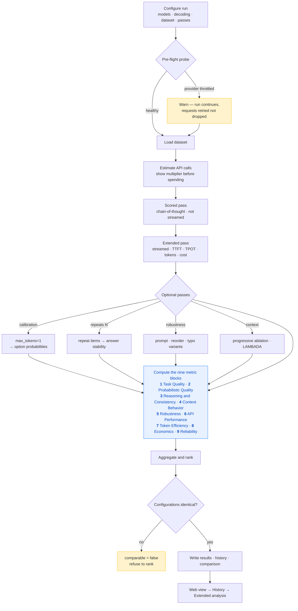

# LAMBADA & MMLU Benchmark — Documentation

Small language models evaluated across nine measurable stages over the OpenRouter API. This page covers the workflow, what each metric means, and the measured results.

*Generated 2026-09-09 17:28 from `results/v2`. The full academic write-up is in `extended-final-report.md`.*

---

## 1. Process Workflow

One benchmark run, end to end. Stages 1-9 are produced by every run; stage 10
is excluded because nothing in it is observable through a hosted inference API.

Stage 10 — hardware and distributed execution (TP, PP, DP, SP, CP, EP; VRAM;
energy) — sits outside this flow. Those are *configuration variables of a
serving deployment*, not properties of a model, and a hosted API exposes none
of them. They are recorded in the run config and would only be measurable on a
self-hosted vLLM path.

### 1.1 The two measurement passes

Each item is sent to the API twice, and the distinction explains small
differences between tables.

| Pass | Prompt | Streamed | Produces |
|---|---|---|---|
| **Scored** | chain-of-thought, then an answer | no | headline accuracy, reasoning analysis |
| **Extended** | identical prompt | yes | TTFT, TPOT, throughput, tokens, cost, reliability |
| **Calibration** *(optional)* | direct answer, `max_tokens = 1` | no | option probabilities → NLL, ECE, Brier, rank |

Time-to-first-token cannot be observed from a single blocking response, so
latency requires streaming. Because the two passes are separate calls, their
accuracies differ slightly even at temperature 0; that residual is serving
non-determinism and the web view states the delta explicitly.

---

## 2. Metric Components

Every metric the benchmark produces, grouped by stage. `Observable` records whether this deployment — a client of a hosted inference API — can measure it at all.

### 2.1 Stage 1 — Task Quality

*Measure model capability. Priority **P0**; observable through OpenRouter: **yes**.*

| Metric | What it measures | Good |
|---|---|---|
| **Overall accuracy** | Correct ÷ questions the API actually answered. | higher |
| **Macro accuracy** | Mean of per-subject accuracies, so a large subject cannot dominate. | higher |
| **Subject / category accuracy** | The same score computed within each subject and each of the four MMLU categories. | higher |
| **Normalised accuracy** | `(acc − chance) ÷ (1 − chance)` — distance above guessing. | higher |
| **Wilson 95% CI** | Binomial interval that stays inside [0,1] at small n. | narrower |
| **Error rate** | `1 − accuracy`, framed as a budget. | lower |
| **Parse-failure rate** | Responses with no extractable answer — disobedience, not ignorance. | lower |
| **Option-position bias** | Distance between the letters picked and the letters that are correct. | lower |
| **Last-word / exact / stem match** | LAMBADA: normalised, byte-identical, and inflection-tolerant matching. | higher |

### 2.2 Stage 2 — Probabilistic Quality

*Measure confidence and probability quality. Priority **P1**; observable through OpenRouter: **conditional**; requires provider that returns token log-probabilities.*

| Metric | What it measures | Good |
|---|---|---|
| **Correct-option probability** | Probability mass placed on the right answer. | higher |
| **Log probability** | `log P(correct)`, averaged. | → 0 |
| **NLL** | `−mean(log P(correct))` — how surprised the model was by the truth. | lower |
| **Perplexity** | `exp(NLL)`. 1.0 = certain and right; 4.0 ≈ guessing among four. | lower |
| **Entropy** | Spread of the predictive distribution. High = unsure. | context |
| **ECE** | Bin by confidence; compare mean confidence against observed accuracy per bin. | lower |
| **MCE** | The worst single bin rather than the weighted mean — tail risk. | lower |
| **Brier score** | Squared error of confidence against outcome. A proper scoring rule. | lower |
| **Confidence↔accuracy correlation** | Whether stated confidence carries any signal. | higher |
| **Target rank / MRR / hit@k** | LAMBADA: where the gold word sat among ranked predictions. | higher |

### 2.3 Stage 3 — Reasoning & Consistency

*Measure stability and reasoning reliability. Priority **P1**; observable through OpenRouter: **yes**; requires repeats > 1 and/or multiple seeds.*

| Metric | What it measures | Good |
|---|---|---|
| **Answer stability** | Share of items where every repeat gave an identical answer. | higher |
| **Majority-vote accuracy** | Accuracy after taking the most common of k samples. | higher |
| **Self-consistency gain** | Majority-vote minus mean single-sample accuracy. | higher |
| **Mean agreement** | How dominant the winning answer was across repeats. | higher |
| **Seed stability** | Accuracy spread across independent seeds. | lower |

### 2.4 Stage 4 — Context Behavior

*Measure context usage and dependency. Priority **P1**; observable through OpenRouter: **yes**; requires context ablation pass.*

| Metric | What it measures | Good |
|---|---|---|
| **Context utilisation** | `acc(full passage) − acc(last sentence only)`. | higher |
| **Utilisation ratio** | Share of skill that depends on the wider passage. 1.0 = entirely. | higher |
| **Context sensitivity** | `acc(full) − acc(no context at all)`. | higher |
| **Context ablation** | Accuracy under a progressive cut-down of the passage. | — |
| **Position sensitivity** | Accuracy bucketed by passage length — a lost-in-the-middle probe. | flat |

### 2.5 Stage 5 — Robustness

*Measure resistance to prompt and input changes. Priority **P1**; observable through OpenRouter: **yes**; requires robustness pass.*

| Metric | What it measures | Good |
|---|---|---|
| **Prompt variation** | The same question under semantically identical templates. | → 0 drop |
| **Option reordering** | Options permuted with the gold letter remapped. | → 0 drop |
| **Input perturbation** | Adjacent-key typos, casing, whitespace, punctuation, homoglyphs. | → 0 drop |
| **Accuracy drop** | `baseline − variant`. | → 0 |
| **Flip rate** | Answers that changed at all — catches offsetting errors. | lower |
| **Broke / fixed** | Right→wrong and wrong→right, counted separately. | lower |
| **Robustness score** | `1 − mean(relative drop)` across all variants. | higher |

### 2.6 Stage 6 — API Performance

*Measure inference-service performance. Priority **P0**; observable through OpenRouter: **yes**.*

| Metric | What it measures | Good |
|---|---|---|
| **TTFT** | Time to the first *content* token — prefill, queueing and network. | lower |
| **TPOT** | `(E2E − TTFT) ÷ (tokens − 1)` — steady-state generation rate. | lower |
| **End-to-end latency** | Total wait for the complete answer. | lower |
| **p50 / p95 / p99** | Latency distribution. For serving, the tail is the experience. | lower |
| **Prefill / decode throughput** | Prompt tokens/s and generated tokens/s. | higher |
| **Request throughput** | Completed requests per second across the run. | higher |

### 2.7 Stage 7 — Token Efficiency

*Measure token consumption and efficiency. Priority **P0**; observable through OpenRouter: **yes**.*

| Metric | What it measures | Good |
|---|---|---|
| **Prompt / completion tokens** | What was billed, as reported by the provider. | lower |
| **Reasoning tokens** | Tokens spent on hidden reasoning; 0 is a real answer. | lower |
| **Cached prompt tokens** | Prompt tokens served from the provider cache, and cheaper. | higher |
| **Tokens per item** | Total tokens ÷ items evaluated. | lower |
| **Tokens per correct answer** | Token cost of a *useful* answer. | lower |

### 2.8 Stage 8 — Economics

*Measure monetary efficiency. Priority **P0**; observable through OpenRouter: **yes**.*

| Metric | What it measures | Good |
|---|---|---|
| **Cost per request** | Provider-reported spend, averaged. | lower |
| **Cost per 1K / 1M tokens** | Blended price actually paid. | lower |
| **Cost per correct answer** | Money per useful answer — the selection criterion. | lower |
| **Correct answers per dollar** | The same ratio inverted. | higher |

### 2.9 Stage 9 — Reliability

*Measure operational stability. Priority **P0**; observable through OpenRouter: **yes**.*

| Metric | What it measures | Good |
|---|---|---|
| **Success / failure rate** | Requests that returned, versus those that errored after retries. | higher / lower |
| **Invalid output rate** | A 200 response carrying nothing usable. | lower |
| **Timeout / 429 rate** | Failures bucketed by class. | lower |
| **Retry rate** | Retries per request — invisible in an accuracy table. | lower |
| **Provider failover** | Whether more than one backend served the run. | no |
| **Reproducibility score** | Seed spread combined with repeat stability. | higher |

### 2.10 Tokenization *(LAMBADA)*

*Separates a tokenizer handicap from a comprehension gap: a multi-token target must be produced correctly several times over.*

| Metric | What it measures | Good |
|---|---|---|
| **Tokens per target word** | Tokens needed for the gold word, with its leading space. | lower |
| **Fragmentation rate** | Share of targets needing more than one token. | lower |
| **Subword exact match** | Match at token level rather than string level. | higher |
| **Accuracy by fragmentation** | Accuracy split by 1 / 2 / 3+ token targets. | — |

### 2.11 Stage 10 — Hardware & Distributed *(excluded)*

The benchmark is a client of a shared, auto-scaled third-party endpoint. Parallelism layout, GPU telemetry and power draw are chosen and held by the provider; none of them is exposed to the caller. Any figure reported here would be fabricated.

**To measure it:** Run the same suite against a self-hosted vLLM backend (benchmark_config.local_vllm_config), where TP/PP/DP/SP/CP/EP become settable variables and VRAM, KV cache, communication overhead and energy become directly measurable.

| Subsection | Metrics |
|---|---|
| Tensor Parallelism | TP Degree, TP Speedup |
| Pipeline Parallelism | PP Degree, PP Speedup |
| Data/Sequence/Context/Expert Parallelism | DP, SP, CP, EP |
| Hardware Telemetry | GPU Utilization, VRAM, KV Cache, Memory Bandwidth |
| Compute Efficiency | FLOPs, MFU, HFU |
| Distributed Scaling | Communication Overhead, Parallel Efficiency, Pipeline Bubble |
| Energy | Joules/token, Tokens/Watt, GPU Power |

---

## 3. Results

Measured values per model, with a short note on where each figure comes from and why it landed where it did.

### 3.1 MMLU

**2,850 questions per model · 3 models · 8,550 scored items.** Greedy decoding (temperature 0.0).

**Task quality**

| Model | Accuracy | 95% CI | Macro (subject) | Normalised | Error rate | Parse fail |
|---|---|---|---|---|---|---|
| Gemma-3-4B | **60.4%** | 58.5–62.1% | 60.4% | 47.1% | 39.6% | 0.4% |
| Llama-3.2-3B | **54.7%** | 52.8–56.5% | 54.7% | 39.6% | 45.3% | 11.7% |
| Ministral-8B | **79.3%** | 77.8–80.8% | 79.3% | 72.4% | 20.7% | 0.6% |

**Serving, tokens and cost**

| Model | TTFT | E2E p95 | Decode tok/s | Tokens / correct | $ / 1M tok | $ / correct |
|---|---|---|---|---|---|---|
| Gemma-3-4B | 0.582 s | 3.117 s | 80.0 | 564 | $0.0821 | $0.000046 |
| Llama-3.2-3B | 0.330 s | 1.171 s | 257.3 | 572 | $0.1453 | $0.000083 |
| Ministral-8B | 0.413 s | 2.738 s | 114.4 | 419 | $0.1226 | $0.000051 |

**Reliability**

| Model | Provider | Success | Failure | Invalid output | Timeout | 429 | Retries | Failover |
|---|---|---|---|---|---|---|---|---|
| Gemma-3-4B | DeepInfra | 99.9% | 0.1% | 0.2% | 0.0% | 0.1% | 40 | no |
| Llama-3.2-3B | Cloudflare | 100.0% | 0.0% | 11.7% | 0.0% | 0.0% | 0 | no |
| Ministral-8B | Mistral | 100.0% | 0.0% | 0.6% | 0.0% | 0.0% | 0 | no |

**Composite ranking**

| # | Model | Quality | Efficiency | Reliability | Composite |
|---|---|---|---|---|---|
| 1 | Ministral-8B | 0.793 | 0.476 | 0.994 | **0.776** |
| 2 | Llama-3.2-3B | 0.547 | 1.000 | 0.883 | **0.659** |
| 3 | Gemma-3-4B | 0.604 | 0.373 | 0.996 | **0.627** |

composite = 0.714·quality + 0.143·efficiency + 0.143·reliability

The nominal weighting is 0.50·quality + 0.15·calibration + 0.15·robustness + 0.10·efficiency + 0.10·reliability. Calibration and robustness could not be measured in this run, so their weight is redistributed proportionally over the components that were — scoring an unmeasured component zero would penalise a model for a study that was never run. The weights above are the ones actually applied.

**Why these numbers**

- **Ministral-8B leads at 79.3%** (95% CI 77.8–80.8%). Accuracy is scored over items the API actually answered; a request refused with a 429 says nothing about the model, so it is excluded from the denominator and reported separately as an error rate.
- **Llama-3.2-3B returns no parseable answer on 11.7% of items.** That is an instruction-following failure, not ignorance — its score understates what it knows. Measured by parsing each response for an answer token and counting the misses separately from wrong answers, because the remedies differ.
- **Cost is provider-reported per request**, not estimated. Gemma-3-4B gives the cheapest correct answer at $0.000046, against $0.000083 for Llama-3.2-3B (1.8×).
- **Latency is client-measured from the streamed response.** Llama-3.2-3B is fastest end-to-end at 0.652 s mean; p95 is reported alongside because the tail, not the mean, is what a user experiences.
- **Blank stages are absences, not zeros.** Probabilistic quality, reasoning and consistency, context behaviour, robustness carry no data here: calibration needs a provider that returns token log-probabilities, and this run was routed to Cloudflare, DeepInfra, Mistral; reasoning and consistency, context behaviour, robustness each need an additional pass over the dataset, which multiplies the API spend. Each is stored as unavailable with its reason rather than filled with 0, so a gap in coverage can never be mistaken for a poor score. The History view can run them after the fact via **Secondary analysis**.

### 3.2 LAMBADA

**1,000 passages per model · 3 models · 3,000 scored items.** Greedy decoding (temperature 0.0).

**Task quality**

| Model | Last-word accuracy | 95% CI | Exact match | Stem match | Error rate | Empty output |
|---|---|---|---|---|---|---|
| Gemma-3-4B | **18.0%** | 15.7–20.5% | 18.0% | 18.5% | 82.0% | 0.1% |
| Llama-3.2-3B | **22.5%** | 20.0–25.2% | 22.5% | 23.2% | 77.5% | 0.0% |
| Ministral-8B | **39.9%** | 36.9–43.0% | 39.9% | 40.2% | 60.1% | 0.0% |

**Context behaviour** — accuracy by passage-length quartile. A flat row means length is not the constraint.

| Model | Q1 (shortest) | Q2 | Q3 | Q4 (longest) | Span |
|---|---|---|---|---|---|
| Gemma-3-4B | 16.8% | 18.8% | 17.6% | 18.8% | 2.0% |
| Llama-3.2-3B | 19.2% | 21.2% | 21.2% | 28.0% | 8.8% |
| Ministral-8B | 37.6% | 38.8% | 36.4% | 45.2% | 8.8% |

**Tokenization** — how much of the gap is the vocabulary rather than comprehension.

| Model | Tokens / target | Fragmented | Acc. 1 token | Acc. 2 tokens | Acc. 3+ tokens | Tokenizer |
|---|---|---|---|---|---|---|
| Gemma-3-4B | 1.45 | 40.6% | 23.6% | 10.6% | 2.6% | approx (fallback BPE) |
| Llama-3.2-3B | 1.45 | 40.6% | 29.5% | 13.4% | 2.6% | approx (fallback BPE) |
| Ministral-8B | 1.52 | 45.8% | 44.3% | 34.8% | 34.5% | exact |

**Serving, tokens and cost**

| Model | TTFT | E2E p95 | Decode tok/s | Tokens / correct | $ / 1M tok | $ / correct |
|---|---|---|---|---|---|---|
| Gemma-3-4B | 0.531 s | 1.336 s | 587.5 | 1060 | $0.1005 | $0.000107 |
| Llama-3.2-3B | 0.345 s | 0.665 s | 673.9 | 954 | $0.1062 | $0.000101 |
| Ministral-8B | 0.537 s | 1.316 s | 816.3 | 462 | $0.2082 | $0.000096 |

**Reliability**

| Model | Provider | Success | Failure | Invalid output | Timeout | 429 | Retries | Failover |
|---|---|---|---|---|---|---|---|---|
| Gemma-3-4B | DeepInfra | 100.0% | 0.0% | 0.1% | 0.0% | 0.0% | 0 | no |
| Llama-3.2-3B | Cloudflare | 100.0% | 0.0% | 0.0% | 0.0% | 0.0% | 0 | no |
| Ministral-8B | Mistral | 100.0% | 0.0% | 0.0% | 0.0% | 0.0% | 0 | no |

**Composite ranking**

| # | Model | Quality | Efficiency | Reliability | Composite |
|---|---|---|---|---|---|
| 1 | Ministral-8B | 0.399 | 0.623 | 1.000 | **0.517** |
| 2 | Llama-3.2-3B | 0.225 | 1.000 | 1.000 | **0.446** |
| 3 | Gemma-3-4B | 0.180 | 0.657 | 0.999 | **0.365** |

composite = 0.714·quality + 0.143·efficiency + 0.143·reliability

The nominal weighting is 0.50·quality + 0.15·calibration + 0.15·robustness + 0.10·efficiency + 0.10·reliability. Calibration and robustness could not be measured in this run, so their weight is redistributed proportionally over the components that were — scoring an unmeasured component zero would penalise a model for a study that was never run. The weights above are the ones actually applied.

**Why these numbers**

- **Ministral-8B leads at 39.9%** (95% CI 36.9–43.0%). Accuracy is scored over items the API actually answered; a request refused with a 429 says nothing about the model, so it is excluded from the denominator and reported separately as an error rate.
- **Cost is provider-reported per request**, not estimated. Ministral-8B gives the cheapest correct answer at $0.000096, against $0.000107 for Gemma-3-4B (1.1×). Gemma-3-4B has the cheapest *tokens* but not the cheapest *answers* — accuracy converts token price into value.
- **Latency is client-measured from the streamed response.** Llama-3.2-3B is fastest end-to-end at 0.354 s mean; p95 is reported alongside because the tail, not the mean, is what a user experiences.
- **Blank stages are absences, not zeros.** Probabilistic quality, reasoning and consistency, robustness carry no data here: calibration needs a provider that returns token log-probabilities, and this run was routed to Cloudflare, DeepInfra, Mistral; reasoning and consistency, robustness each need an additional pass over the dataset, which multiplies the API spend. Each is stored as unavailable with its reason rather than filled with 0, so a gap in coverage can never be mistaken for a poor score. The History view can run them after the fact via **Secondary analysis**.
- **Passage length is not the binding constraint.** Sorting passages by true word count into quartiles moves accuracy by at most 8.8% (Llama-3.2-3B), and not monotonically. §4.4 tests this rather than eyeballing it: length is significant but negligible in size (V = 0.068), while target fragmentation is two to three times larger. The failures are a vocabulary handicap, not a lost-in-the-middle effect. Lengths come from the reconstructed dataset split — the per-item records store only a fixed-length preview, whose word count is *not* passage length (see §4.6).
- **Part of the LAMBADA spread is the tokenizer.** On targets needing 3+ tokens, Ministral-8B holds 34.5% while Llama-3.2-3B falls to 2.6% — a mechanical handicap, since a multi-token word must be produced correctly several times over. Note Gemma-3-4B, Llama-3.2-3B fell back to a generic BPE vocabulary (their tokenizers are gated), so their fragmentation rates are indicative rather than exact.

---

## 4. Statistical Significance and Variance

An accuracy table says Ministral scored 79.3% and Gemma 60.4%. It does not say whether that gap could be noise, nor which of the things that vary across items actually moves the result. Both are computed from the per-item records.

### 4.1 Method

| Test | Question it answers | Why this one | Reported |
|---|---|---|---|
| **Cochran's Q** | Do the models differ at all? | The omnibus. Running three pairwise tests and quoting the smallest p-value would be fishing; Q licenses the pairwise step. | Q, df, p |
| **McNemar** | Is the gap between two models real? | The models answered *identical* items, so the comparison is paired. An unpaired two-proportion test discards that pairing and inflates the variance. Only discordant items carry information. | b, c, χ², p, Δ ± CI, odds ratio |
| **Holm–Bonferroni** | Did we get a false positive from testing three pairs? | Controls the family-wise error rate like Bonferroni, but rejects at least as often, so it costs no power. | adjusted p |
| **χ² independence** | Does a factor change accuracy? | Tests whether correctness is independent of the level an item falls in. Reported with **Cramér's V**, because at thousands of items a trivial association is still significant. | χ², df, p, V, effect |
| **Variance decomposition** | Is the per-subject spread real? | 57 subjects × 50 questions: some spread is genuine difficulty, some is what 50 coin flips do. Subtracting the expected binomial variance leaves the real part. | observed SD, true SD, between-share |
| **Oracle ceiling** | What would picking the best model per item buy? | The gap between the best single model and any-model-correct is headroom that individual accuracies cannot show. | best, oracle, headroom |

All statistics are pure-stdlib implementations (`metrics/significance.py`), pinned against SciPy and statsmodels by `tests/test_significance.py` so the report can be regenerated on a host where SciPy cannot be installed.

### 4.2 Are the model differences real?

**MMLU** — Cochran's Q = 594.659 (df 2), p < 0.0001. The models differ; pairwise tests follow.

| Pair | Δ accuracy | 95% CI | Only A right | Only B right | Odds ratio | p (Holm) | Verdict |
|---|---|---|---|---|---|---|---|
| Gemma-3-4B vs Llama-3.2-3B | +0.0642 | +0.044 to +0.084 | 520 | 337 | 1.543 | < 0.0001 | **significant** |
| Gemma-3-4B vs Ministral-8B | -0.1821 | -0.201 to -0.163 | 163 | 682 | 0.239 | < 0.0001 | **significant** |
| Llama-3.2-3B vs Ministral-8B | -0.2463 | -0.266 to -0.227 | 136 | 838 | 0.162 | < 0.0001 | **significant** |

**LAMBADA** — Cochran's Q = 173.547 (df 2), p < 0.0001. The models differ; pairwise tests follow.

| Pair | Δ accuracy | 95% CI | Only A right | Only B right | Odds ratio | p (Holm) | Verdict |
|---|---|---|---|---|---|---|---|
| Gemma-3-4B vs Llama-3.2-3B | -0.0440 | -0.073 to -0.015 | 89 | 133 | 0.669 | 0.0039 | **significant** |
| Gemma-3-4B vs Ministral-8B | -0.2150 | -0.248 to -0.182 | 58 | 273 | 0.212 | < 0.0001 | **significant** |
| Llama-3.2-3B vs Ministral-8B | -0.1710 | -0.205 to -0.137 | 84 | 255 | 0.329 | < 0.0001 | **significant** |

### 4.3 Do the models fail on the same items?

High overlap means the items are hard; disjoint failures mean the models have different competences and routing would pay.

| Benchmark | Pair | Agreement | Both wrong | φ |
|---|---|---|---|---|
| MMLU | Gemma-3-4B vs Llama-3.2-3B | 69.9% | 27.0% | 0.389 |
| MMLU | Gemma-3-4B vs Ministral-8B | 70.3% | 14.9% | 0.350 |
| MMLU | Llama-3.2-3B vs Ministral-8B | 65.8% | 15.9% | 0.324 |
| LAMBADA | Gemma-3-4B vs Llama-3.2-3B | 77.8% | 68.7% | 0.316 |
| LAMBADA | Gemma-3-4B vs Ministral-8B | 66.9% | 54.7% | 0.271 |
| LAMBADA | Llama-3.2-3B vs Ministral-8B | 66.1% | 52.1% | 0.253 |

| Benchmark | Best single model | Best | Oracle (any correct) | Headroom | No model correct |
|---|---|---|---|---|---|
| MMLU | Ministral-8B | 79.4% | 87.8% | +8.4% | 12.2% |
| LAMBADA | Ministral-8B | 39.5% | 51.5% | +12.0% | 48.5% |

### 4.4 Which factors move the outcome?

Significance and size are different questions. At thousands of items almost any factor reaches p < 0.05, so Cramér's V decides whether it matters.

| Benchmark | Factor | Levels | Accuracy spread | χ² | p | V | Effect |
|---|---|---|---|---|---|---|---|
| MMLU | subject category | 4 | 11.3% | 74.819 | < 0.0001 | 0.0935 | negligible |
| MMLU | correct-option position | 4 | 7.0% | 26.694 | < 0.0001 | 0.0559 | negligible |
| LAMBADA | passage length (true) | 4 | 14.9% | 13.89 | 0.0031 | 0.068 | negligible |
| LAMBADA | target fragmentation — Gemma-3-4B | 3 | 21.0% | 32.295 | < 0.0001 | 0.1797 | small |
| LAMBADA | target fragmentation — Llama-3.2-3B | 3 | 26.7% | 42.351 | < 0.0001 | 0.2058 | small |
| LAMBADA | target fragmentation — Ministral-8B | 3 | 13.1% | 10.715 | 0.0047 | 0.1035 | small |

**MMLU — accuracy by subject category**

| humanities | other | social_sciences | stem |
|---|---|---|---|
| 65.7% | 68.1% | 70.2% | 58.9% |

**MMLU — accuracy by correct-option position**

| answer = A | answer = B | answer = C | answer = D |
|---|---|---|---|
| 66.7% | 64.8% | 68.1% | 61.1% |

**LAMBADA — accuracy by passage length (true)**

| Q1 <=72w | Q2 73-87w | Q3 88-102w | Q4 >102w |
|---|---|---|---|
| 25.4% | 26.8% | 37.1% | 22.2% |

### 4.5 How much of the MMLU subject spread is real?

| Quantity | Value | Reading |
|---|---|---|
| Subjects | 57 | ~50 questions each |
| Observed SD across subjects | 13.3 pp | raw spread |
| Sampling (binomial) variance | 0.00140 | what 50 draws do on their own |
| True between-subject SD | 12.8 pp | after removing that |
| Between-group share | **0.921** | share of spread that is real |

Under a null of identical subjects this share averages about 0.08 and rarely passes 0.3, so **0.92 is decisive**: subject difficulty is a real, large effect and the per-subject table can be read. Hardest: moral_scenarios (37%), abstract_algebra (39%), high_school_physics (41%). Easiest: high_school_psychology (87%), marketing (86%), high_school_government_and_politics (85%).

### 4.6 What this changes

- **Every pairwise gap survives correction on both benchmarks.** The ranking is not an artefact of sampling — at these item counts the differences are far larger than the paired intervals.
- **Tokenization matters; passage length barely does.** Length reaches significance (p = 0.0031) but with V = 0.068 — negligible, and the accuracy is not even monotonic in length. Target fragmentation reaches V = 0.2058 on the worst-affected model, two to three times the length effect. The LAMBADA gap is mostly a vocabulary handicap, not a context-window one.
- **Subject category is significant but small.** p < 0.0001 with V = 0.0935 (negligible) across an 11.3% spread — a good illustration of why V is reported: with 8,550 pooled items, significance alone would have overstated it.
- **A measurable option-position effect.** Accuracy varies with *where the correct answer sits*: answer = C scores 68.1%, answer = D 61.1% (p < 0.0001, V = 0.0559). Small, but it is a property of the harness, not the knowledge being tested — which is why the robustness stage permutes options.
- **MMLU: routing headroom of 8.4%.** Some model answers 87.8% of items correctly, against 79.4% for the best single model. The failures are only partly shared — 12.2% defeat all three.
- **LAMBADA: routing headroom of 12.0%.** Some model answers 51.5% of items correctly, against 39.5% for the best single model. The failures are only partly shared — 48.5% defeat all three.
- **One correction.** Section 3's context-behaviour table previously bucketed items by the length of a stored *preview* string, which is truncated to a fixed 203 characters — so it ranked items by mean word length and correlated −0.20 with true passage length. It has been recomputed from the reconstructed dataset split (verified target-by-target against the stored results), and `metrics/context.py` now refuses to compute the metric from a preview at all. The conclusion was unchanged, but it had been reached from the wrong variable.
