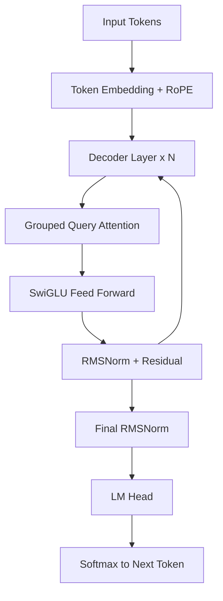
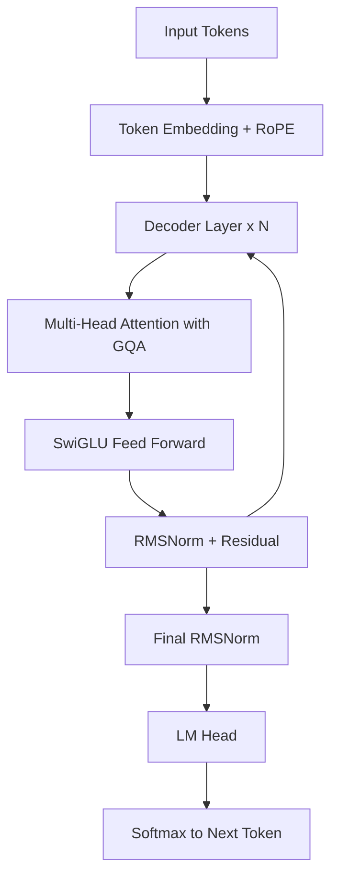
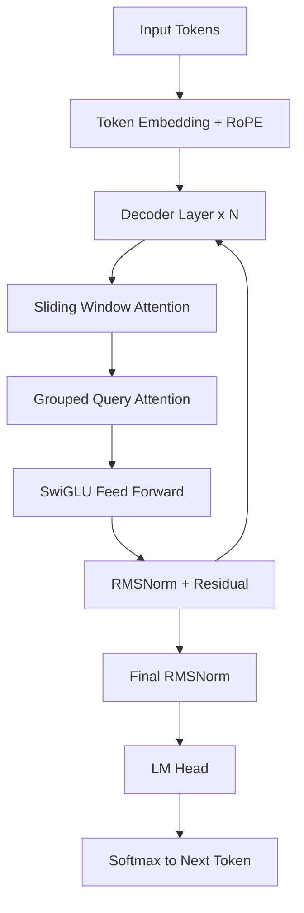
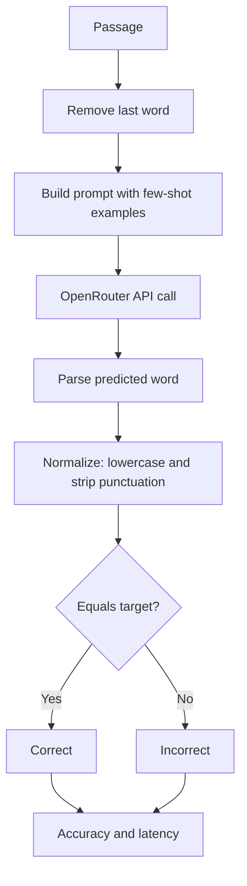
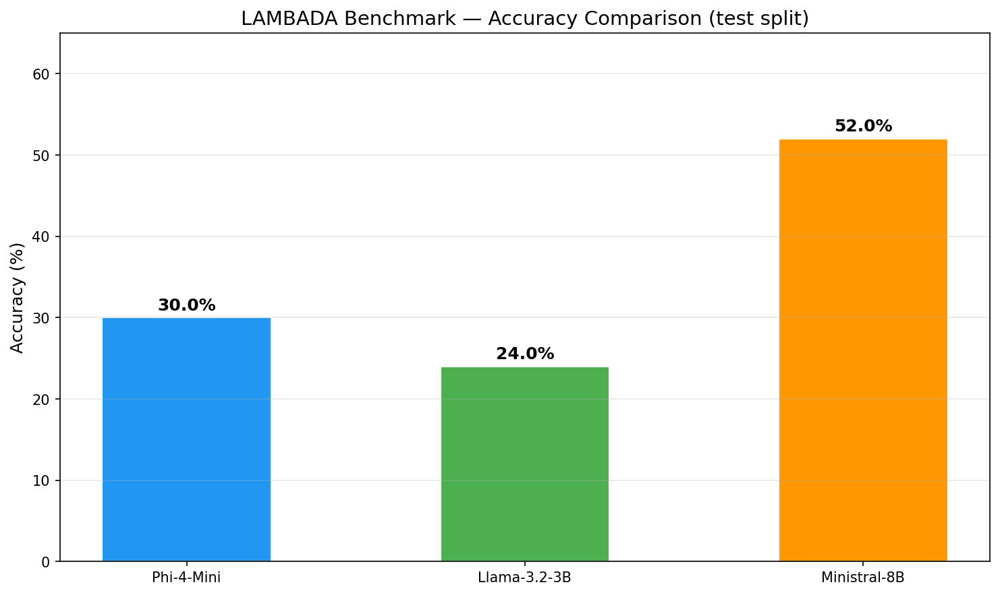
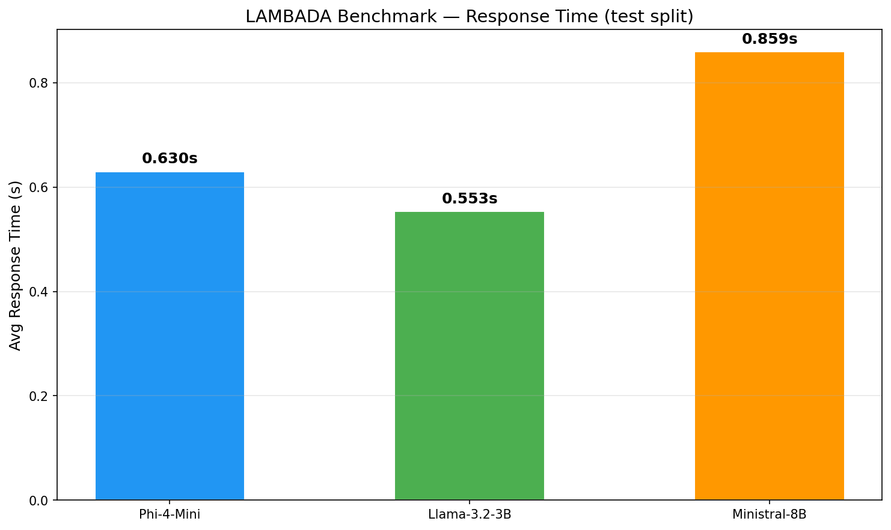
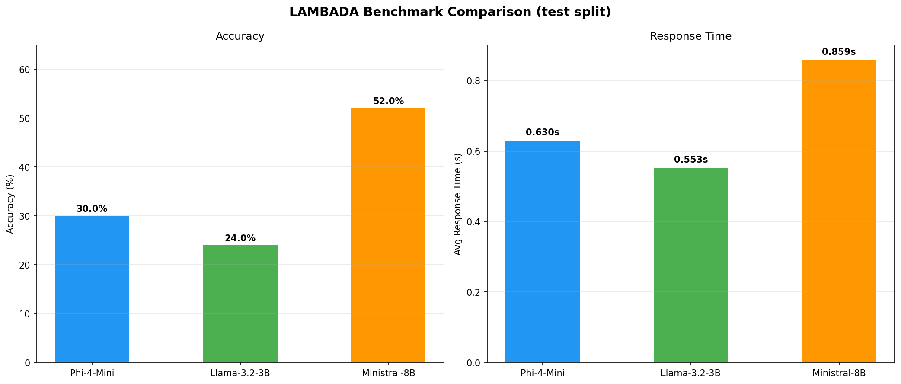
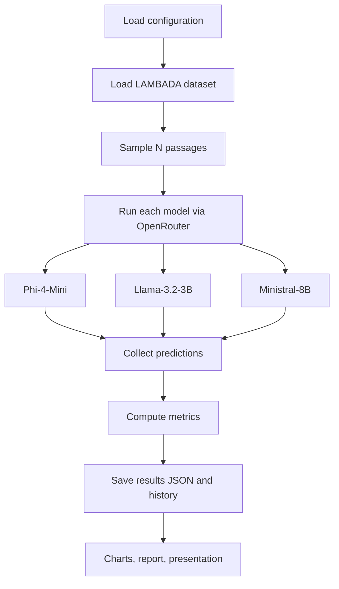

# LAMBADA Benchmark Evaluation Report

Evaluating small language models on long-range word prediction

Submitted to: Prof. Anna Corazza
Submitted by: Francesco Ventimiglia, Danilo Rodriguez, Rohan Baidya
Github link: https://github.com/ronvoy/gen-ai
Site Link: https://unina.cc/gen-ai

## 1. Introduction

- We test three small language models on the LAMBADA benchmark.
- LAMBADA asks the model to predict the final word of a passage, guessable only from the full context.
- This makes it a focused test of long-range context.
- All models run through the OpenRouter API for a hardware-neutral comparison.

## 2. Small Language Models Used

### 2.1 Models at Glance

| # | Model | Developer | Parameters | Architecture | Key Technique |
|---|-------|-----------|------------|--------------|---------------|
| 1 | Phi-4-Mini | Microsoft | 3.8B | Dense decoder-only transformer with Grouped Query Attention | Curated and synthetic data training |
| 2 | Llama-3.2-3B | Meta | 3B | Dense decoder-only transformer with Grouped Query Attention | Compact dense transformer |
| 3 | Ministral-8B | Mistral AI | 8B | Decoder-only transformer with Sliding Window Attention | Sliding Window Attention + GQA |

### 2.2 Phi-4-Mini (Microsoft)

- 3.8B dense decoder-only transformer from Microsoft.
- Built around data quality over scale, using filtered web and synthetic textbook-style data.
- Grouped query attention and a 128k vocabulary.

**Working technique - Curated and synthetic data training:**

- Cleaner training data lets a small model learn more per parameter.
- Stays cheap to run while staying competitive on language tasks.

Key properties:

- Dense transformer, no expert routing.
- Grouped Query Attention for a smaller KV cache.
- Small footprint for edge and low-latency use.

#### Process flow - Phi-4-Mini inference

### 2.3 Llama-3.2-3B (Meta)

- 3B instruction-tuned model from Meta for on-device, low-cost use.
- Standard Llama recipe: dense transformer with RoPE, GQA, and SwiGLU layers.
- Built by pruning and distilling from larger Llama 3.1 models.

**Working technique - Compact dense transformer:**

- Takes the proven dense transformer design and shrinks it.
- Predictable and easy to serve on modest hardware.

Key properties:

- Dense decoder-only transformer.
- RoPE position embeddings for length generalisation.
- Grouped Query Attention and SwiGLU layers.

#### Process flow - Llama-3.2-3B inference

### 2.4 Ministral-8B (Mistral AI)

- 8B model from Mistral AI, built for edge use.
- Interleaved sliding window attention keeps memory and compute low on long inputs.
- Grouped query attention further shrinks the KV cache.

**Working technique - Sliding Window Attention + GQA:**

- Each layer attends only to a local window instead of every token.
- Stacked layers carry context further than any single window.
- GQA shares key-value heads for fast decoding on long passages.

Key properties:

- Sliding window attention for local context.
- Grouped Query Attention for a smaller KV cache.
- Efficient long-context inference at the edge.

#### Process flow - Ministral-8B inference

## 3. Dataset Overview

- LAMBADA is drawn from the BookCorpus.
- Each passage is chosen so the final word is predictable from the full passage but not from the last sentence alone.

### 3.1 Splits

| Split | File | Passages | Purpose |
|-------|------|----------|---------|
| Test | lambada_test_plain_text.txt | 5,153 | Primary evaluation |
| Development | lambada_development_plain_text.txt | 4,869 | Validation and tuning |
| Control Test | lambada_control_test_data_plain_text.txt | 5,000 | Baseline, unfiltered |
| Rejected | rejected_plain_text.txt | 11,941 | Passages cut during curation |
| Training Novels | train-novels/ (16 genres) | 2,662 novels | Pre-training material |
| Vocabulary | lambada-vocab-2.txt | 112,746 entries | Reference vocabulary |

### 3.2 Properties

| Property | Value |
|----------|-------|
| Source corpus | BookCorpus (unpublished novels) |
| Language | English |
| Task type | Word prediction |
| Curation criterion | Target guessable from full context only |
| First published | ACL 2016 (Paperno et al.) |

## 4. Benchmark Method

### 4.1 Metrics

| Metric | Definition | Better |
|--------|------------|--------|
| Exact-match accuracy | correct / total after lowercasing and stripping punctuation | Higher |
| Average response time | Mean wall-clock time per API call | Lower |
| Error rate | errors / total (timeouts, failures) | Lower |
| Throughput | total / total wall-clock time | Higher |

### 4.2 Scoring Flow

### 4.3 Fine-Tuning Parameters

- The Fine Tune panel exposes decoding parameters; it does not change model weights.
- For single-word prediction, greedy decoding with more examples works best.

| Parameter | Range | Effect |
|-----------|-------|--------|
| Temperature | 0.0 - 2.0 | Higher adds randomness; 0.0 is greedy and deterministic |
| Top-p | 0.0 - 1.0 | Nucleus sampling cutoff; lower keeps only the likeliest tokens |
| Max tokens | 1 - 128 | Cap on answer length; a single word needs very few |
| Few-shot examples | 0 - 5 | Worked examples added to the prompt to set the format |
| Frequency penalty | -2.0 - 2.0 | Discourages repeating tokens |
| Presence penalty | -2.0 - 2.0 | Encourages introducing new tokens |

Presets: Optimal (greedy, five examples), Balanced (mild sampling), Creative (high temperature).

## 5. Results

Latest run on 50 sampled passages from the test split.

| Model | Accuracy (%) | Correct | Total | Avg Latency (s) | Error Rate (%) | Throughput (samples/s) |
|-------|-------------|---------|-------|-----------------|----------------|----------------------|
| Phi-4-Mini | 30.0 | 15 | 50 | 0.630 | 0.0 | 1.59 |
| Llama-3.2-3B | 24.0 | 12 | 50 | 0.553 | 0.0 | 1.81 |
| Ministral-8B | 52.0 | 26 | 50 | 0.859 | 0.0 | 1.16 |

Best accuracy: Ministral-8B at 52.0 percent.

Fastest: Llama-3.2-3B at 0.553 s per query.

#### Per-Model Statistics

| Statistic | Phi-4-Mini | Llama-3.2-3B | Ministral-8B |
|-----------|------------|--------------|--------------|
| Accuracy | 30.0% | 24.0% | 52.0% |
| Correct | 15 / 50 | 12 / 50 | 26 / 50 |
| Mean latency | 0.630s | 0.553s | 0.859s |
| Median latency | 0.608s | 0.535s | 0.639s |
| Errors | 0 | 0 | 0 |

### 5.1 Accuracy

### 5.2 Response Time

### 5.3 Combined Metrics

## 6. Project Workflow

## 7. Conclusion

- Ministral-8B was the most accurate; Llama-3.2-3B was the fastest.
- LAMBADA rewards real use of context over surface patterns.
- The usual trade-off holds: stronger context handling helps accuracy, smaller models answer faster.

---

- Paperno, D. et al. (2016). The LAMBADA dataset. Proceedings of ACL 2016.
- Microsoft (2024). Phi-4 technical report.
- Meta (2024). Llama 3.2 model card.
- Mistral AI (2024). Ministral model family.
