# LAMBADA & MMLU Benchmark Evaluation Report

Evaluating small language models on long-range word prediction (LAMBADA) and multi-subject knowledge & reasoning (MMLU)

Submitted to: Prof. Anna Corazza
Submitted by: Francesco Ventimiglia, Danilo Rodriguez, Rohan Baidya
Github link: https://github.com/ronvoy/gen-ai
Site Link: https://unina.cc/gen-ai

## 1. Introduction

- We test three small language models on two complementary benchmarks.
- LAMBADA asks the model to predict the final word of a passage, guessable only from the full context - a focused test of long-range context handling.
- MMLU (Massive Multitask Language Understanding) is a multiple-choice knowledge and reasoning test spanning 57 subjects in four categories (STEM, Humanities, Social Sciences, Other); the model must write short step-by-step reasoning before committing to an answer letter.
- All models run through the OpenRouter API for a hardware-neutral comparison.
- Both benchmarks share one web app with live terminal output, run history, presets, and charts.

## 2. Small Language Models Used

### 2.1 Models at Glance

| # | Model | Developer | Parameters | OpenRouter id | Architecture | Key Technique |
|---|-------|-----------|------------|---------------|--------------|---------------|
| 1 | Gemma-3-4B | Google | 4B | `google/gemma-3-4b-it` | Dense decoder-only transformer with interleaved local/global attention | Knowledge distillation + local/global attention interleaving |
| 2 | Llama-3.2-3B | Meta | 3B | `meta-llama/llama-3.2-3b-instruct` | Dense decoder-only transformer with Grouped Query Attention | Compact dense transformer |
| 3 | Ministral-8B | Mistral AI | 8B | `mistralai/ministral-8b-2512` | Decoder-only transformer with Sliding Window Attention | Sliding Window Attention + GQA |

### 2.2 Gemma-3-4B (Google)

- 4B instruction-tuned dense decoder-only transformer from Google, built with the same research that powers Gemini.
- Interleaves several local sliding-window attention layers with an occasional global attention layer, keeping memory low while information still flows across a long context (up to 128k tokens).
- The small Gemma 3 models are trained with knowledge distillation from larger teacher models.

**Working technique - Knowledge distillation + local/global attention interleaving:**

- Most layers only look at a local window of nearby tokens (cheap); every few layers one global layer lets any token attend to the whole context (expressive).
- Distillation teaches the small model to match a larger teacher's output distribution rather than raw text alone, delivering strong quality per parameter at edge-friendly cost.

Key properties:

- Dense decoder-only transformer, no expert routing.
- 5:1 interleaving of local sliding-window and global attention layers.
- Grouped Query Attention with QK-norm; 128k-token context window.
- Distilled from larger Gemma/Gemini-family teacher models.

#### Process flow - Gemma-3-4B inference

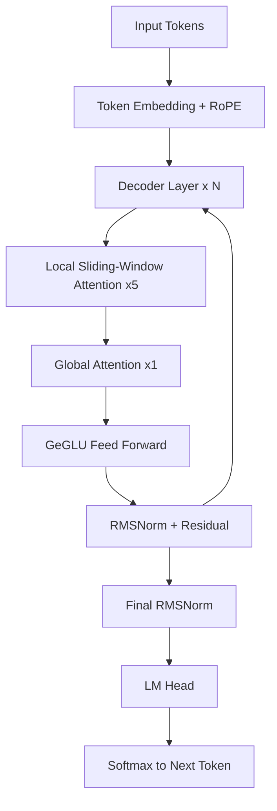

### 2.3 Llama-3.2-3B (Meta)

- 3B instruction-tuned model from Meta for on-device, low-cost use.
- Standard Llama recipe: dense transformer with RoPE, GQA, and SwiGLU layers.
- Built by pruning and distilling from larger Llama 3.1 models.

**Working technique - Compact dense transformer:**

- Takes the proven dense transformer design and shrinks it.
- Predictable and easy to serve on modest hardware.

Key properties:

- Dense decoder-only transformer.
- RoPE position embeddings for length generalisation.
- Grouped Query Attention and SwiGLU layers.

#### Process flow - Llama-3.2-3B inference

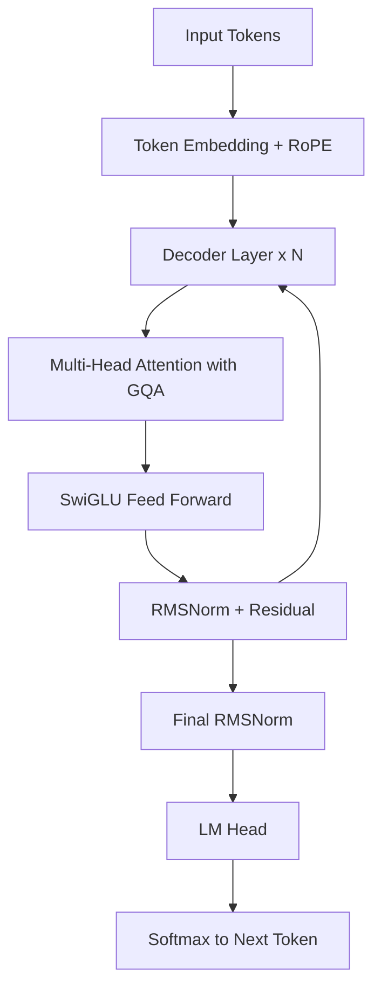

### 2.4 Ministral-8B (Mistral AI)

- 8B model from Mistral AI, built for edge use.
- Interleaved sliding window attention keeps memory and compute low on long inputs.
- Grouped query attention further shrinks the KV cache.

**Working technique - Sliding Window Attention + GQA:**

- Each layer attends only to a local window instead of every token.
- Stacked layers carry context further than any single window.
- GQA shares key-value heads for fast decoding on long passages.

Key properties:

- Sliding window attention for local context.
- Grouped Query Attention for a smaller KV cache.
- Efficient long-context inference at the edge.

#### Process flow - Ministral-8B inference

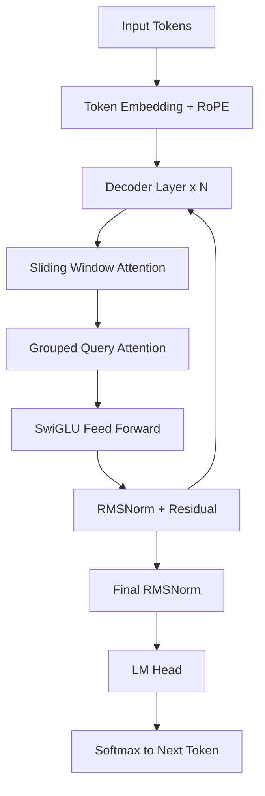

## 3. LAMBADA Benchmark

### 3.1 Dataset Overview

- LAMBADA is drawn from the BookCorpus.
- Each passage is chosen so the final word is predictable from the full passage but not from the last sentence alone.

#### Splits

| Split | File | Passages | Purpose |
|-------|------|----------|---------|
| Test | lambada_test_plain_text.txt | 5,153 | Primary evaluation |
| Development | lambada_development_plain_text.txt | 4,869 | Validation and tuning |
| Control Test | lambada_control_test_data_plain_text.txt | 5,000 | Baseline, unfiltered |
| Rejected | rejected_plain_text.txt | 11,941 | Passages cut during curation |
| Training Novels | train-novels/ (16 genres) | 2,662 novels | Pre-training material |
| Vocabulary | lambada-vocab-2.txt | 112,746 entries | Reference vocabulary |

#### Properties

| Property | Value |
|----------|-------|
| Source corpus | BookCorpus (unpublished novels) |
| Language | English |
| Task type | Word prediction |
| Curation criterion | Target guessable from full context only |
| First published | ACL 2016 (Paperno et al.) |

### 3.2 Metrics

| Metric | Definition | Better |
|--------|------------|--------|
| Exact-match accuracy | correct / total after lowercasing and stripping punctuation | Higher |
| Average response time | Mean wall-clock time per API call | Lower |
| Error rate | errors / total (timeouts, failures) | Lower |
| Throughput | total / total wall-clock time | Higher |

### 3.3 Scoring Flow

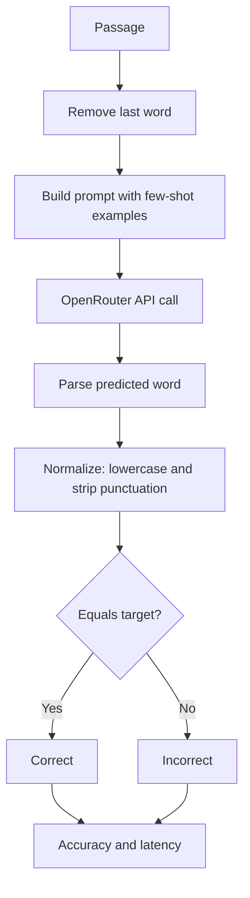

### 3.4 Fine-Tuning Parameters

- The Fine Tune panel exposes decoding parameters; it does not change model weights.
- For single-word prediction, greedy decoding with more examples works best.

| Parameter | Range | Effect |
|-----------|-------|--------|
| Temperature | 0.0 - 2.0 | Higher adds randomness; 0.0 is greedy and deterministic |
| Top-p | 0.0 - 1.0 | Nucleus sampling cutoff; lower keeps only the likeliest tokens |
| Max tokens | 1 - 128 | Cap on answer length; a single word needs very few |
| Few-shot examples | 0 - 5 | Worked examples added to the prompt to set the format |
| Frequency penalty | -2.0 - 2.0 | Discourages repeating tokens |
| Presence penalty | -2.0 - 2.0 | Encourages introducing new tokens |

Presets (see Section 6): Optimal (greedy decoding, five worked examples - most reliable accuracy), Normal (balanced defaults), Best Performance (trimmed token and example budget for the fastest, cheapest runs).

### 3.5 Results

Latest saved metrics per model on the test split.

| Model | Accuracy (%) | Correct | Total | Avg Latency (s) | Errors |
|-------|-------------|---------|-------|-----------------|--------|
| Gemma-3-4B | 21.9 | 219 | 1000 | 1.198 | 0 |
| Llama-3.2-3B | 20.8 | 208 | 1000 | 0.577 | 0 |
| Ministral-8B | 38.1 | 381 | 1000 | 0.731 | 0 |

Best accuracy: Ministral-8B at 38.1 percent. Fastest: Llama-3.2-3B at 0.577 s per query. Gemma-3-4B's accuracy holds steady at 21.9 percent on the full 1,000-sample test split (consistent with its earlier 50-sample estimate of 22.0 percent), but at this sample size it is now clearly the slowest model at 1.198 s per query, well behind Llama-3.2-3B and Ministral-8B.

#### Charts

Accuracy per model:

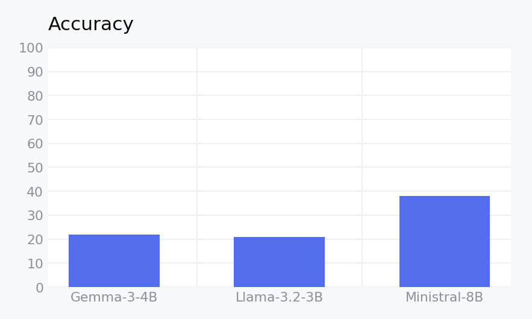

Average response time per model:

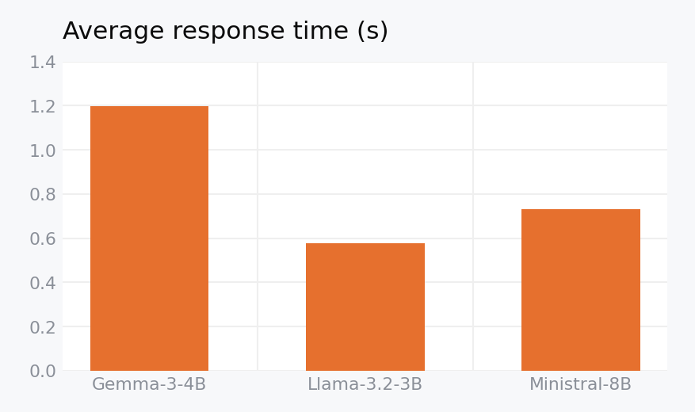

### 3.6 SLM Web App

The LAMBADA run panel: model and sample-count inputs, Run Benchmark and Fine Tune (presets) buttons, the live terminal streaming per-sample processing output (green = correct prediction, red = wrong), and the metrics table below with the latest saved results for all three models.

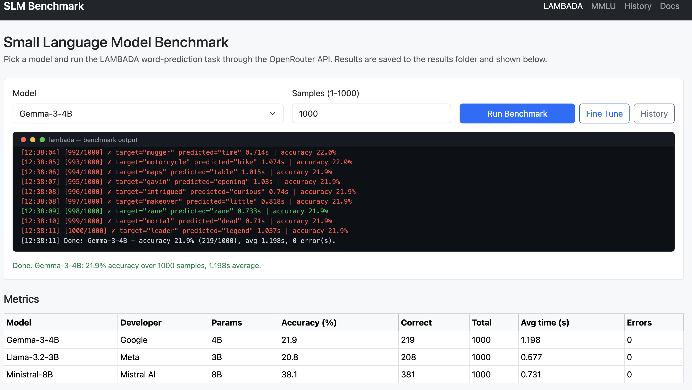

## 4. MMLU Benchmark

How the MMLU benchmark runs in this project, from a click on "Run MMLU" (or `./run_mmlu.sh`) to the ranking table, charts, and per-question reasoning shown in the web app. For every question the model must first write short step-by-step reasoning and then commit to one of four options (A-D); both the final letter and the reasoning text are parsed and evaluated.

### 4.1 Workflow Diagram

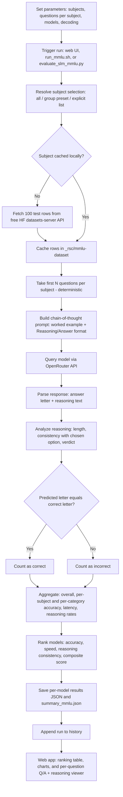

### 4.2 Chronological Steps

| #   | Step               | What happens                                                                                                                                         | Where (file / function)                                    |
|-----|--------------------|------------------------------------------------------------------------------------------------------------------------------------------------------|------------------------------------------------------------|
| 1   | Parameters         | Read subjects, questions per subject, models, decoding params (all documented at the top of the script and shell runner)                             | `evaluate_slm_mmlu.py` (RUN PARAMETERS), `run_mmlu.sh`     |
| 2   | Trigger            | User clicks Run MMLU, runs `./run_mmlu.sh`, or `python evaluate_slm_mmlu.py`                                                                         | `passenger_wsgi.py` (`/mmlu/run`) or `run_mmlu_evaluation` |
| 3   | Resolve subjects   | Turn "all", a group preset, or a list into valid subject names                                                                                       | `resolve_subjects`                                         |
| 4   | Fetch questions    | Download the first 100 test rows per subject from the free Hugging Face datasets-server API (cais/mmlu, fallback tasksource/mmlu); no API key needed | `_download_subject`                                        |
| 5   | Cache              | Store rows in `_rsc/mmlu-dataset/<subject>.json` so reruns are offline and repeatable                                                                | `fetch_subject_questions`                                  |
| 6   | Sample             | Take the first N questions per subject (deterministic, no randomness)                                                                                | `fetch_subject_questions`, `load_mmlu_tasks`               |
| 7   | Build prompt       | Chain-of-thought prompt: one worked example, strict `Reasoning:` then `Answer: <letter>` output format                                               | `build_mmlu_prompt`, `WORKED_EXAMPLE`                      |
| 8   | Query model        | Send the prompt to the chosen model through OpenRouter                                                                                               | `query_model_mmlu` (HTTP POST)                             |
| 9   | Parse              | Extract the answer letter AND the reasoning text (handles `Reasoning:/Answer:`, `<think>` blocks, "the answer is (B)", bare letters, truncation)     | `parse_mmlu_response`                                      |
| 10  | Evaluate reasoning | Score the reasoning: is it present, how long, does it actually support the chosen option; assign a verdict                                           | `analyze_reasoning`                                        |
| 11  | Compare            | Exact match: predicted letter equals the correct letter                                                                                              | `evaluate_model_mmlu`                                      |
| 12  | Aggregate          | Overall / per-subject / per-category accuracy, latency, errors, reasoning rates                                                                      | `evaluate_model_mmlu`                                      |
| 13  | Rank               | Per-dimension ranks and composite score across all evaluated models                                                                                  | `build_mmlu_summary`                                       |
| 14  | Save               | Write `results/<model>_mmlu.json` and `results/summary_mmlu.json`                                                                                    | `run_mmlu_evaluation` / `run_mmlu_benchmark`               |
| 15  | History            | Append the run (models, subjects, question count, params) to history                                                                                 | `passenger_wsgi.append_history`                            |
| 16  | Present            | Ranking table, accuracy charts, and the per-question Q/A + reasoning accordion                                                                       | `templates/mmlu.html` (Chart.js)                           |

### 4.3 Components

| Component          | File                                                                        | Role                                                                                                                                                 |
|--------------------|-----------------------------------------------------------------------------|------------------------------------------------------------------------------------------------------------------------------------------------------|
| Run parameters     | `evaluate_slm_mmlu.py` (top), `run_mmlu.sh` (top)                           | Subject selection ("all", group presets, or explicit list), questions per subject (1-100), models, decoding params - every option listed in comments |
| Subject catalogue  | `MMLU_SUBJECTS`, `SUBJECT_GROUPS`, `CATEGORY_LABELS`                        | The 57 subjects mapped to their official categories; group presets derived from the mapping                                                          |
| Dataset fetcher    | `fetch_subject_questions`, `_download_subject`                              | Free HF datasets-server API client with source fallback and local JSON cache                                                                         |
| Task loader        | `load_mmlu_tasks`                                                           | Flattens subjects x questions into one ordered task list                                                                                             |
| Prompt builder     | `build_mmlu_prompt`, `WORKED_EXAMPLE`                                       | Chain-of-thought prompt with a worked example enforcing a parseable format                                                                           |
| Model client       | `query_model_mmlu`                                                          | OpenRouter chat-completions call with timing and error capture                                                                                       |
| Response parser    | `parse_mmlu_response`                                                       | Splits a raw response into (answer letter, reasoning text)                                                                                           |
| Reasoning analyzer | `analyze_reasoning`                                                         | Heuristic quality check: presence, word count, consistency, verdict                                                                                  |
| Evaluator          | `evaluate_model_mmlu`                                                       | Runs all tasks for one model; aggregates accuracy and reasoning metrics                                                                              |
| Ranker             | `build_mmlu_summary`                                                        | Per-dimension ranks + composite score across models                                                                                                  |
| CLI runner         | `run_mmlu_evaluation`, `_parse_cli`, `run_mmlu.sh`                          | One-shot terminal pipeline: setup, install, run, print ranking                                                                                       |
| Web routes         | `passenger_wsgi.py`: `/mmlu`, `/mmlu/run`, `/mmlu/metrics`, `/mmlu/details`, `/progress/<job_id>` | Online runs, live progress feed, ranking JSON, and the per-question detail feed                                              |
| Web page           | `templates/mmlu.html`                                                       | Subject picker with presets, decoding sliders + presets, live terminal, ranking table, charts, Q/A + reasoning viewer                                |

### 4.4 Metrics Produced

| Metric                | Definition                                                                                                               |
|-----------------------|--------------------------------------------------------------------------------------------------------------------------|
| Accuracy              | correct letters / total questions (exact match)                                                                          |
| Category accuracy     | Accuracy aggregated over STEM / Humanities / Social Sciences / Other                                                     |
| Subject accuracy      | correct / total per individual subject                                                                                   |
| Average response time | Mean wall-clock seconds per API call                                                                                     |
| Errors                | Count of failed or timed-out API calls                                                                                   |
| Reasoning rate        | Share of answers that came with a non-trivial explanation (>= 5 words)                                                   |
| Reasoning consistency | Share of answers whose reasoning actually supports the chosen option (names the letter or reuses the choice's key words) |
| Avg reasoning words   | Mean length of the parsed reasoning text                                                                                 |
| Composite score       | 0.70 x accuracy + 0.15 x reasoning consistency + 0.15 x relative speed (fastest avg time / model's avg time)             |

### 4.5 Reasoning Verdicts (per question)

| Verdict          | Meaning                                                                 |
|------------------|-------------------------------------------------------------------------|
| sound            | Correct answer, and the reasoning clearly supports it                   |
| right-weak-link  | Correct answer, reasoning present but does not clearly support the pick |
| lucky-guess      | Correct answer with no real reasoning                                   |
| flawed-reasoning | Reasoned its way to a wrong answer                                      |
| blind-guess      | Wrong answer and no reasoning                                           |
| no-answer        | No A-D letter could be parsed (API error or malformed output)           |

### 4.6 Results

Latest full run: all 57 subjects x 5 questions = 285 questions per model, zero API errors.

| Rank | Model | Accuracy (%) | STEM | Human. | Social | Other | Reasoning consist. (%) | Avg words | Avg time (s) | Composite |
|------|-------|-------------|------|--------|--------|-------|------------------------|-----------|--------------|-----------|
| 1 | Ministral-8B | 78.9 | 78.9 | 73.9 | 83.3 | 80.0 | 69.1 | 54.1 | 1.537 | 0.731 |
| 2 | Llama-3.2-3B | 55.8 | 43.3 | 63.1 | 63.3 | 58.6 | 59.7 | 61.8 | 0.768 | 0.630 |
| 3 | Gemma-3-4B | 63.9 | 61.1 | 61.5 | 73.3 | 61.4 | 64.6 | 59.3 | 2.502 | 0.590 |

- Ministral-8B leads every category and the composite score.
- Gemma-3-4B is second on accuracy and reasoning consistency, but its 2.5 s average latency drops it below the much faster Llama-3.2-3B on the composite ranking.

Models are ranked per dimension (1 = best) on accuracy, speed, and reasoning consistency, then ordered by the composite score. Accuracy dominates the composite (70%); reasoning quality and latency (15% each) break ties, which mirrors how small language models are picked in practice: quality first, then cost and latency.

#### Charts

Overall accuracy per model, driving the composite ranking:

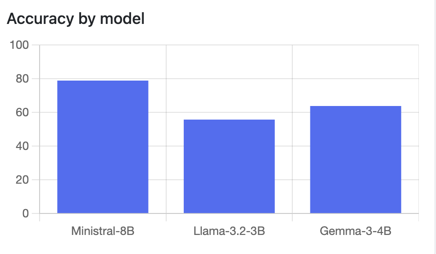

Subject-category accuracy (STEM / Humanities / Social Sciences / Other) per model:

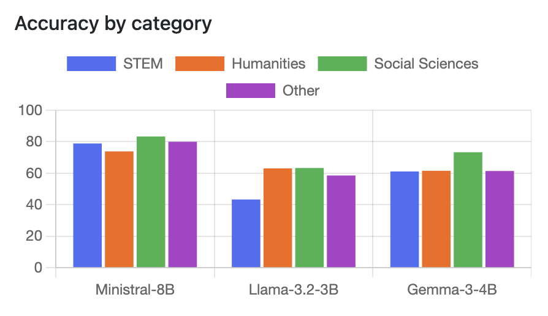

### 4.7 MMLU Web App

The MMLU run panel: model and questions-per-subject inputs, subject picker with category presets, and the live terminal that streams processing output below the input fields before and during a run.

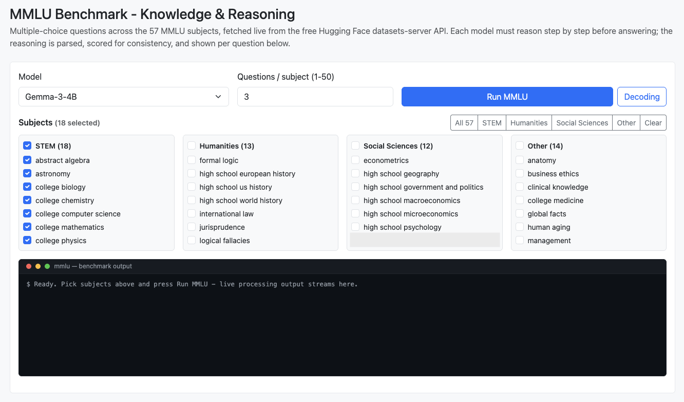

The Q/A section lists every question the selected model saw, grouped per subject with a correct-count badge and category tag:

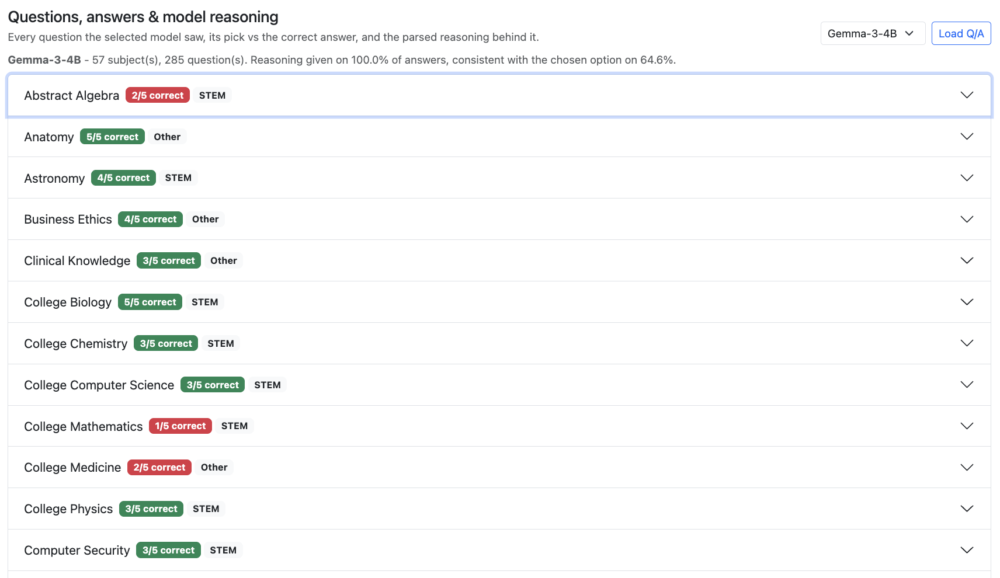

Expanding a subject shows each question with the model's pick vs the correct answer, its parsed reasoning, the reasoning verdict, and per-question latency:

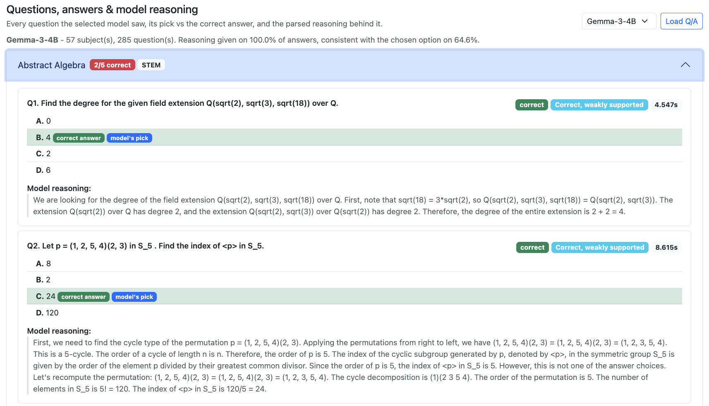

## 5. Fine-Tuning Presets

Both benchmark pages expose one-click presets over the decoding parameters. They control decoding, not model weights.

### 5.1 LAMBADA Presets (`PRESETS` in config.py)

| Preset | Temperature | Top-p | Max tokens | Few-shot | Intent |
|--------|-------------|-------|------------|----------|--------|
| Optimal | 0.0 | 1.0 | 16 | 5 | Greedy decoding with the most worked examples - most reliable accuracy |
| Normal | 0.3 | 0.9 | 32 | 3 | Balanced default |
| Best Performance | 0.0 | 1.0 | 8 | 2 | Trimmed token and example budget - fastest, cheapest runs |

### 5.2 MMLU Presets (`MMLU_PRESETS` in config.py)

| Preset | Temperature | Top-p | Max tokens | Intent |
|--------|-------------|-------|------------|--------|
| Optimal | 0.0 | 1.0 | 512 | Most reasoning room - most reliable accuracy |
| Normal | 0.2 | 0.95 | 384 | Matches the defaults |
| Best Performance | 0.0 | 1.0 | 192 | Caps the reasoning budget so runs finish faster |

## 6. Project Workflow

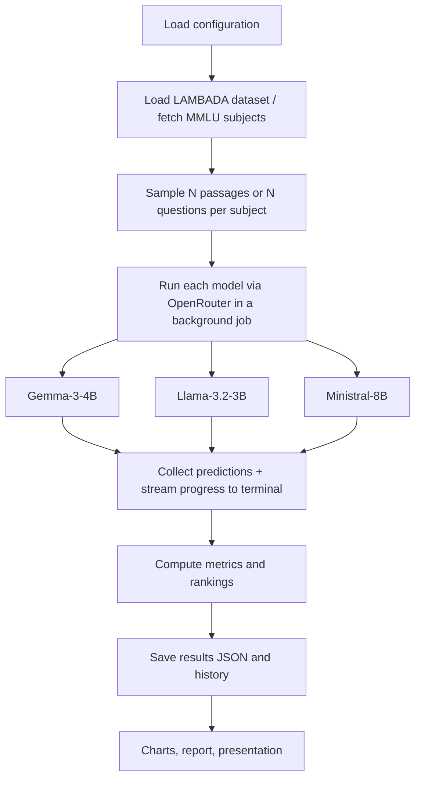

## 7. Conclusion

- Ministral-8B was the most accurate on both benchmarks (38.1% LAMBADA, 78.9% MMLU); Llama-3.2-3B was consistently the fastest.
- Gemma-3-4B is competitive on accuracy and reasoning quality but pays for it in latency.
- LAMBADA rewards real use of context over surface patterns; MMLU adds breadth of knowledge and rewards reasoning that actually supports the answer.
- The usual trade-off holds: stronger context handling and reasoning help accuracy, smaller models answer faster.
- Live terminal streaming and the Optimal / Normal / Best Performance presets make runs observable in real time and easy to reproduce.

---

- Paperno, D. et al. (2016). The LAMBADA dataset. Proceedings of ACL 2016.
- Hendrycks, D. et al. (2021). Measuring Massive Multitask Language Understanding. Proceedings of ICLR 2021.
- Google (2025). Gemma 3 technical report.
- Meta (2024). Llama 3.2 model card.
- Mistral AI (2024). Ministral model family.
