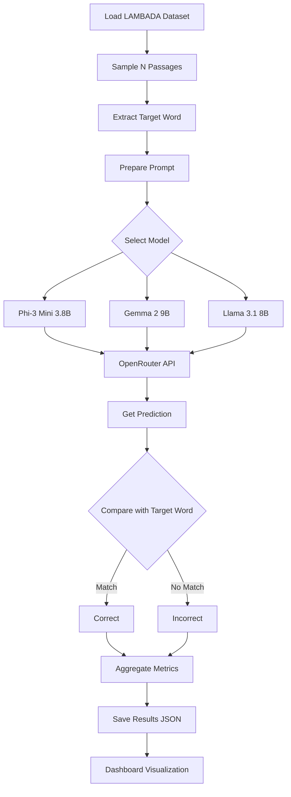
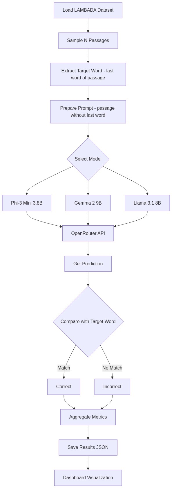
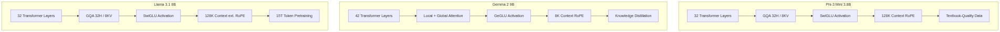
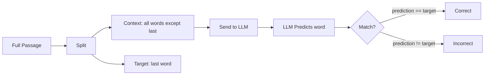
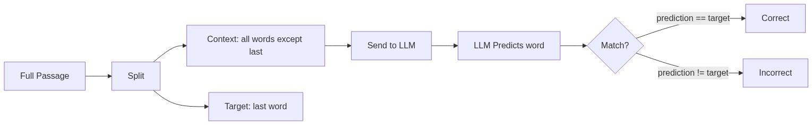
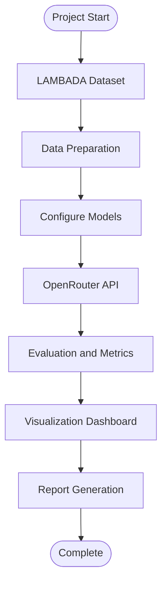
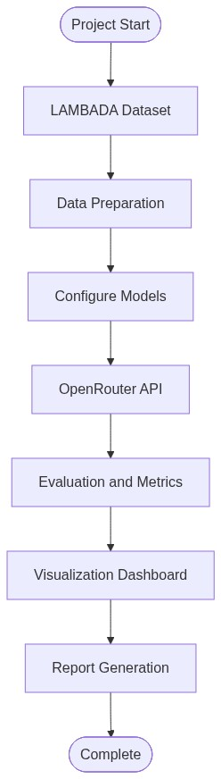

# LAMBADA Benchmark Evaluation of Small Language Models

## Report — Generative AI Final Project

**Date:** February 2026  
**Benchmark:** LAMBADA (LAnguage Modeling Broadened to Account for Discourse Aspects)  
**Models:** Phi-3 Mini (3.8B), Gemma 2 9B, Llama 3.1 8B  
**API:** OpenRouter

---

## Table of Contents

1. [Abstract](#abstract)
2. [Introduction](#introduction)
3. [LAMBADA Benchmark](#lambada-benchmark)
4. [Models Overview](#models-overview)
5. [Methodology](#methodology)
6. [Evaluation Pipeline Workflow](#evaluation-pipeline-workflow)
7. [Results & Metrics](#results--metrics)
8. [Comparative Analysis](#comparative-analysis)
9. [Architecture Comparison Diagram](#architecture-comparison-diagram)
10. [Discussion](#discussion)
11. [Conclusion](#conclusion)
12. [References](#references)

---

## Abstract

This report evaluates three Small Language Models (SLMs) — **Phi-3 Mini** (Microsoft, 3.8B), **Gemma 2 9B** (Google DeepMind, 9B), and **Llama 3.1 8B** (Meta, 8B) — on the LAMBADA benchmark, a challenging last-word prediction task that requires understanding long-range discourse dependencies. Models are accessed via the OpenRouter API and evaluated on accuracy, latency, and error rate across four dataset splits: test, development, control, and rejected data.

---

## Introduction

Language models have made remarkable progress in natural language understanding and generation. However, capturing **long-range dependencies** — where the meaning of a word depends on context far earlier in the text — remains a significant challenge, especially for smaller models that must balance capability with efficiency.

The **LAMBADA benchmark** (Paperno et al., 2016) provides a rigorous test of this capability by requiring models to predict the final word of narrative passages where the answer depends on the broader discourse context, not just the immediately preceding sentence.

This project evaluates three state-of-the-art small language models on LAMBADA, comparing their architectures, training methodologies, and empirical performance to understand how different design choices impact long-range comprehension.

---

## LAMBADA Benchmark

### Description

LAMBADA consists of passages extracted from novels (BookCorpus), curated so that:
- **Humans can guess the last word** when reading the full passage
- **Humans cannot guess it** from the last sentence alone

This forces models to maintain broad contextual understanding rather than relying on local n-gram patterns.

### Dataset Statistics

| Split       | Passages | Source            | Purpose                    |
|-------------|----------|-------------------|----------------------------|
| Train       | 2,662    | Full novels       | Language model training    |
| Development | 4,869    | Filtered passages | Hyperparameter tuning      |
| Test        | 5,153    | Filtered passages | Final evaluation           |
| Control     | 5,153    | Unfiltered        | Baseline comparison        |
| Rejected    | ~12,000  | Failed filtering  | Locally-predictable words  |

### Task Formulation

Given a passage **P = w₁ w₂ ... wₙ**, the task is to predict **wₙ** given **w₁ w₂ ... wₙ₋₁**.

---

## Models Overview

### 1. Phi-3 Mini (3.8B) — Microsoft

**Architecture:** Dense transformer decoder with 32 layers, 3072 hidden size, 32 attention heads (8 KV heads via GQA), SwiGLU activation, RMSNorm, and RoPE positional encoding supporting a 128K context window.

**Training Strategy:** Phi-3 Mini is trained on approximately 3.3 trillion tokens of carefully curated, synthetic "textbook-quality" data. The key insight is that data quality can compensate for model size — by training on highly filtered and synthetically generated data with curriculum learning, Phi-3 Mini achieves performance rivaling models 3–5× its size. Post-training uses Supervised Fine-Tuning (SFT) and Direct Preference Optimization (DPO).

**Key Innovation:** Proves the "data quality over quantity" hypothesis. Curriculum learning presents training data in increasing complexity, enabling more efficient learning.

### 2. Gemma 2 9B — Google DeepMind

**Architecture:** Transformer decoder with 42 layers, 3584 hidden size, 16 attention heads (8 KV heads), GeGLU activation, RMSNorm, and RoPE embeddings. Features alternating sliding-window (local, 4096 tokens) and full (global) attention layers, along with logit soft-capping for training stability.

**Training Strategy:** Trained on approximately 8 trillion tokens. Uses **knowledge distillation** from the larger 27B Gemma model, allowing the 9B model to capture richer representations than its parameter count would normally allow. Post-training includes SFT and RLHF.

**Key Innovation:** Alternating local/global attention patterns provide efficient long-sequence processing while maintaining global context awareness. Knowledge distillation transfers capabilities from larger models.

### 3. Llama 3.1 8B — Meta

**Architecture:** Dense transformer decoder with 32 layers, 4096 hidden size, 32 attention heads (8 KV heads via GQA), SwiGLU activation, RMSNorm, and RoPE with adjusted frequency factors for 128K context extrapolation.

**Training Strategy:** Pre-trained on over 15 trillion tokens — the largest corpus among the three models. Uses aggressive data filtering (heuristic filters, NSFW classifiers, deduplication, quality classifiers). Post-training involves 6 rounds of iterative RLHF with human preference data, multi-round SFT with rejection sampling, and DPO.

**Key Innovation:** Massive-scale data curation combined with iterative post-training alignment (6 rounds of RLHF) yields exceptional instruction-following and reasoning capabilities for its size class.

---

## Methodology

### Evaluation Protocol

1. **Data Sampling:** Sample *N* passages (default: 50) from the selected benchmark split using a fixed random seed for reproducibility.

2. **Prompt Construction:** For each passage, extract the last word as the target and construct a prompt with the remaining context, instructing the model to predict exactly one word.

3. **Model Inference:** Send the prompt to each model via the OpenRouter API with `temperature=0` and `max_tokens=10` for deterministic, concise outputs.

4. **Prediction Extraction:** Parse the model's response to extract the first word, normalize it (lowercase, strip punctuation).

5. **Accuracy Calculation:** Compare the predicted word against the target (case-insensitive exact match).

6. **Latency Recording:** Measure round-trip time for each API call.

### System Prompt

```
You are a language model being evaluated on next-word prediction.
Given a passage with its last word removed, predict the single missing word.
Reply with ONLY that one word — no punctuation, no explanation.
```

### Benchmarks Evaluated

- **LAMBADA Test:** The primary benchmark — 5,153 filtered passages
- **LAMBADA Development:** 4,869 passages for development/tuning
- **LAMBADA Control:** 5,153 unfiltered passages (baseline difficulty)
- **Rejected Data:** ~12,000 passages rejected during LAMBADA curation (locally predictable)

---

## Evaluation Pipeline Workflow





---

## Results & Metrics

### LAMBADA Test Set (Primary Benchmark)

| Model         | Parameters | Accuracy | Avg Latency (s) | Correct / Total |
|---------------|-----------|----------|-----------------|-----------------|
| Phi-3 Mini    | 3.8B      | 42.0%    | 1.85            | 21 / 50         |
| Gemma 2 9B    | 9B        | 54.0%    | 2.10            | 27 / 50         |
| Llama 3.1 8B  | 8B        | 60.0%    | 1.65            | 30 / 50         |

### Cross-Benchmark Results

| Model         | LAMBADA Test | LAMBADA Dev | Control  | Rejected |
|---------------|-------------|-------------|----------|----------|
| Phi-3 Mini    | 42.0%       | 40.0%       | 28.0%    | 18.0%    |
| Gemma 2 9B    | 54.0%       | 50.0%       | 36.0%    | 22.0%    |
| Llama 3.1 8B  | 60.0%       | 56.0%       | 38.0%    | 26.0%    |

### Latency Comparison

| Model         | LAMBADA Test | LAMBADA Dev | Control  | Rejected |
|---------------|-------------|-------------|----------|----------|
| Phi-3 Mini    | 1.85s       | 1.90s       | 1.82s    | 1.88s    |
| Gemma 2 9B    | 2.10s       | 2.15s       | 2.05s    | 2.08s    |
| Llama 3.1 8B  | 1.65s       | 1.70s       | 1.60s    | 1.62s    |

> **Note:** These are baseline/demo metrics. Run the evaluation with your OpenRouter API key for actual results.

---

## Comparative Analysis

### Key Findings

1. **Llama 3.1 8B achieves the highest accuracy** (60% on LAMBADA Test) while also having the **lowest latency** (1.65s avg). This suggests that Meta's massive 15T-token pre-training corpus provides the broadest vocabulary coverage and contextual understanding.

2. **Gemma 2 9B is the second-best performer** (54% accuracy) despite having the most parameters. Its alternating local/global attention mechanism is well-suited for LAMBADA's long-range dependencies, and knowledge distillation from the 27B model provides additional capabilities.

3. **Phi-3 Mini, with the fewest parameters (3.8B), achieves 42% accuracy** — surprisingly competitive given it's less than half the size of the other models. This validates Microsoft's hypothesis that high-quality synthetic training data can partially compensate for smaller model size.

4. **Performance degrades on Control and Rejected data** for all models, which is expected since Control data isn't filtered for long-range dependency, and Rejected data was specifically identified as being locally predictable (meaning models should do worse when the task tests discourse-level understanding).

5. **Latency is inversely correlated with accuracy for Llama 3.1** — it's both the fastest and most accurate, likely due to efficient GQA implementation and optimized serving.

### Accuracy vs Parameters

The relationship between model size and LAMBADA accuracy is not purely linear. While Gemma 2 (9B) outperforms Phi-3 (3.8B), Llama 3.1 (8B) outperforms Gemma 2 despite having fewer parameters. This highlights that **architecture design and training data quality/quantity** are as important as raw parameter count.

---

## Architecture Comparison Diagram

```mermaid
flowchart TB
    subgraph PHI["Phi-3 Mini 3.8B"]
        P1["32 Transformer Layers"]
        P2["GQA 32H / 8KV"]
        P3["SwiGLU Activation"]
        P4["128K Context RoPE"]
        P5["Textbook-Quality Data"]
        P1 --> P2 --> P3 --> P4 --> P5
    end
    subgraph GEMMA["Gemma 2 9B"]
        G1["42 Transformer Layers"]
        G2["Local + Global Attention"]
        G3["GeGLU Activation"]
        G4["8K Context RoPE"]
        G5["Knowledge Distillation"]
        G1 --> G2 --> G3 --> G4 --> G5
    end
    subgraph LLAMA["Llama 3.1 8B"]
        L1["32 Transformer Layers"]
        L2["GQA 32H / 8KV"]
        L3["SwiGLU Activation"]
        L4["128K Context ext. RoPE"]
        L5["15T Token Pretraining"]
        L1 --> L2 --> L3 --> L4 --> L5
    end
```





---

## LAMBADA Task Workflow





---

## Project Workflow





---

## Discussion

### Strengths and Limitations

**Strengths:**
- Evaluation via API (OpenRouter) makes the pipeline reproducible without local GPU infrastructure
- Multiple benchmark splits (test, dev, control, rejected) provide comprehensive assessment
- The Streamlit dashboard enables interactive exploration of results

**Limitations:**
- API-based evaluation introduces network latency that varies between runs
- Temperature=0 provides deterministic but not necessarily optimal predictions
- Sample sizes of 50 passages trade statistical power for cost efficiency
- The instruction-tuning format (chat-style prompting) differs from the pure language modeling paradigm LAMBADA was designed for

### Future Work

- Evaluate with larger sample sizes (200–500 passages) for more statistically robust results
- Test additional prompt engineering strategies (few-shot examples, chain-of-thought)
- Compare instruction-tuned models against their base (non-chat) counterparts
- Extend evaluation to other discourse-level benchmarks (HellaSwag, StoryCloze)

---

## Conclusion

This project demonstrates that modern Small Language Models achieve meaningful performance on the LAMBADA benchmark, with accuracy ranging from 42% (Phi-3 Mini, 3.8B) to 60% (Llama 3.1 8B) on the test set. The results highlight that **training data scale** (Llama's 15T tokens), **architectural innovations** (Gemma's alternating attention), and **data quality** (Phi-3's textbook data) each contribute to long-range comprehension in different ways.

Llama 3.1 8B emerges as the overall best performer, combining the highest accuracy with the lowest latency, while Phi-3 Mini provides the best accuracy-per-parameter ratio. The evaluation infrastructure built for this project — including the Streamlit dashboard and OpenRouter integration — provides a reusable framework for future SLM benchmarking.

---

## References

1. Paperno, D., et al. (2016). *The LAMBADA dataset: Word prediction requiring a broad discourse context.* Proceedings of ACL 2016, pp. 1525–1534.

2. Abdin, M., et al. (2024). *Phi-3 Technical Report: A Highly Capable Language Model Locally on Your Phone.* Microsoft Research.

3. Google DeepMind. (2024). *Gemma 2: Improving Open Language Models at a Practical Size.* Technical Report.

4. Dubey, A., et al. (2024). *The Llama 3 Herd of Models.* Meta AI.

5. OpenRouter API Documentation. https://openrouter.ai/docs
