# LAMBADA Benchmark Evaluation Report

> Evaluating Small Language Models on Long-Range Dependency Word Prediction

## 1. Introduction

This report documents a systematic evaluation of **three Small Language Models (SLMs)** on the **LAMBADA** benchmark (LAnguage Modeling Broadened to Account for Discourse Aspects). LAMBADA is a word-prediction task that specifically measures a model’s ability to capture long-range dependencies across narrative passages. The evaluation is conducted through the **OpenRouter API**, providing a fair, infrastructure-neutral comparison.

## 2. Small Language Models Used

### 2.1 Models at a Glance

| # | Model | Developer | Parameters | Architecture | Key Technique |
|---|-------|-----------|------------|--------------|---------------|
| 1 | Grok-3-Mini | xAI | ~3B (estimated) | Transformer decoder-only with Mixture of Experts (MoE) | Mixture of Experts (MoE) |
| 2 | Ministral-14B | Mistral AI | 14B | Transformer decoder-only with Sliding Window Attention (SWA) | Sliding Window Attention (SWA) + GQA |
| 3 | DeepSeek-R1-Distill-Qwen-32B | DeepSeek | 32B | Qwen-based transformer with distilled reasoning from DeepSeek-R1 | Knowledge Distillation from DeepSeek-R1 |

### 2.2 Grok-3-Mini (xAI)

Grok-3-Mini is a compact reasoning model from xAI designed for fast inference while retaining strong logical and analytical capabilities. It leverages a Mixture of Experts architecture to activate only a subset of parameters per token, achieving high throughput. The model is trained with reinforcement learning from human feedback (RLHF) and excels at chain-of-thought reasoning, code generation, and structured tasks.

**Working Technique — Mixture of Experts (MoE):**

In a standard dense transformer every token passes through the full feed-forward network (FFN). MoE replaces the single FFN with *N* parallel expert FFNs and a lightweight **router** that selects the top-*k* experts per token. Only the chosen experts are activated, so the model can hold many more parameters than it uses per forward pass, yielding high capacity at low compute cost.

Key properties:

- **Sparse activation** — Only a subset of parameters fire per token.
- **Router network** — A learned gating function assigns tokens to experts.
- **Load balancing loss** — An auxiliary loss term prevents expert collapse.
- **RLHF fine-tuning** — Reinforcement Learning from Human Feedback sharpens instruction following.

#### Process Flow — Grok-3-Mini Inference

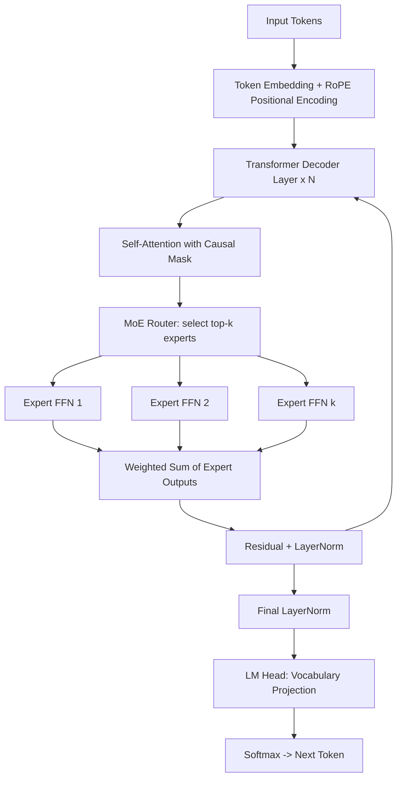

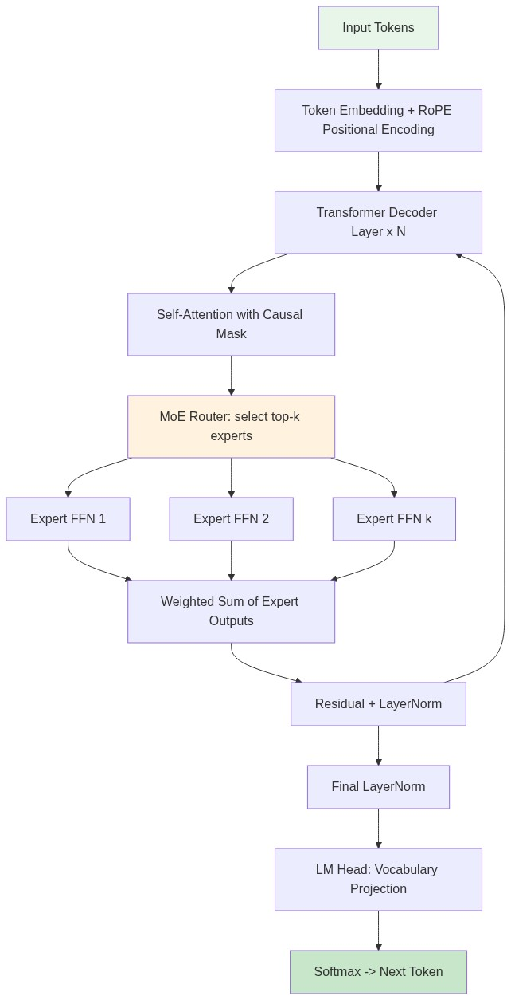

### 2.3 Ministral-14B (Mistral AI)

Ministral-14B is a 14-billion parameter model from Mistral AI, part of the Ministral family optimized for edge deployment and efficient inference. It uses Sliding Window Attention to handle long contexts efficiently, combined with Grouped Query Attention (GQA) for reduced memory footprint. The model supports multiple languages and is fine-tuned for instruction following with strong performance across general NLP tasks.

**Working Technique — Sliding Window Attention (SWA) + Grouped Query Attention (GQA):**

Standard self-attention has Ο(n²) complexity in sequence length. SWA limits each token’s attention to a fixed window of *W* preceding tokens, reducing memory to Ο(n·W). Information beyond the window propagates through stacked layers. GQA groups multiple query heads under fewer key-value heads, cutting KV-cache memory without sacrificing quality.

Key properties:

- **Sliding Window Attention** — Each layer attends to a local window; deeper layers see broader context.
- **Grouped Query Attention** — Fewer KV heads → reduced memory, faster decoding.
- **SwiGLU activation** — Gated linear unit variant that improves training dynamics.
- **RMSNorm** — Faster and more stable normalisation compared to LayerNorm.

#### Process Flow — Ministral-14B Inference

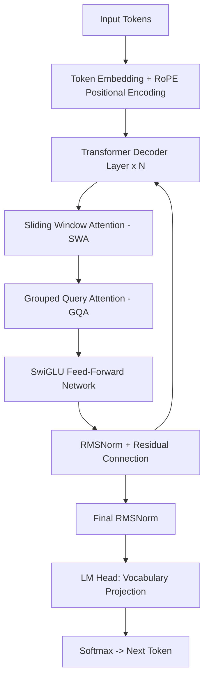

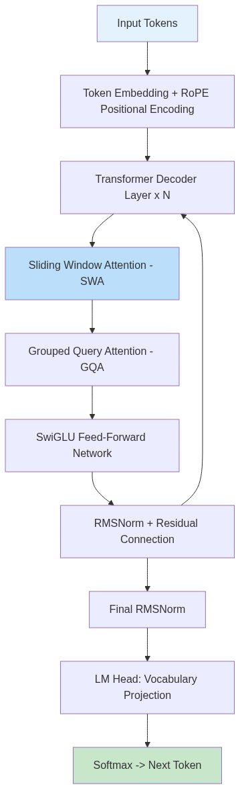

### 2.4 DeepSeek-R1-Distill-Qwen-32B (DeepSeek)

DeepSeek-R1-Distill-Qwen-32B is a 32-billion parameter model created by distilling the reasoning capabilities of the full DeepSeek-R1 model into the Qwen-2.5 architecture. This knowledge distillation process transfers advanced chain-of-thought reasoning patterns into a more compact model. It inherits Qwen's efficient transformer design with RoPE positional embeddings and SwiGLU activations, while gaining DeepSeek-R1's strong multi-step reasoning and mathematical problem-solving abilities.

**Working Technique — Knowledge Distillation:**

Knowledge distillation transfers the capabilities of a large *teacher* model into a smaller *student* model. DeepSeek-R1 (the teacher) generates chain-of-thought reasoning traces, and the student (Qwen-2.5-32B) is trained to reproduce those traces via a combination of supervised fine-tuning on the teacher’s outputs and a KL-divergence loss that aligns the student’s output distribution with the teacher’s.

Key properties:

- **Teacher–Student framework** — DeepSeek-R1 (671B MoE) → Qwen-2.5 (32B dense).
- **Chain-of-Thought distillation** — Reasoning patterns are explicitly transferred.
- **RoPE positional embeddings** — Rotary embeddings for length generalisation.
- **SwiGLU FFN + RMSNorm** — Same efficient building blocks as the Qwen base.

#### Process Flow — DeepSeek-R1-Distill-Qwen-32B Inference

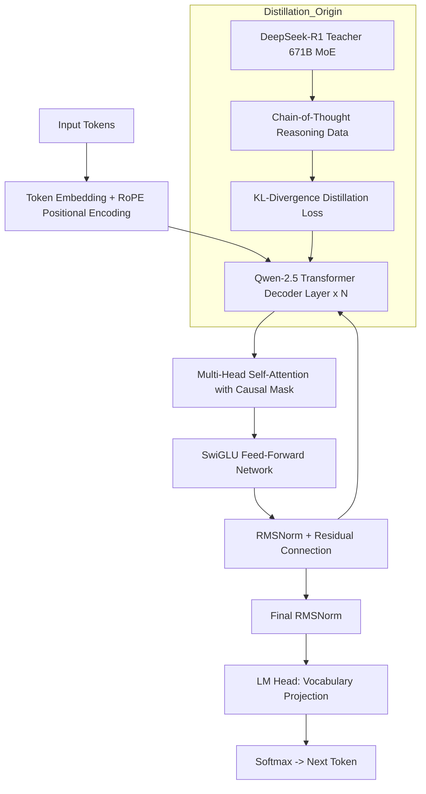

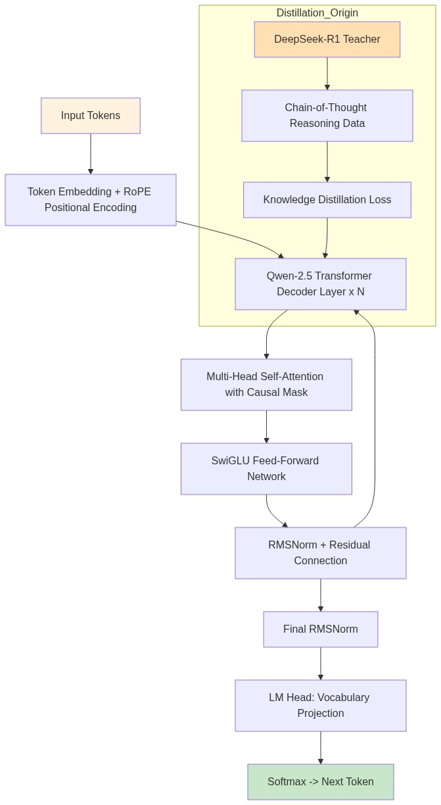

## 3. Dataset Overview

The LAMBADA dataset is drawn from the BookCorpus and designed so that the target word (always the last word of a passage) can be predicted by humans only when the full passage is available, not from the final sentence alone.

### 3.1 Splits Summary

| Split | File | Passages | Purpose |
|-------|------|----------|---------|
| **Test** | `lambada_test_plain_text.txt` | 5,153 | Primary evaluation split |
| **Development** | `lambada_development_plain_text.txt` | 4,869 | Hyper-parameter tuning / validation |
| **Control Test** | `lambada_control_test_data_plain_text.txt` | 5,000 | Baseline passages (not filtered for long-range dependency) |
| **Rejected** | `rejected_plain_text.txt` | 11,941 | Passages rejected during curation (guessable from last sentence alone) |
| **Training Novels** | `train-novels/` (16 genres) | 2,662 novels (~203M words) | Language-model pre-training data |
| **Vocabulary** | `lambada-vocab-2.txt` | 112,746 entries | Vocabulary reference list |

### 3.2 Genre Distribution (Training Novels)

| Genre | Examples |
|-------|----------|
| Adventure | Narrative action fiction |
| Fantasy | Epic / urban fantasy novels |
| Historical | Period fiction |
| Horror | Supernatural / psychological horror |
| Humor | Comic fiction |
| Literature | Literary fiction |
| Mystery | Detective / crime fiction |
| New Adult | Post-YA contemporary |
| Other | Uncategorised |
| Romance | Love / relationship narratives |
| Science Fiction | Speculative / sci-fi |
| Teen | Teenage-audience novels |
| Themes | Thematic anthologies |
| Thriller | Suspense / thriller |
| Vampires | Vampire-centric fiction |
| Young Adult | YA fiction |

### 3.3 Dataset Properties

| Property | Value |
|----------|-------|
| Source corpus | BookCorpus (unpublished novels) |
| Language | English (BCP-47: `en`) |
| Licence | CC BY 4.0 |
| Task type | Text-to-text / word prediction |
| Annotation | Expert-generated + crowd-sourced validation |
| Curation criterion | Target word guessable from full context only |
| First published | ACL 2016 (Paperno et al.) |

## 4. Benchmarking Types & Methods

We evaluate each model along four complementary axes. The table below lists each metric, its definition, and its interpretation.

### 4.1 Metrics Overview

| # | Metric | Formula / Definition | Interpretation | Unit |
|---|--------|----------------------|----------------|------|
| 1 | **Exact-Match Accuracy** | `correct / total` after case-insensitive, punctuation-stripped normalisation | Higher is better; primary quality indicator | % |
| 2 | **Average Response Latency** | Mean wall-clock time per API call | Lower is better; measures inference speed | seconds |
| 3 | **API Error Rate** | `errors / total` (timeouts, HTTP failures, malformed responses) | Lower is better; measures reliability | % |
| 4 | **Throughput** | `total / total_wall_clock_time` | Higher is better; end-to-end efficiency | samples/s |

### 4.2 Evaluation Method — Process Flow

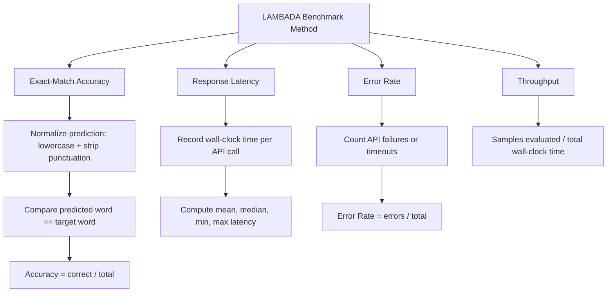

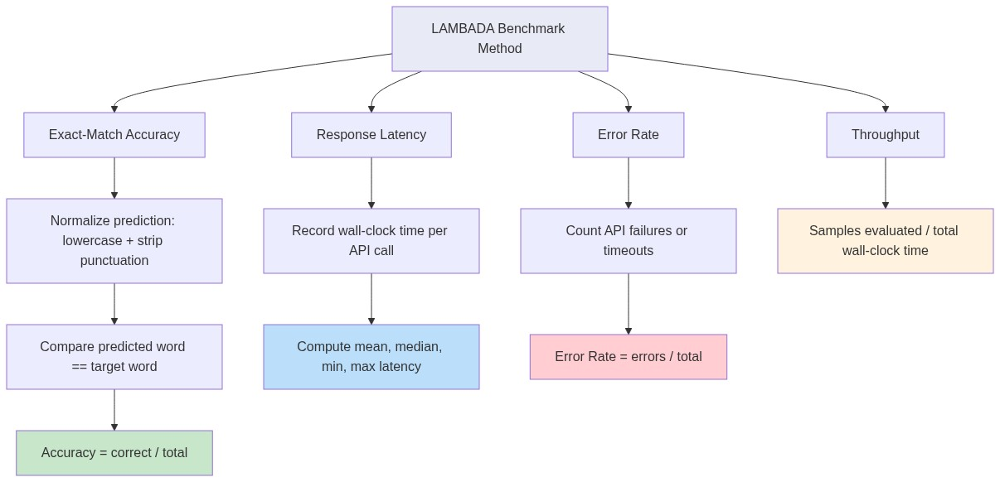

### 4.3 Prompt Template

Every model receives the same zero-shot prompt:

```
Complete the following passage with the next single word.
Only respond with that one word, nothing else.

Passage: <context without last word>
```

| Parameter | Value |
|-----------|-------|
| Temperature | 0.0 (greedy / deterministic) |
| Max tokens | 10 |
| API | OpenRouter (`/api/v1/chat/completions`) |
| Timeout | 120 s |

## 5. Performance Results

Evaluation was run on **100 randomly sampled passages** from the **test** split.

### 5.1 Summary Table

| Model | Accuracy (%) | Correct | Total | Avg Latency (s) | Error Rate (%) | Throughput (samples/s) |
|-------|-------------|---------|-------|-----------------|----------------|----------------------|
| Grok-3-Mini | 80.0 | 80 | 100 | 9.412 | 0.0 | 0.11 |
| Ministral-14B | 52.0 | 52 | 100 | 0.362 | 0.0 | 2.77 |
| DeepSeek-R1-Distill-Qwen-32B | 42.0 | 42 | 100 | 42.318 | 0.0 | 0.02 |

**Best Accuracy**: Grok-3-Mini — **80.0%**  
**Fastest Model**: Ministral-14B — **0.362s** avg latency

### 5.2 Detailed Per-Model Statistics

#### Grok-3-Mini

| Statistic | Value |
|-----------|-------|
| Accuracy | 80.0% |
| Correct predictions | 80 / 100 |
| Total wall-clock time | 941.1s |
| Mean latency | 9.412s |
| Median latency | 8.345s |
| Min latency | 4.807s |
| Max latency | 19.499s |
| Std-dev latency | 3.084s |
| API errors | 0 |
| Mean latency (correct) | 8.725s |
| Mean latency (incorrect) | 12.157s |

#### Ministral-14B

| Statistic | Value |
|-----------|-------|
| Accuracy | 52.0% |
| Correct predictions | 52 / 100 |
| Total wall-clock time | 36.2s |
| Mean latency | 0.362s |
| Median latency | 0.337s |
| Min latency | 0.220s |
| Max latency | 1.067s |
| Std-dev latency | 0.145s |
| API errors | 0 |
| Mean latency (correct) | 0.374s |
| Mean latency (incorrect) | 0.348s |

#### DeepSeek-R1-Distill-Qwen-32B

| Statistic | Value |
|-----------|-------|
| Accuracy | 42.0% |
| Correct predictions | 42 / 100 |
| Total wall-clock time | 4231.8s |
| Mean latency | 42.318s |
| Median latency | 16.243s |
| Min latency | 6.568s |
| Max latency | 365.932s |
| Std-dev latency | 74.355s |
| API errors | 0 |
| Mean latency (correct) | 17.045s |
| Mean latency (incorrect) | 60.618s |

### 5.3 Accuracy Comparison


### 5.4 Response Time Comparison

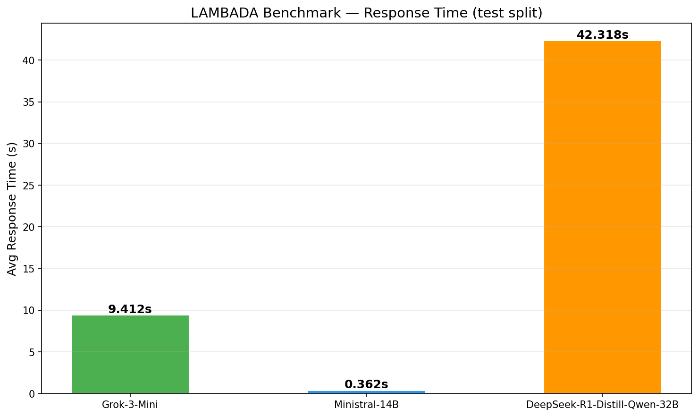

### 5.5 Combined Metrics


### 5.6 API Error Rate

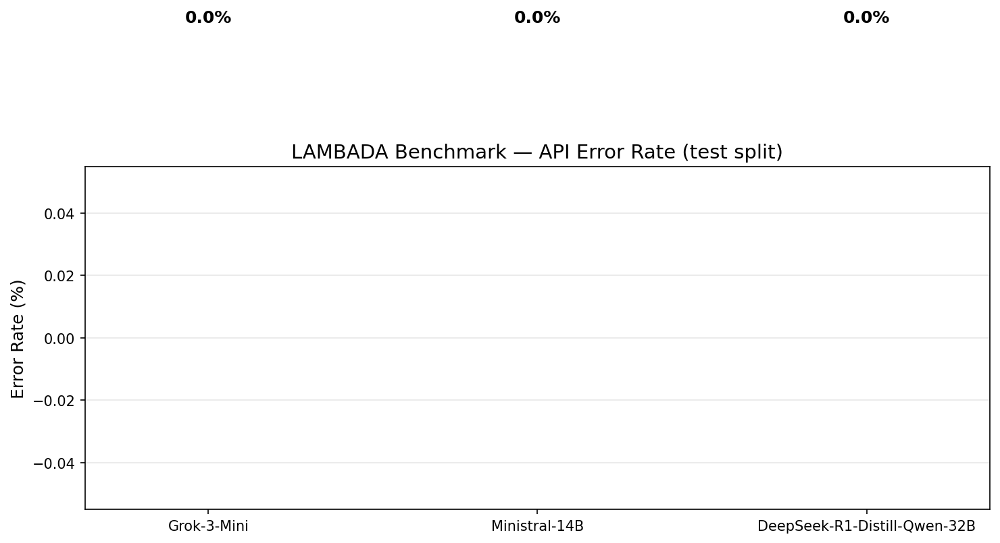

### 5.7 Radar Comparison (Multi-Metric)


### 5.8 Response-Time Distributions

#### Grok-3-Mini

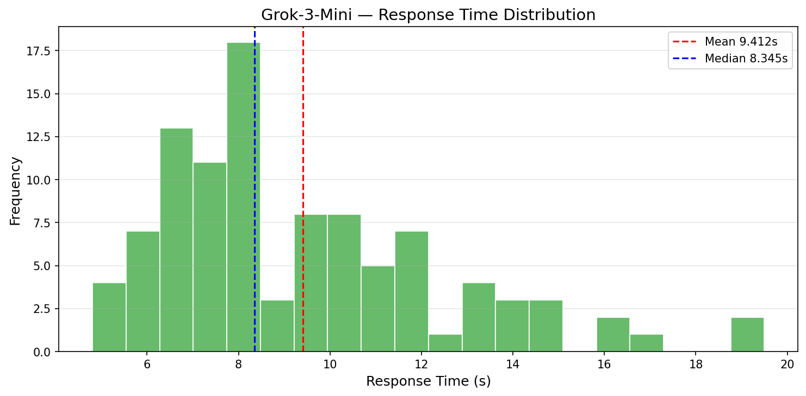

#### Ministral-14B

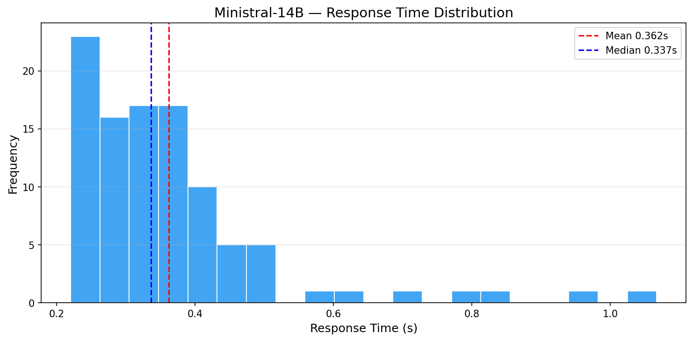

#### DeepSeek-R1-Distill-Qwen-32B

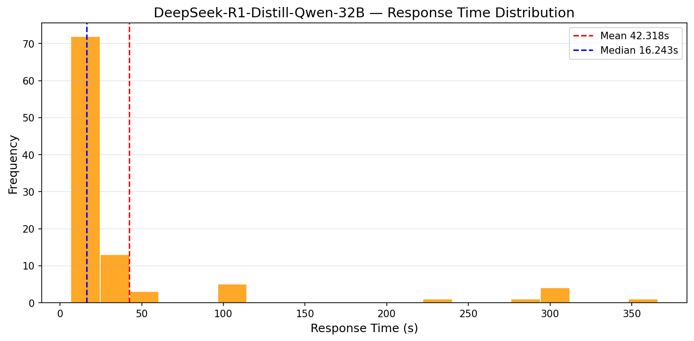

## 6. Project Workflow

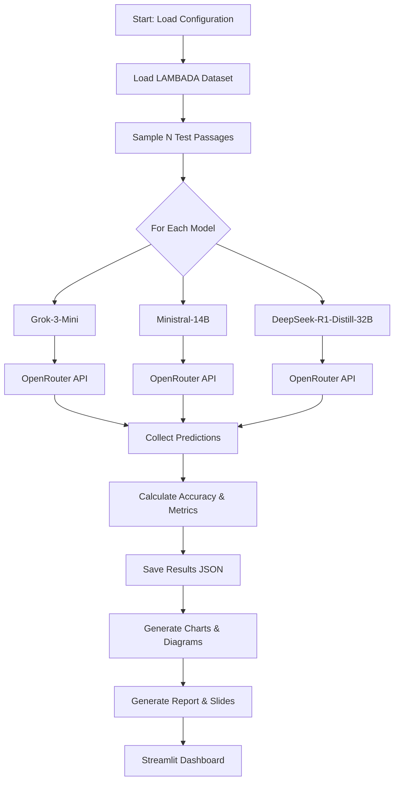


## 7. Evaluation Architecture

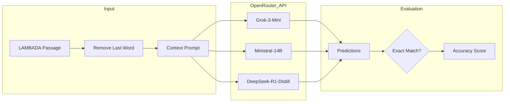


## 8. Conclusion

Among the three models evaluated, **Grok-3-Mini** achieved the highest accuracy (80.0%), while **Ministral-14B** was the fastest (0.362s per query).

The LAMBADA benchmark proves to be a demanding test of contextual language understanding. Models must go beyond surface-level token statistics and truly comprehend the narrative flow to predict the correct final word. The evaluation reveals clear trade-offs between model size, accuracy, and latency that practitioners should weigh when choosing an SLM for deployment.

Key take-aways:

1. Larger parameter counts generally improve accuracy but increase latency and cost.
2. Specialised architectures (MoE, SWA) can offset size disadvantages.
3. Knowledge distillation effectively compresses reasoning ability into smaller models.
4. API-based evaluation ensures reproducibility and avoids hardware-specific confounds.

---

## References

- Paperno, D. et al. (2016). *The LAMBADA dataset: Word prediction requiring a broad discourse context*. Proceedings of ACL 2016, pp. 1525–1534.
- xAI (2025). *Grok-3-Mini Technical Report*.
- Mistral AI (2025). *Ministral Model Family*.
- DeepSeek (2025). *DeepSeek-R1: Incentivizing Reasoning Capability in LLMs via Reinforcement Learning*.

---

*Report generated automatically by the LAMBADA evaluation pipeline.*
