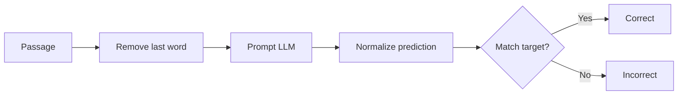
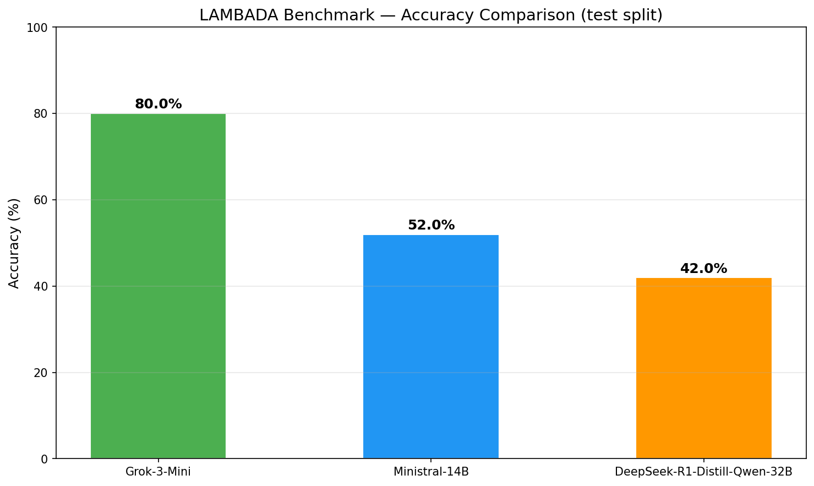
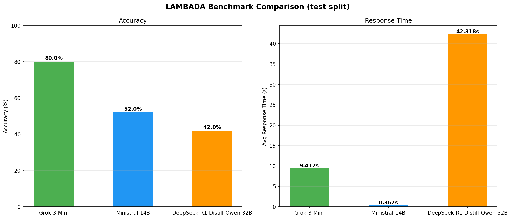
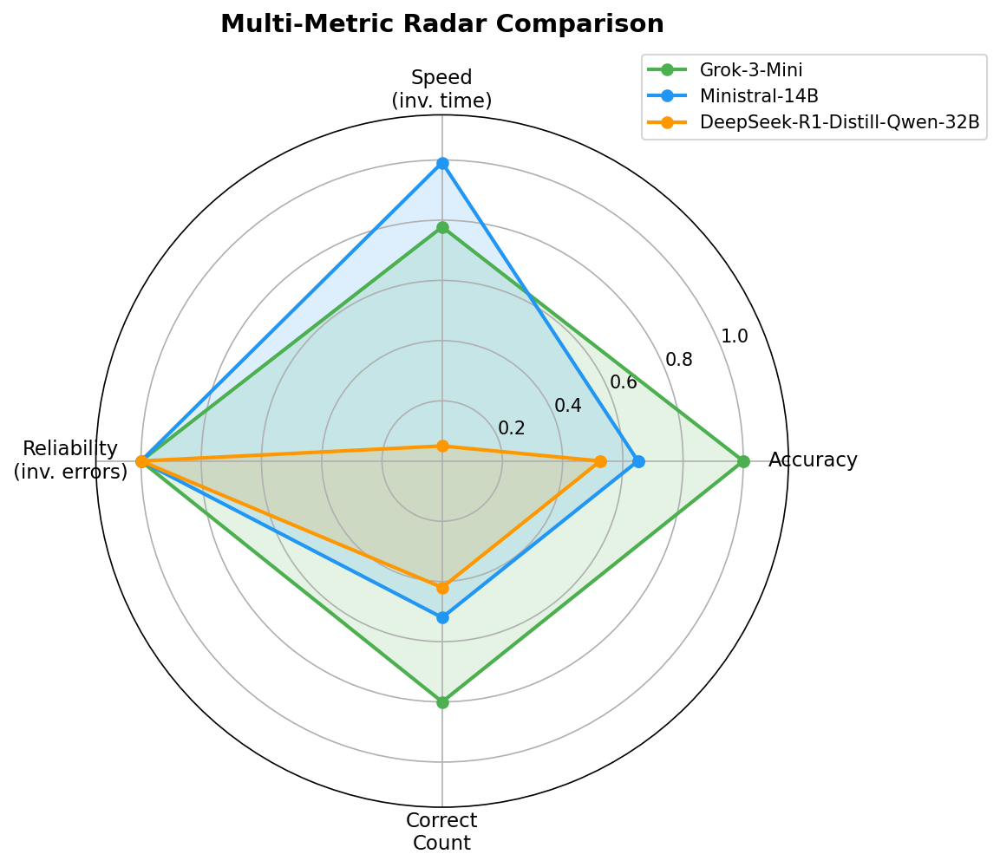
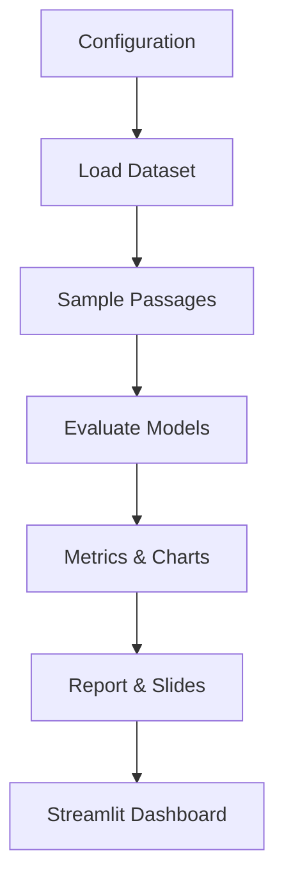

# Slide 1 — Project Overview

## LAMBADA Benchmark: Evaluating Three SLMs

We evaluate **Grok-3-Mini**, **Ministral-14B**, and **DeepSeek-R1-Distill-Qwen-32B** on the LAMBADA last-word-prediction benchmark using the OpenRouter API.

---

# Slide 2 — Models Used

## Small Language Models at a Glance

| Model | Developer | Parameters | Key Technique |
|-------|-----------|------------|---------------|
| Grok-3-Mini | xAI | ~3B (est.) | Mixture of Experts (MoE) |
| Ministral-14B | Mistral AI | 14B | Sliding Window + GQA |
| DeepSeek-R1-Distill | DeepSeek | 32B | Knowledge Distillation |

---

# Slide 3 — How Each Model Works

## Grok-3-Mini: Mixture of Experts

A router selects top-*k* expert FFNs per token → sparse activation, high throughput.

## Ministral-14B: Sliding Window Attention

Each layer attends to a fixed window; deep stacking gives long-range reach at Ο(n·W) cost.

## DeepSeek-R1-Distill: Knowledge Distillation

Chain-of-thought reasoning from a 671B teacher distilled into a 32B Qwen student.

---

# Slide 4 — LAMBADA Dataset Overview

## Dataset Splits

| Split | Passages | Purpose |
|-------|----------|---------|
| Test | 5,153 | Primary evaluation |
| Development | 4,869 | Validation |
| Control Test | 5,000 | Baseline (unfiltered) |
| Rejected | 11,941 | Guessable from last sentence |
| Training | 2,662 novels | LM pre-training data |

Task: predict the **last word** of a narrative passage using full context.

---

# Slide 5 — Benchmarking Methods

## Metrics Used

| Metric | Definition | Goal |
|--------|------------|------|
| Exact-Match Accuracy | correct / total (normalised) | Higher = better |
| Avg Response Latency | Mean wall-clock time per API call | Lower = better |
| API Error Rate | errors / total | Lower = better |
| Throughput | samples / total time | Higher = better |

---

# Slide 6 — Performance Results

## Summary Metrics

| Model | Accuracy | Avg Latency | Errors |
|-------|----------|-------------|--------|
| Grok-3-Mini | 80.0% | 9.412s | 0 |
| Ministral-14B | 52.0% | 0.362s | 0 |
| DeepSeek-R1-Distill-Qwen-32B | 42.0% | 42.318s | 0 |

**Best**: Grok-3-Mini at 80.0% accuracy

---

# Slide 7 — Visual Comparison

## Accuracy vs. Response Time

## Multi-Metric Radar

---

# Slide 8 — Workflow Diagram

## End-to-End Pipeline

---

# Slide 9 — Key Takeaways

## Conclusions

- LAMBADA is a rigorous test of long-range contextual understanding.
- Larger models tend toward higher accuracy but at greater latency and cost.
- MoE and SWA architectures offer efficient alternatives to brute-force scaling.
- Knowledge distillation effectively compresses reasoning into smaller models.
- API-based evaluation provides reproducible, hardware-agnostic comparisons.

---

*Generated by LAMBADA Evaluation Pipeline*
