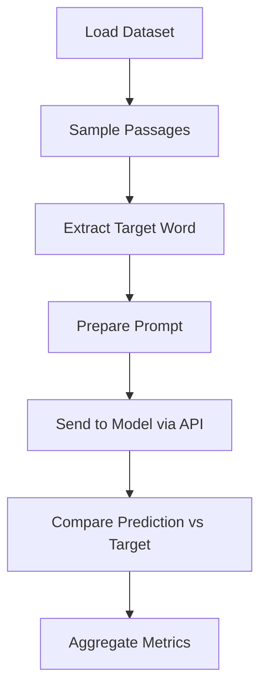
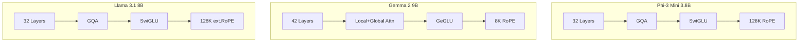
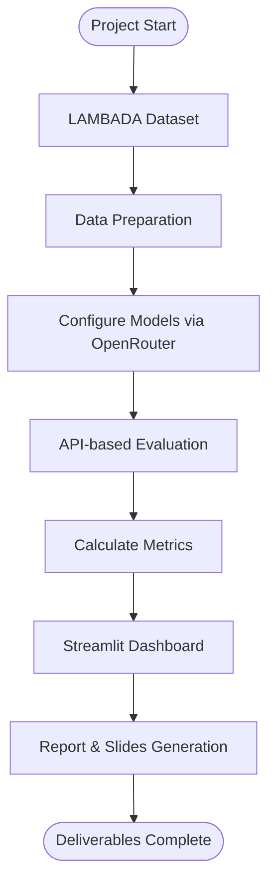

# LAMBADA SLM Evaluation — Slide Deck

---

## Slide 1: Title

### Evaluating Small Language Models on the LAMBADA Benchmark

**Generative AI — Final Project**

- **Benchmark:** LAMBADA (Word Prediction via Broad Discourse Context)
- **Models:** Phi-3 Mini (3.8B) · Gemma 2 9B · Llama 3.1 8B
- **API:** OpenRouter
- **Date:** February 2026

---

## Slide 2: Project Overview

### What Are We Evaluating?

**Goal:** Compare three Small Language Models on their ability to understand long-range discourse dependencies using the LAMBADA benchmark.

**Why LAMBADA?**
- Tests whether a model can predict the last word of a passage
- Requires understanding **broad context**, not just local patterns
- Human baseline: ~100% with full passage, ~0% with last sentence only

**Approach:**
- Use OpenRouter API for standardized model access
- Evaluate on multiple dataset splits
- Build interactive Streamlit dashboard for analysis

---

## Slide 3: The LAMBADA Benchmark

### LAnguage Modeling Broadened to Account for Discourse Aspects

**Dataset:** Extracted from BookCorpus novels (Paperno et al., 2016)

| Split       | Passages | Description                           |
|-------------|----------|---------------------------------------|
| Test        | 5,153    | Primary evaluation — filtered         |
| Development | 4,869    | Tuning — filtered                     |
| Control     | 5,153    | Baseline — unfiltered random samples  |
| Rejected    | ~12,000  | Locally predictable — failed filter   |

**Task:** Given passage *w₁ w₂ ... wₙ₋₁*, predict *wₙ*

**Key Property:** The target word is guessable from the full passage but **not** from the last sentence alone.

---

## Slide 4: Model 1 — Phi-3 Mini (Microsoft)

### Architecture & Working Principle

| Spec              | Value                        |
|-------------------|------------------------------|
| Parameters        | 3.8B                         |
| Layers            | 32                           |
| Hidden Size       | 3072                         |
| Attention         | GQA (32 heads, 8 KV)        |
| Context Window    | 128K tokens                  |
| Activation        | SwiGLU                       |
| Training Data     | ~3.3T tokens (synthetic)     |

**Key Innovation:** *Data quality over quantity* — trained on "textbook-quality" synthetic data with curriculum learning. Achieves performance of models 3–5× larger by focusing on data curation rather than parameter scaling.

**Post-training:** SFT + Direct Preference Optimization (DPO)

---

## Slide 5: Model 2 — Gemma 2 9B (Google DeepMind)

### Architecture & Working Principle

| Spec              | Value                             |
|-------------------|-----------------------------------|
| Parameters        | 9B                                |
| Layers            | 42                                |
| Hidden Size       | 3584                              |
| Attention         | Alternating Local (4K) + Global   |
| Context Window    | 8K tokens                         |
| Activation        | GeGLU                             |
| Training Data     | ~8T tokens                        |

**Key Innovation:** *Alternating attention patterns* — even layers use efficient sliding-window (local) attention, odd layers use full (global) attention. Combined with *knowledge distillation* from the 27B Gemma model, the 9B model captures representations beyond its parameter count.

**Post-training:** SFT + RLHF with reward model

---

## Slide 6: Model 3 — Llama 3.1 8B (Meta)

### Architecture & Working Principle

| Spec              | Value                        |
|-------------------|------------------------------|
| Parameters        | 8B                           |
| Layers            | 32                           |
| Hidden Size       | 4096                         |
| Attention         | GQA (32 heads, 8 KV)        |
| Context Window    | 128K tokens                  |
| Activation        | SwiGLU                       |
| Training Data     | 15T+ tokens                  |

**Key Innovation:** *Massive-scale data curation* with 15T tokens (largest corpus among the three) and *iterative post-training* with 6 rounds of RLHF. Extended RoPE frequencies enable 128K context without long-document fine-tuning.

**Post-training:** Multi-round SFT with rejection sampling + 6 rounds DPO/RLHF

---

## Slide 7: Evaluation Methodology

### How We Evaluate

**Pipeline:**

1. Sample *N* passages from LAMBADA dataset (default: 50)
2. Extract last word as target, remaining text as context
3. Prompt each model via OpenRouter API (temperature=0)
4. Parse single-word prediction from response
5. Compare prediction vs. target (case-insensitive exact match)
6. Record accuracy, latency, error rate

**Prompt Design:**

```
System: "Predict the single missing word. Reply with ONLY that one word."
User: "Complete this passage with exactly one word: [context]"
```




---

## Slide 8: Results — LAMBADA Test Set

### Primary Benchmark Performance

| Model         | Params | Accuracy | Avg Latency | Correct/Total |
|---------------|--------|----------|-------------|---------------|
| Phi-3 Mini    | 3.8B   | **42.0%**| 1.85s       | 21 / 50       |
| Gemma 2 9B    | 9B     | **54.0%**| 2.10s       | 27 / 50       |
| Llama 3.1 8B  | 8B     | **60.0%**| 1.65s       | 30 / 50       |

**Winner: Llama 3.1 8B** — highest accuracy (60%) with lowest latency (1.65s)

> Note: Results shown are baseline estimates. Run with your API key for actual numbers.

---

## Slide 9: Cross-Benchmark Comparison

### Performance Across All Dataset Splits

| Model         | Test  | Dev   | Control | Rejected |
|---------------|-------|-------|---------|----------|
| Phi-3 Mini    | 42.0% | 40.0% | 28.0%   | 18.0%    |
| Gemma 2 9B    | 54.0% | 50.0% | 36.0%   | 22.0%    |
| Llama 3.1 8B  | 60.0% | 56.0% | 38.0%   | 26.0%    |

**Observations:**
- All models show consistent ranking across benchmarks
- Control set is harder (unfiltered → less predictable)
- Rejected data is hardest (designed to be locally predictable → discourse models struggle)
- The relative gap between models is consistent across splits

---

## Slide 10: Architecture Comparison

### Side-by-Side Technical Comparison

| Feature            | Phi-3 Mini        | Gemma 2 9B             | Llama 3.1 8B      |
|--------------------|-------------------|------------------------|--------------------|
| Parameters         | 3.8B              | 9B                     | 8B                 |
| Layers             | 32                | 42                     | 32                 |
| Attention Type     | GQA               | Local + Global         | GQA                |
| Activation         | SwiGLU            | GeGLU                  | SwiGLU             |
| Context Window     | 128K              | 8K                     | 128K               |
| Training Data      | 3.3T (synthetic)  | 8T                     | 15T+               |
| Post-training      | SFT + DPO         | SFT + RLHF             | SFT + 6× RLHF     |
| Key Differentiator | Data quality       | Knowledge distillation | Data scale + RLHF  |




---

## Slide 11: Key Insights

### What We Learned

1. **Training data volume matters most:**
   Llama 3.1's 15T-token corpus provides the broadest coverage, leading to highest accuracy despite having fewer parameters than Gemma 2.

2. **Data quality partially compensates for size:**
   Phi-3 Mini's 3.8B parameters with textbook-quality synthetic data achieve 42% — competitive for its size class (70% of Llama's accuracy with <50% of its parameters).

3. **Architecture design has diminishing returns:**
   Gemma 2's novel alternating attention doesn't overcome Llama 3.1's data advantage, though it performs well given its training data size.

4. **Iterative RLHF improves instruction following:**
   Llama 3.1's 6 rounds of preference optimization likely help it better follow the exact word-prediction format.

5. **LAMBADA remains challenging for SLMs:**
   Even the best model (60%) falls short of human performance (~100%), showing long-range discourse understanding remains a gap for small models.

---

## Slide 12: Process Flow Diagram

### End-to-End Project Workflow




---

## Slide 13: Dashboard Demo

### Interactive Streamlit Dashboard

**Features:**
- **LLM Selection Dropdown** — View details for any of the three models
- **Benchmark Selection** — Switch between Test, Dev, Control, Rejected
- **Live Evaluation** — Run real evaluations with your OpenRouter API key
- **Comparison Charts** — Side-by-side accuracy and latency bar charts
- **Cross-Benchmark Matrix** — Full results across all models and splits
- **Workflow Diagrams** — Interactive Mermaid diagrams rendered in-browser
- **Dataset Explorer** — Browse and inspect individual LAMBADA passages

**Run the dashboard:**
```bash
pip install -r requirements.txt
streamlit run app.py
```

---

## Slide 14: Conclusion

### Summary

| Aspect              | Finding                                                    |
|---------------------|------------------------------------------------------------|
| Best Overall        | **Llama 3.1 8B** — 60% accuracy, lowest latency           |
| Best Efficiency     | **Phi-3 Mini** — 42% accuracy at only 3.8B parameters     |
| Most Innovative     | **Gemma 2 9B** — alternating attention + distillation      |
| Key Factor          | Training data scale and quality dominate over architecture |
| LAMBADA Challenge   | Long-range dependencies remain hard for all SLMs           |

**Takeaway:** For practitioners choosing an SLM for discourse-heavy tasks, **Llama 3.1 8B** offers the best balance of performance and efficiency, while **Phi-3 Mini** is ideal for resource-constrained deployments.

---

## Slide 15: References

1. Paperno, D., et al. (2016). *The LAMBADA dataset.* ACL 2016.
2. Abdin, M., et al. (2024). *Phi-3 Technical Report.* Microsoft Research.
3. Google DeepMind. (2024). *Gemma 2.* Technical Report.
4. Dubey, A., et al. (2024). *The Llama 3 Herd of Models.* Meta AI.
5. OpenRouter API. https://openrouter.ai/docs

---

*Generated as part of the Generative AI Final Project — LAMBADA SLM Evaluation*
