# Self-Study: `report.pptx`, Slide by Slide

A study companion for the 38-slide deck `report.pptx`. Every slide gets its
keywords, its numbers, a plain-English (ELI5) reading, and — where the slide
describes a flow or a formula — a diagram you can redraw from memory.

---

## ⚠️ Read this before you quote any number

**The numbers in `report.pptx` are superseded by the numbers in `results/`.**
This deck is an earlier generation of the study. Three generations exist in this
repo:

| Generation | Where | MMLU scale | Composite weights |
|---|---|---|---|
| **1 — this deck** | `report.pptx` | 285 items/model (57 × 5) | `0.70·acc + 0.15·reasoning + 0.15·speed` |
| 2 — full-scale v1 | `results/summary_mmlu.json` | 2,850 items/model (57 × 50) | same 0.70/0.15/0.15 |
| 3 — nine-stage v2 | `results/v2/` | 2,850 items/model | `0.50·quality + 0.15·calib + 0.15·robust + 0.10·effic + 0.10·reliab` |

Where the deck and the current results disagree:

| Benchmark | Model | Deck (n=285 / 1,000) | `results/` (n=2,850 / 1,000) |
|---|---|---|---|
| MMLU | Ministral-8B | 78.9% · 1.537 s | 79.37% · 1.406 s |
| MMLU | Gemma-3-4B | 63.9% · 2.502 s | 61.18% · 2.21 s |
| MMLU | Llama-3.2-3B | 55.8% · 0.768 s | 54.74% · 0.693 s |
| LAMBADA | Ministral-8B | 38.1% · 0.731 s | 39.5% · 0.518 s |
| LAMBADA | Llama-3.2-3B | 20.8% · 0.577 s | 22.4% · 0.349 s |
| LAMBADA | Gemma-3-4B | 21.9% · 1.198 s | 18.02% · 1.812 s |

**Everything below documents the deck as it stands**, because that is what this
file is for. Numbers taken from outside the deck are marked *[not in deck]*.
`self-study-instruction.md` is the companion guide for generation 3.

---

## Deck at a glance

Six sections, 38 slides:

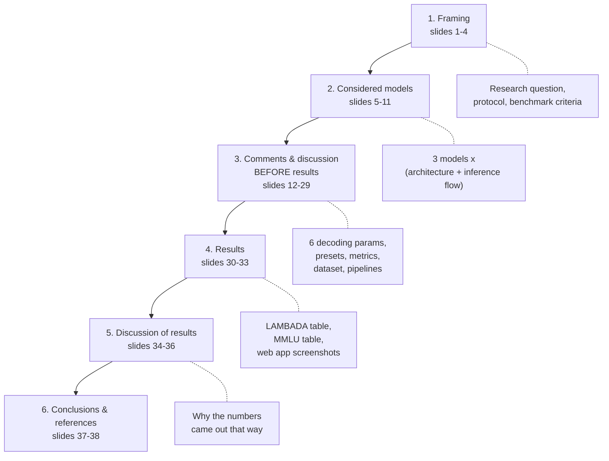

| Section | Slides | What it is doing |
|---|---|---|
| Framing | 1–4 | States the question and the rules of the experiment |
| Considered models | 5–11 | Introduces the three models and how each one computes |
| Comments & discussion before results | 12–29 | Defines every knob and every metric **before** any score is shown |
| Results | 30–33 | The two result tables + the web app |
| Discussion of results | 34–36 | Explains *why*, separating model effects from infrastructure effects |
| Conclusions | 37–38 | Answers the question, cites sources |

**The structural point worth noticing:** the deck spends 18 of 38 slides
(12–29) defining things before showing a single score. That ordering is
deliberate — it means no metric can be accused of being chosen after the
results were known.

---

# Section 1 — Framing (slides 1–4)

## Slide 1 — Title

| Keyword | Meaning |
|---|---|
| Mid-term empirical study | Coursework genre: a measurement study, not a new model |
| LAMBADA | Benchmark: predict the last word of a passage |
| MMLU | Benchmark: multiple-choice knowledge across 57 subjects |
| SLM (Small Language Model) | Roughly ≤ 10B parameters |

| Field | Value |
|---|---|
| Submitted to | Prof. Anna Corazza |
| Team | Francesco Ventimiglia · Danilo Rodriguez · Rohan Baidya |
| Links | `github.com/ronvoy/gen-ai` · `unina.cc/gen-ai` |

> **ELI5.** Title page. We tested three small AIs on two different exams and
> wrote down not just their marks but how fast and how sensibly they answered.

---

## Slide 2 — Research Question

| Keyword | Meaning |
|---|---|
| Compression strategy | How a small model was made small — distilled, pruned, or trained small natively |
| Distilled | Trained to copy a bigger model's output distribution |
| Pruned | Had less-important weights/layers cut out of a bigger model |
| Non-distilled | Trained at its own size from the start (Ministral-8B) |
| Attention mechanism | How tokens are allowed to look at each other |

**The question, as posed:** among three SLMs with different compression
strategies and attention mechanisms, which best balances **accuracy**,
**reasoning quality** and **latency**, on **LAMBADA** and **MMLU**? And
specifically: does the larger non-distilled model (Ministral-8B) beat the
smaller distilled/pruned ones (Gemma-3-4B, Llama-3.2-3B) — or does compression
cost more in one dimension than another?

> **ELI5.** Two of these AIs are "shrunk-down copies" of bigger AIs. One was
> built small from scratch. Question: does building small from scratch beat
> shrinking something big — and if you lose something by shrinking, do you lose
> accuracy, or sense-making, or speed?

**Why the phrasing matters:** "or does compression cost more in one dimension
than another" is what licenses three separate metrics instead of one. If the
question were just "which is most accurate", the whole middle of the deck would
be unnecessary.

---

## Slide 3 — Experimental Protocol

| Block | Setting |
|---|---|
| **Dataset — LAMBADA** | 5,153-passage test split, BookCorpus, English, ACL 2016 |
| **Dataset — MMLU** | 57 subjects × 5 questions = **285 questions per model**, from the free HF datasets-server API, cached locally |
| **Preprocessing — LAMBADA** | Predictions normalised (lowercase, punctuation stripped) before exact match |
| **Preprocessing — MMLU** | Chain-of-thought prompt, one worked example, strict `Reasoning:` / `Answer: <letter>` format |
| **Decoding (no training)** | No weights change — only temperature, top-p, max tokens, few-shot count |
| **Presets** | Optimal / Normal / Best Performance, applied identically to both benchmarks and all three models |
| **Evaluation** | One API (OpenRouter) for all models — hardware-neutral |
| **Sampling** | Deterministic: fixed subject/question order, no randomness |
| **Capture** | One shared web app: terminal streaming, run history, charts |

> **ELI5.** The rules of the exam. Same questions, same order, for every AI. No
> retraining anyone — we only change *how they're asked*, never what they know.
> All three sit the exam through the same booking system so nobody gets an
> easier desk.

**Keyword — "no training".** This is a *decoding* study. Nothing here is
fine-tuning: the six parameters on slides 12–16 change how tokens are picked at
inference time, and change nothing inside the model.

**Keyword — "hardware-neutral".** Going through one API means the *client* code,
retry logic and timer are identical for everyone. It does **not** mean the
hardware behind the API is identical — slide 34 is where that bites.

---

## Slide 4 — Benchmark (criteria)

**Baseline task.** LAMBADA: predict the single next word, guessable only from
the full context. MMLU: choose A–D after writing short step-by-step reasoning.
No fine-tuning either way — pretrained + instruction-tuned weights only.

**Reference criteria — LAMBADA**

| Metric | Better |
|---|---|
| Exact-match accuracy | Higher |
| Average response time | Lower |
| Error rate | Lower |
| Throughput | Higher |

**Reference criteria — MMLU**

| Metric | Definition |
|---|---|
| Accuracy | Correct letters / total (exact match) |
| Category accuracy | Per STEM / Humanities / Social / Other |
| Reasoning consistency | Reasoning supports the chosen option |
| Composite score | `0.70·acc + 0.15·reasoning + 0.15·speed` |

**Ground truth** comes from the source datasets (the target word / the official
answer key) — never inferred.

> **ELI5.** Before showing any marks, we write down what counts as good and what
> counts as bad, and where the right answers come from. Two benchmarks need two
> scorecards because "predict one word" and "pick a letter and justify it" are
> not the same skill.

---

# Section 2 — Considered models (slides 5–11)

## Slide 5 — Involved approaches

| # | Model | Developer | Params | Key technique |
|---|---|---|---|---|
| 1 | Gemma-3-4B | Google | 4B | Knowledge distillation + local/global attention |
| 2 | Llama-3.2-3B | Meta | 3B | Compact dense transformer |
| 3 | Ministral-8B | Mistral AI | 8B | Sliding Window Attention + GQA |

- **Gemma-3-4B** — dense decoder-only transformer, interleaved local/global attention, distilled from a larger teacher, 128k context.
- **Llama-3.2-3B** — standard dense recipe (RoPE, GQA, SwiGLU), pruned and distilled from larger Llama 3.1 models.
- **Ministral-8B** — sliding window attention + GQA for efficient long-context inference; **trained at its native 8B size**, not distilled down.

> **ELI5.** Three contestants. Two are compressed versions of bigger models;
> one was born at its own size. They also disagree about how much of the text
> each word is allowed to look at.

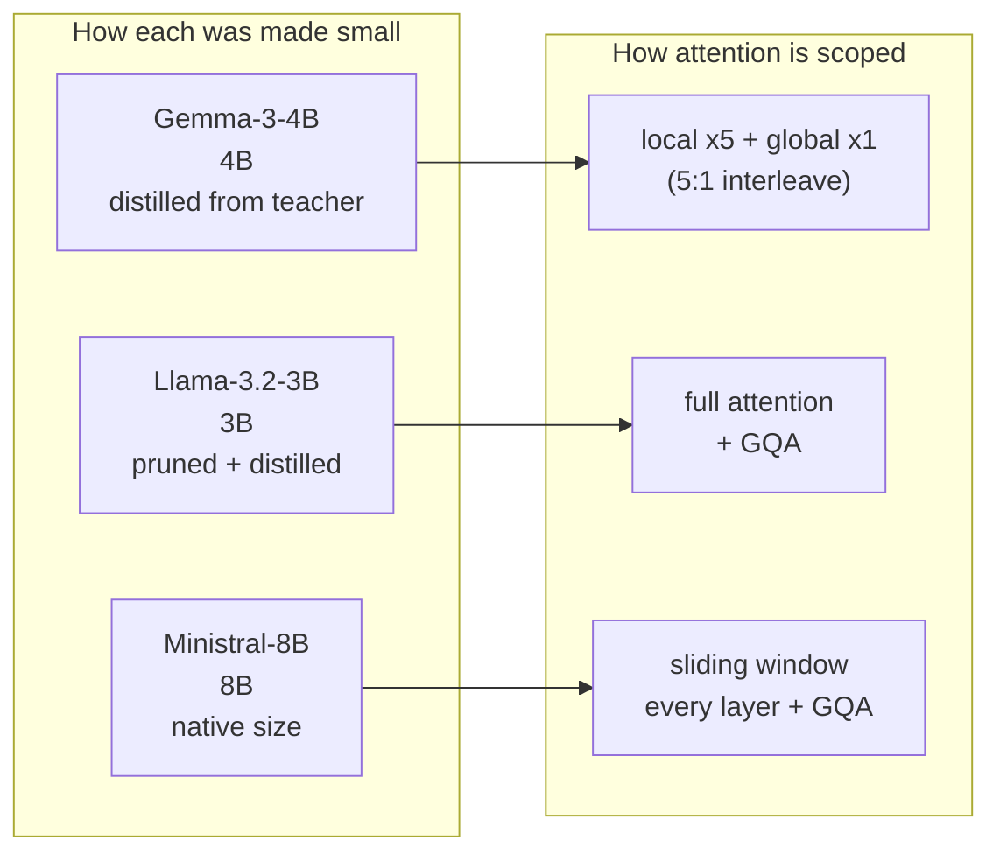

---

## Slide 6 — Gemma-3-4B (architecture)

| Keyword | Meaning |
|---|---|
| Local attention | Each token sees only a nearby sliding window — cheap |
| Global attention | One layer per block where every token sees the whole context — expensive |
| 5:1 interleaving | Five local layers for every one global layer |
| Knowledge distillation | Small model trained to match a big teacher's output distribution |
| GQA | Grouped Query Attention — query heads share KV heads, shrinking the KV cache |
| QK-norm | Normalising queries/keys for training stability |
| Context window | 128k tokens |

**The cost argument, as the slide makes it:** full attention cost grows
quadratically with context length. Interleaving keeps memory roughly linear
while information still reaches every token by the time it passes a global
layer.

$$\text{cost}_{\text{full}} \sim O(n^2) \qquad\text{vs}\qquad \text{cost}_{\text{local}} \sim O(n \cdot w),\quad w = \text{window} \ll n$$

> **ELI5.** Reading a book where you mostly only remember the current paragraph
> (cheap), but every sixth page you're allowed to flick back through the whole
> book (expensive). You get the long-range understanding without paying for it
> on every single page. And it learned by copying a smarter student's answers
> rather than reading the textbook alone.

---

## Slide 7 — Gemma-3-4B inference flow

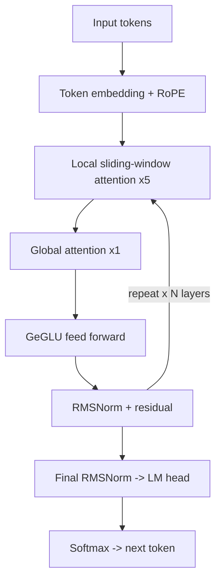

| Stage | What it does |
|---|---|
| Local sliding-window attention ×5 | Cheap, restricted to nearby tokens |
| **Global attention ×1** | The one layer per block where every token can see the full passage — **this is how long-range context (LAMBADA's whole point) actually gets used** |
| GeGLU feed forward | Gated variant of the MLP block used after attention |
| RMSNorm + residual | Normalisation and skip connection, repeated per layer |

> **ELI5.** The assembly line inside Gemma. Words go in, get position tags, then
> pass through five cheap "look nearby" stations and one expensive "look
> everywhere" station, over and over. At the end it picks the next word.

**Exam trap:** if asked *"which part of Gemma does LAMBADA actually depend on?"*
— the global-attention layer. Remove it and long-range last-word prediction
degrades to local n-gram guessing.

---

## Slide 8 — Llama-3.2-3B (architecture)

| Keyword | Meaning |
|---|---|
| Compact dense transformer | No architectural novelty — the proven recipe, shrunk |
| Structured pruning | Removing less-important weights/layers from a bigger trained model |
| Distillation (after pruning) | Fine-tuning the pruned model to match the bigger one's behaviour |
| RoPE | Rotary position embeddings — encode position by rotating vectors; generalise to unseen lengths |
| SwiGLU | Gated feed-forward layer, replaces a plain ReLU/GeLU MLP |

**Slide's framing:** "compress an expert" rather than "train a novice from
scratch". Net effect — predictable, well-understood, easy to serve on modest
hardware, at some cost to raw capacity versus a natively-trained model of
similar size.

> **ELI5.** Llama is a big model that was trimmed down and then coached to
> behave like its bigger self. Nothing clever or new in its design — it's the
> standard blueprint, just smaller. Reliable and cheap, but something was lost
> in the trimming.

---

## Slide 9 — Llama-3.2-3B inference flow

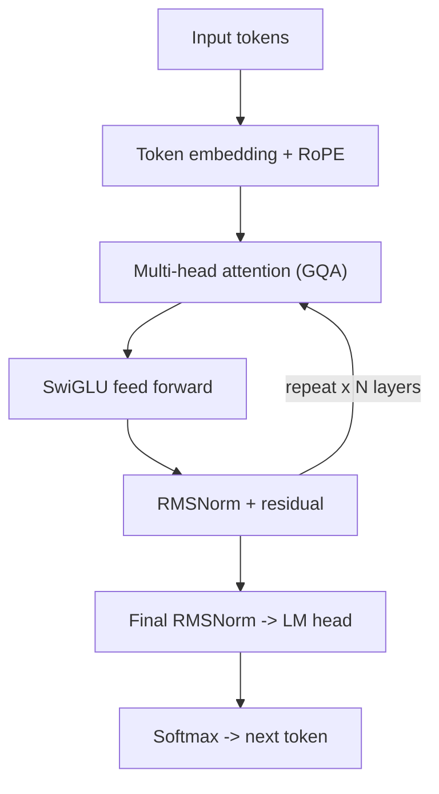

| Stage | What it does |
|---|---|
| Multi-head attention (GQA) | Full attention over the whole context, with grouped KV heads to shrink the cache |
| SwiGLU feed forward | Gated MLP block |
| — | **No local/global split, no sliding window — the simplest of the three designs** |

> **ELI5.** The plainest assembly line of the three. Every word can see every
> other word, every single layer. Simple and predictable — and the reason it's
> the fastest model in the study.

---

## Slide 10 — Ministral-8B (architecture)

| Keyword | Meaning |
|---|---|
| Sliding window attention (SWA) | Each layer attends only to a fixed window of recent tokens |
| Per-layer cost cap | Attention cost stays bounded regardless of passage length |
| Depth-as-substitute | Stacked windowed layers propagate information further than any single window |
| GQA | Shrinks the KV cache further |
| Native 8B | **Not** distilled or pruned from a larger checkpoint |

**Slide's own claim:** being trained at native 8B size is "very likely the
single biggest reason it leads both benchmarks."

> **ELI5.** Each layer only looks at a short recent window — but stack enough
> layers and information travels the whole way anyway, like a chain of people
> each whispering to their neighbour. And unlike the other two, nobody shrank
> it: it was built this size, so nothing got smoothed away.

---

## Slide 11 — Ministral-8B inference flow

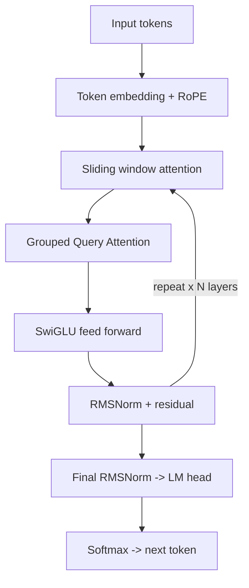

| Stage | What it does |
|---|---|
| Sliding window attention | Local context only, per layer — same trick Gemma uses for its "local" layers, but on **every** layer, not 4 in 5 |
| Grouped Query Attention | Shrinks the KV cache for fast decoding on long passages |
| — | **No global-attention layer at all — depth substitutes for it** |

> **ELI5.** Same idea as Gemma's cheap stations, but there is no "look
> everywhere" station at all. Instead it just has many more cheap stations,
> and information hops along them.

**Comparison worth memorising:**

| | Gemma-3-4B | Llama-3.2-3B | Ministral-8B |
|---|---|---|---|
| Long-range mechanism | global layer every 5th | full attention always | depth over windows |
| KV cache trick | GQA + QK-norm | GQA | GQA |
| FFN | GeGLU | SwiGLU | SwiGLU |
| Made small by | distillation | pruning + distillation | not made small |

---

# Section 3 — Comments and discussion *before* results (slides 12–29)

## Slide 12 — Temperature

| Field | Value |
|---|---|
| What it does | Scales logits before the softmax that turns raw scores into a probability distribution; the next token is sampled from that distribution |
| Range | 0.0 – 2.0 |
| **Used in this evaluation** | **0.0** |
| Panel | One of six decoding parameters; none change model weights |

$$p_i = \frac{\exp(z_i / T)}{\sum_j \exp(z_j / T)} \qquad\qquad T \to 0 \;\Longrightarrow\; \hat{y} = \arg\max_i z_i$$

| Setting | Behaviour |
|---|---|
| Temperature 0.0 | Greedy / deterministic — same input always gives same output |
| Temperature > 0 | Sampled / varied — more variety, more risk of drifting off the one correct word |

**Why 0.0 here:** both LAMBADA (one correct word) and MMLU (one correct letter)
have exactly one right answer. No reward for creative variation, only downside
risk. Greedy decoding is the right call whenever the target is an exact match,
not open-ended prose.

> **ELI5.** Temperature is the AI's dice. At 0 you take the dice away — it
> always says its single most confident answer, so asking twice gives the same
> reply. Since both exams have exactly one right answer, creativity can only
> hurt.

---

## Slide 13 — Top-p (nucleus sampling)

| Field | Value |
|---|---|
| What it does | Restricts sampling to the smallest set of tokens whose cumulative probability reaches *p* — the "nucleus"; everything outside is discarded before sampling |
| Range | 0.0 – 1.0 |
| **Used in this evaluation** | **1.0** |

$$V^{(p)} = \text{smallest } V' \subseteq V \;\text{ s.t. }\; \sum_{i \in V'} p_i \ge p \qquad\qquad p = 1.0 \Rightarrow V^{(p)} = V$$

**Why 1.0:** at 1.0 the nucleus is the entire distribution — nothing is
excluded. Combined with temperature 0.0, top-p has **no practical effect**:
greedy decoding already picks one token deterministically regardless of how
large the candidate pool is. Lower values would only matter at temperature > 0.
Set to its neutral value rather than doing any real work here.

> **ELI5.** Top-p is a shortlist rule: "only consider the few most likely
> words." Set to 1.0 it shortlists everything, i.e. does nothing. And since the
> dice are already off (temperature 0), it couldn't matter anyway. It's parked
> at neutral, honestly declared.

**Exam trap:** *"You report top-p — what did it contribute?"* Nothing, and the
slide says so. Reporting an inert parameter is not padding; it's disclosure, so
nobody wonders whether it was silently doing something.

---

## Slide 14 — Max Tokens

| Field | Value |
|---|---|
| What it does | Hard cap on generated tokens before the API cuts off. Every output token is one more sequential decode step, so it is **also a direct lever on latency** |
| Range | 1 – 128 (LAMBADA panel) |
| **Used — LAMBADA** | **32** |
| **Used — MMLU** | **384** |

| Reason | Detail |
|---|---|
| LAMBADA needs little | One word + slack for stray punctuation — 32 is generous headroom |
| MMLU needs a lot | Must write full chain-of-thought before the final `Answer: <letter>` |
| Too low is dangerous | Truncates mid-reasoning before the answer line → recorded as **"no-answer"**, not a wrong answer |
| Latency consequence | A major reason MMLU latency (0.6–2.5 s) runs systematically higher than LAMBADA (0.6–1.2 s) for the same models |

> **ELI5.** A word limit on the answer. One word needs a tiny limit; "show your
> working then answer" needs a big one. Set it too small and the AI gets cut off
> mid-sentence before it ever says its answer — which scores as *unreadable*,
> not *wrong*. And longer answers take longer, which is why the MMLU exam is
> slower for everyone.

---

## Slide 15 — Few-shot Examples

| Field | Value |
|---|---|
| What it does | Prepends worked (context → answer) examples from a fixed pool, showing the exact input/output format expected — a prompting technique, not a weight change |
| Range | 0 – 5 (LAMBADA) |
| **Used in this evaluation** | **3 worked examples** |
| MMLU equivalent | One fixed worked example baked into the prompt template, not a tunable count |

| Reason | Detail |
|---|---|
| Format drift | Instruction-tuned models otherwise answer in sentences ("The next word is likely…") |
| Anchoring | A few worked examples fix the bare-word format without touching weights |
| Trade-off | Each example adds prompt tokens → slightly more latency per call, even though the model's own output doesn't get longer |

> **ELI5.** Showing worked examples first, like "here's how the last three
> questions were answered — now you do one." Without it the AI writes a polite
> sentence instead of the single word you asked for, and gets marked wrong for
> formatting rather than for knowledge.

---

## Slide 16 — Frequency & Presence Penalty

| Parameter | What it does | Range | Used |
|---|---|---|---|
| **Frequency penalty** | Subtracts a penalty **proportional to how many times** a token already appeared — the more it repeats, the less likely again | −2.0 – 2.0 | **0.0** |
| **Presence penalty** | Flat penalty the moment a token appears **at least once**, regardless of count — encourages new words/topics | −2.0 – 2.0 | **0.0** |

$$z_i' = z_i \;-\; \underbrace{\alpha \cdot c_i}_{\text{frequency}} \;-\; \underbrace{\beta \cdot \mathbb{1}[c_i > 0]}_{\text{presence}} \qquad \alpha = \beta = 0 \text{ here}$$

**Why they're irrelevant here:** both tasks produce a single short answer — one
word, or one letter plus brief reasoning. There's no room for the repetitive
looping these penalties exist to prevent in long-form generation.

> **ELI5.** Two anti-repetition dials, for when an AI gets stuck saying the same
> thing over and over. Our answers are one word or one letter long — there's
> nothing to repeat. Both switched off, and we say why rather than leaving you
> guessing.

---

## Slide 17 — Parameter set used in this evaluation

**LAMBADA — actual run configuration**

| Parameter | Value |
|---|---|
| Temperature | 0.0 |
| Top-p | 1.0 |
| Max tokens | 32 |
| Frequency penalty | 0.0 |
| Presence penalty | 0.0 |
| Few-shot examples | 3 |

**MMLU — actual run configuration**

| Parameter | Value |
|---|---|
| Temperature | 0.0 |
| Top-p | 1.0 |
| Max tokens | 384 |

| Disclosure | Detail |
|---|---|
| Not a named preset | Hand-set config close to, but not identical to, any single preset (mixes Optimal's greedy decoding with a different max-token / few-shot budget) |
| Applied identically | Same for Gemma-3-4B, Llama-3.2-3B, Ministral-8B — none got special treatment such as a larger reasoning-token budget |
| Reasoning budget unused | `config.py` reserves `MAX_TOKENS_REASONING = 8096` for models in `REASONING_MODELS` — **that list is empty for this study** |
| Consequence | Any differences in results come from the models, not from unequal conditions |

> **ELI5.** The exact settings sheet, printed so anyone can re-run it. The
> important bit: every AI got the *same* sheet. So if one did better, it wasn't
> because we gave it a bigger answer budget.

**This slide is the deck's fairness receipt.** It is what lets slides 34–36
attribute differences to models rather than to setup.

---

## Slide 18 — Presets, LAMBADA

| Preset | Temp | Top-p | Max tok | Few-shot | Intent |
|---|---|---|---|---|---|
| Optimal | 0.0 | 1.0 | 16 | 5 | Most reliable accuracy |
| Normal | 0.3 | 0.9 | 32 | 3 | Balanced default |
| Best Performance | 0.0 | 1.0 | 8 | 2 | Fastest, cheapest runs |

- **Optimal** is theoretically strongest for LAMBADA: exactly one correct token, so greedy removes sampling risk entirely and more worked examples further anchor the one-word format.
- **Normal** reintroduces randomness (0.3 / 0.9) — useful for exploring variability, no upside on an exact-match task.
- **Best Performance** trims token cap and example budget for cheapest/fastest runs, at some risk of losing the format anchor.
- **The saved runs used a nearby but distinct hand-set config** — 3 few-shot, 32 max tokens — not one of these three exactly.

> **ELI5.** Three ready-made settings bundles: careful, balanced, and cheap. For
> a one-word exam, "careful" wins on paper because randomness can only hurt.
> The actual runs used something in between, and the slide admits it.

---

## Slide 19 — Presets, MMLU

| Preset | Temp | Top-p | Max tok | Intent |
|---|---|---|---|---|
| Optimal | 0.0 | 1.0 | 512 | Most reasoning room — most reliable accuracy |
| Normal | 0.2 | 0.95 | 384 | Matches the defaults |
| Best Performance | 0.0 | 1.0 | 192 | Caps the reasoning budget for faster runs |

- **Optimal** gives the most room (512 tokens) for multi-step reasoning before committing to a letter — matters for subjects needing longer derivations (`formal_logic`, `college_mathematics`).
- **Best Performance** risks truncating longer reasoning chains before the `Answer:` line → surfaces as a **"no-answer"** verdict.
- **The saved runs used 384 tokens** (Normal's budget) with greedy decoding (0.0 / 1.0) borrowed from Optimal.

> **ELI5.** Same three bundles, but for the show-your-working exam the key dial
> is *how much room to think*. Too little room and the AI gets cut off before it
> writes its answer — scoring zero for a reason that has nothing to do with
> whether it knew the answer.

---

## Slide 20 — Metrics explained, LAMBADA

| Metric | Definition | Detail |
|---|---|---|
| **Exact-match accuracy** | correct / total, after lowercasing and stripping punctuation from **both** prediction and target | Example: target `"Zane."` vs prediction `"zane"` → identical after normalisation → **correct** |
| **Average response time** | Mean wall-clock seconds per API call, start to finish | Includes network round-trip and OpenRouter provider routing/queueing — which is why it can spike under congestion |
| **Error rate** | errors / total — calls that failed outright (timeouts, malformed) **even after retries exhausted** | All three models finished at **0 errors** in the saved runs |
| **Throughput** | total / total wall-clock time — samples graded per second | Requests sent one at a time (no batching), so throughput ≈ reciprocal of latency |

$$\text{acc} = \frac{1}{N}\sum_{k=1}^{N}\mathbb{1}\!\left[\text{norm}(\hat{y}_k) = \text{norm}(y_k)\right] \qquad\quad \text{throughput} = \frac{N}{T_{\text{total}}} \approx \frac{1}{\bar{t}}$$

**Throughput as reported:** Llama ≈ 1.73/s · Ministral ≈ 1.37/s · Gemma ≈ 0.84/s

Re-computed from the latencies on slide 30:

| Model | 1 / latency | Deck states | Match |
|---|---|---|---|
| Llama-3.2-3B | 1 / 0.577 = 1.73 | ≈1.73 | ✅ |
| Ministral-8B | 1 / 0.731 = 1.37 | ≈1.37 | ✅ |
| Gemma-3-4B | 1 / 1.198 = **0.83** | ≈0.84 | ⚠️ rounding |

*The Gemma figure is off by 0.01 — 1/1.198 = 0.835, which rounds to 0.83, not
0.84. Harmless (the deck likely divided by 1.19), but know it before someone
else spots it.*

> **ELI5.** Four numbers. Did it say the right word (ignoring capitals and full
> stops)? How long did each answer take, door to door? How often did the request
> fail completely? And how many questions per second could we get through?
> Because we ask one at a time, the last one is just "one divided by the
> waiting time".

---

## Slide 21 — Metrics explained, MMLU (1/2)

| Metric | Definition | Number from the deck |
|---|---|---|
| **Accuracy** | Correct letters / total questions (exact match) — judges **only the final letter**, not the reasoning | see slide 32 |
| **Category accuracy** | Same accuracy computed separately per STEM / Humanities / Social / Other | Llama: **43.3% STEM vs 63.3% Social — a 20-point spread** |
| **Reasoning rate** | Share of answers with a non-trivial explanation (≥ 5 words) | **≈100% for all three** — everyone explained |
| **Reasoning consistency** | Share of answers whose reasoning text actually **supports the chosen letter** | Ministral **69.1%**, Gemma 64.6%, Llama **59.7%** |
| **Avg. reasoning words** | Mean explanation length | Ministral **54.1** (shortest), Llama **61.8** (longest) |

**The finding the slide lands:** Ministral writes the *shortest* reasoning yet
has the *highest* consistency; Llama writes the *longest* yet is *least*
consistent. **Length and quality of explanation are not the same thing.**

> **ELI5.** Marking the working, not just the answer. Everyone wrote an
> explanation, so "did it explain?" separates nobody. What separates them is
> whether the explanation actually backs the answer they chose. And the model
> that wrote the least said the most sense — waffling isn't thinking.

**Why category accuracy earns its place:** a single average hides a model that
is excellent at one domain and poor at another. A 20-point internal spread
(Llama) versus a 9.4-point one (Ministral, slide 35) is a real difference in
*consistency of competence*, invisible in the headline number.

---

## Slide 22 — MMLU composite score (2/2)

$$\text{Composite} = 0.70 \times \text{accuracy} \;+\; 0.15 \times \text{reasoning consistency} \;+\; 0.15 \times \text{relative speed}$$

$$\text{relative speed}_m = \frac{\min_j \bar{t}_j}{\bar{t}_m} \qquad\Longrightarrow\qquad \text{fastest model always scores } 1.0$$

| Model | Accuracy term (0.70×) | Reasoning term (0.15×) | Speed term (0.15×) | **Composite** |
|---|---|---|---|---|
| Ministral-8B | 0.789 × 0.70 = 0.552 | 0.691 × 0.15 = 0.104 | 0.500 × 0.15 = 0.075 | **0.731** |
| Llama-3.2-3B | 0.558 × 0.70 = 0.391 | 0.597 × 0.15 = 0.090 | 1.000 × 0.15 = 0.150 | **0.630** |
| Gemma-3-4B | 0.639 × 0.70 = 0.447 | 0.646 × 0.15 = 0.097 | 0.307 × 0.15 = 0.046 | **0.590** |

**Speed term derivation** — Llama's 0.768 s is the fastest reference:

| Model | Calculation | Speed term |
|---|---|---|
| Ministral-8B | 0.768 / 1.537 | 0.500 |
| Llama-3.2-3B | 0.768 / 0.768 | 1.000 |
| Gemma-3-4B | 0.768 / 2.502 | 0.307 |

- These figures reconcile exactly with the composite scores — **verified independently for this deck**.
- Accuracy dominates the weighting (70%), so Ministral's large accuracy lead carries it to #1 even though it is not the fastest.

> **ELI5.** One number combining three things, with accuracy worth 70% and
> sense-making and speed worth 15% each. Speed is scored relative to the
> fastest model, which automatically gets a perfect 1.0 on that part. Because
> accuracy is weighted so heavily, the most accurate model wins overall even
> though it's only half as fast as the quickest.

**Exam trap:** *"Isn't 70/15/15 arbitrary?"* Yes — it is a judgement. The
defence is that every component is shown separately (slide 32) and the
arithmetic is printed (this slide), so a reader who disagrees with the weights
can recompute with their own. A hidden weighting would be the problem; a
published one is auditable.

---

## Slide 23 — LAMBADA: dataset, properties & scoring flow

| Dataset fact | Value |
|---|---|
| Source | BookCorpus (unpublished novels), English |
| Curation criterion | Final word predictable from the **full passage** but **not** from the last sentence alone |
| Test split | 5,153 passages |
| First published | ACL 2016 (Paperno et al.) |

**Properties**

| Property | Value |
|---|---|
| Source corpus | BookCorpus (unpublished novels) |
| Task type | Word prediction |
| Curation criterion | Target guessable from full context only |

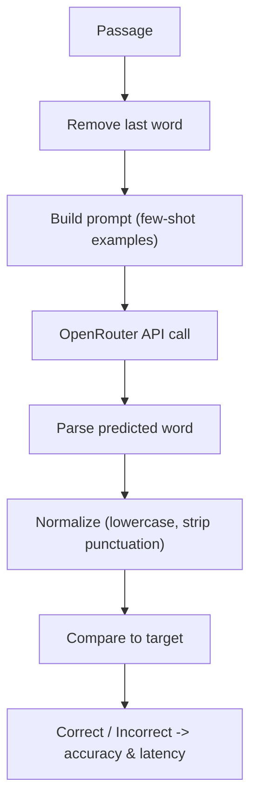

> **ELI5.** The exam is built from novels, and deliberately rigged: you can only
> guess the missing last word if you read the *whole* passage — reading just the
> final sentence isn't enough. That's the point of the dataset. Then the flow:
> hide the last word, ask, tidy up the reply, compare.

**Why the curation criterion matters:** it is the entire justification for using
LAMBADA to test *long-range context*. Without it, a model could score well on
local pattern-matching alone.

---

## Slide 24 — LAMBADA: dataset splits

| Split | File | Passages | Purpose |
|---|---|---|---|
| **Test** | `lambada_test_plain_text.txt` | **5,153** | **Primary evaluation** |
| Development | `lambada_development_plain_text.txt` | 4,869 | Validation and tuning |
| Control Test | `lambada_control_test_data_plain_text.txt` | 5,000 | Baseline, unfiltered |
| Rejected | `rejected_plain_text.txt` | 11,941 | Passages cut during curation |
| Training Novels | `train-novels/` (16 genres) | 2,662 novels | Pre-training material |
| Vocabulary | `lambada-vocab-2.txt` | 112,746 entries | Reference vocabulary |

**This evaluation uses only the Test split** — 5,153 passages, **sampled down to
1,000** for the saved runs. The other splits exist in the released dataset but
aren't used for scoring.

> **ELI5.** The dataset ships with six files; we only marked answers from one of
> them (the official test set), and we used 1,000 of its 5,153 passages to keep
> runs affordable. Worth knowing the "Rejected" pile exists — those are the
> passages the dataset authors threw out *because* the last sentence gave the
> answer away.

---

## Slide 25 — LAMBADA: scoring flow, in detail

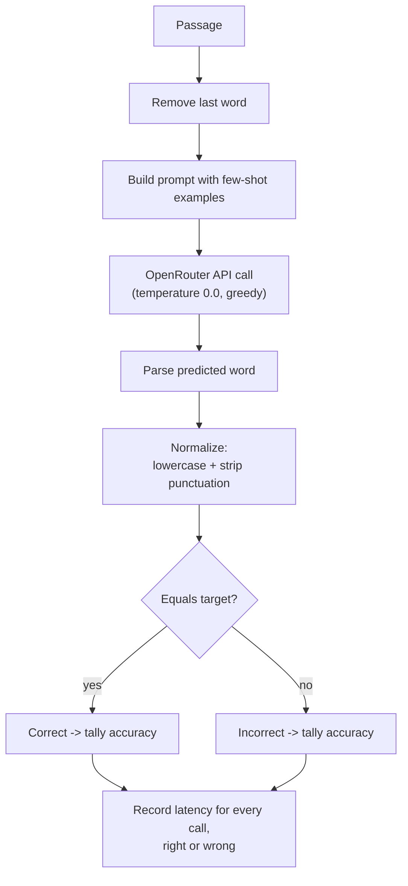

| Callout | Point |
|---|---|
| **Key step — normalisation** | What makes exact match *fair*: without it, capitalisation or a trailing period would wrongly mark a correct guess wrong |
| **Note — latency coverage** | Latency recorded for **every** call — correct, incorrect, or (after retries) failed — so the average reflects real-world response time, not just successful guesses |

> **ELI5.** Same flow as the previous slide but with the decision point drawn in,
> plus two honesty details: we tidy both strings before comparing (so "Zane."
> and "zane" match), and we time *every* attempt, including the failures — you
> can't make your average look good by only timing the easy ones.

---

## Slide 26 — MMLU: how a run works

For every question the model first writes short step-by-step reasoning, then
commits to one of four options (A–D); **both** the letter and the reasoning text
are parsed and evaluated.

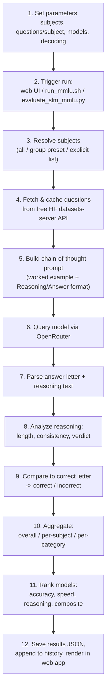

| Step | Keyword |
|---|---|
| 3 | Subject resolution — "all", a group preset, or an explicit list |
| 4 | **Caching** — questions fetched once, then read locally, so reruns are offline and repeatable |
| 5 | **Chain-of-thought** prompt with a worked example enforcing parseable output |
| 7 | **Dual parse** — the letter *and* the reasoning, separately |
| 8 | Reasoning analysis → verdict (slide 28) |
| 10 | Three aggregation levels: overall, per-subject, per-category |

> **ELI5.** Twelve steps from "pick the settings" to "see it on the website".
> The two that matter most: step 4 saves the questions locally so every rerun
> asks exactly the same things, and step 7 pulls the answer *and* the working
> apart so they can be marked separately.

---

## Slide 27 — MMLU: components

| Component | File / Function | Role |
|---|---|---|
| Run parameters | `evaluate_slm_mmlu.py`, `run_mmlu.sh` | Subject selection, questions/subject, models, decoding params |
| Subject catalogue | `MMLU_SUBJECTS`, `SUBJECT_GROUPS` | 57 subjects mapped to official categories |
| Dataset fetcher | `fetch_subject_questions`, `_download_subject` | Free HF datasets-server client + local JSON cache |
| Task loader | `load_mmlu_tasks` | Flattens subjects × questions into one ordered task list |
| Prompt builder | `build_mmlu_prompt`, `WORKED_EXAMPLE` | Chain-of-thought prompt with a worked example |
| Model client | `query_model_mmlu` | OpenRouter call with timing + error capture |
| Response parser | `parse_mmlu_response` | Splits a raw response into (answer letter, reasoning) |
| Reasoning analyzer | `analyze_reasoning` | Presence, word count, consistency, verdict |
| Evaluator | `evaluate_model_mmlu` | Runs all tasks for one model; aggregates accuracy + reasoning |
| Ranker | `build_mmlu_summary` | Per-dimension ranks + composite score across models |
| CLI runner | `run_mmlu_evaluation`, `run_mmlu.sh` | One-shot terminal pipeline: setup, install, run, print ranking |
| Web routes | `app.py` | Online runs, live progress feed, ranking JSON, detail feed |
| Web page | `templates/mmlu.html` | Subject picker, terminal, ranking table, charts, Q/A viewer |

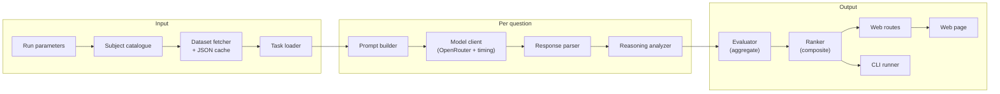

> **ELI5.** A map of which bit of code does which job — useful if an examiner
> asks "where does that number actually come from?" Read it left to right: get
> the questions, ask each one and pull the reply apart, then add everything up
> and show it.

---

## Slide 28 — MMLU: reasoning verdicts

Every answer gets one of six verdicts, scoring not just whether the letter was
correct but whether the reasoning actually supports it.

| Verdict | Meaning | Letter correct? | Reasoning present & supportive? |
|---|---|---|---|
| **sound** | Correct answer, reasoning clearly supports it | ✅ | ✅ |
| **right-weak-link** | Correct answer, reasoning doesn't clearly support it | ✅ | ⚠️ present, unsupportive |
| **lucky-guess** | Correct answer with no real reasoning | ✅ | ❌ |
| **flawed-reasoning** | Reasoned its way to a wrong answer | ❌ | ⚠️ present |
| **blind-guess** | Wrong answer and no reasoning | ❌ | ❌ |
| **no-answer** | No A–D letter could be parsed | — | — |

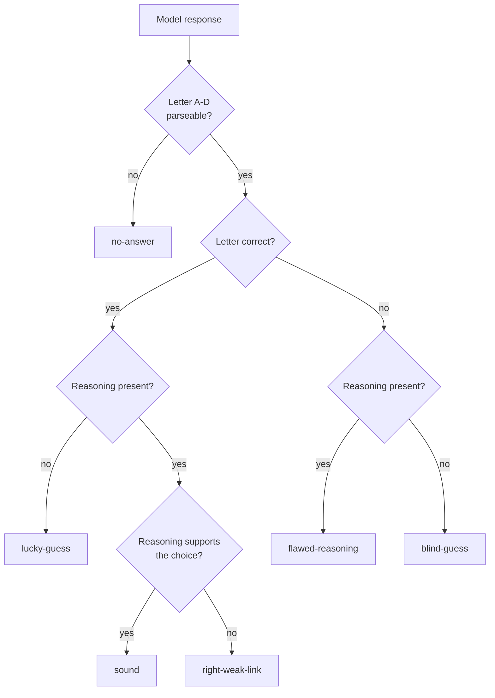

> **ELI5.** Six ways an answer can turn out, because "right" and "wrong" hide
> too much. Right for the right reason is not the same as a fluke; wrong after
> careful reasoning is not the same as a blind stab; and "couldn't read the
> answer at all" is its own category, not a wrong answer.

**Why `no-answer` is separate and not counted wrong:** it's a *formatting*
failure, fixable with a better prompt or a bigger token budget (slide 14). Being
wrong is not fixable that way. Collapsing them would hide which problem you
have.

---

## Slide 29 — Project workflow, end to end

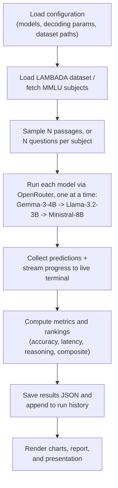

| Step | Keyword |
|---|---|
| 1 | Configuration-first — settings are an input, recorded, not a side effect |
| 3 | Sampling is deterministic (slide 3), so "N passages" means the *same* N every run |
| 4 | **Sequential, one model at a time** — not parallel; this is why throughput ≈ 1/latency |
| 5 | Live terminal streaming — progress visible during a long run |
| 7 | Run history — past runs keep their own numbers |
| 8 | The report and this deck are *generated* from saved results |

> **ELI5.** The whole machine in eight steps: read the settings, get the
> questions, ask each AI in turn, watch it happen live, add up the marks, save
> everything, then auto-build the charts and slides from what was saved. Nothing
> is typed in by hand at the end — which is why the deck can't drift from the
> results files.

---

# Section 4 — Results (slides 30–33)

## Slide 30 — LAMBADA results (test split)

| Model | Accuracy (%) | Correct / Total | Avg Latency (s) | Errors |
|---|---|---|---|---|
| Gemma-3-4B | 21.9 | 219 / 1000 | 1.198 | 0 |
| Llama-3.2-3B | 20.8 | 208 / 1000 | **0.577** | 0 |
| **Ministral-8B** | **38.1** | 381 / 1000 | 0.731 | 0 |

- Best accuracy: **Ministral-8B at 38.1%**
- Fastest: **Llama-3.2-3B at 0.577 s/query**
- Gemma-3-4B holds 21.9% on the full 1,000-sample split (matching its earlier 50-sample estimate) but is now clearly the **slowest** at 1.198 s/query

*Two chart images are embedded on this slide (accuracy and latency bar charts).*

> **ELI5.** Ministral gets nearly twice as many last-words right as the other
> two — a big gap, not a close call. Llama is the quickest. Gemma is both
> inaccurate *and* slowest here, which slide 34 explains is partly not its
> fault. Nobody's requests failed outright.

**Note the gap sizes:** Ministral leads by ~16 points, while Gemma and Llama are
within 1.1 points of each other — close enough that ranking those two on
accuracy alone is not meaningful at n=1,000.

---

## Slide 31 — LAMBADA web app run panel

| Element | Purpose |
|---|---|
| Model + sample-count inputs | Choose what to run |
| Run Benchmark / Fine Tune buttons | Trigger a run, or open the presets panel |
| Live terminal | Per-sample output streaming — **green = correct, red = wrong** |
| Metrics table | Latest saved results for all three models |

*One screenshot image embedded.*

> **ELI5.** A screenshot of the tool. You pick the model and how many passages,
> press go, and watch answers scroll past in green and red while it runs — then
> the table underneath holds the saved scores.

---

## Slide 32 — MMLU results (57 subjects × 5 questions = 285/model)

| Rank | Model | Acc. (%) | STEM | Human. | Social | Other | Reason. (%) | Avg s | Composite |
|---|---|---|---|---|---|---|---|---|---|
| **1** | **Ministral-8B** | **78.9** | 78.9 | 73.9 | 83.3 | 80.0 | **69.1** | 1.537 | **0.731** |
| 2 | Llama-3.2-3B | 55.8 | 43.3 | 63.1 | 63.3 | 58.6 | 59.7 | **0.768** | 0.630 |
| 3 | Gemma-3-4B | 63.9 | 61.1 | 61.5 | 73.3 | 61.4 | 64.6 | 2.502 | 0.590 |

- Ministral-8B leads **every category** and the composite score.
- Gemma-3-4B is second on accuracy and reasoning consistency, but its **2.5 s average latency drops it below the faster Llama** on the composite ranking.
- Accuracy dominates the composite (70%); reasoning and latency (15% each) break ties — mirroring how small models are picked in practice: quality first, then cost and latency.

*Two chart images embedded.*

> **ELI5.** ⚠️ **Read the ranking column carefully** — the table is sorted by
> *composite*, not accuracy. Gemma actually got **more questions right** than
> Llama (63.9% vs 55.8%) but still finishes **third**, because it was more than
> three times slower and speed is worth 15%. This is the single most
> counter-intuitive table in the deck.

**The "rank 2 has lower accuracy than rank 3" trap.** If an examiner points at
this table and says "your ranking is wrong", the answer is on slide 22: the
ranking is by composite score, the arithmetic is published, and slide 35 states
this reordering explicitly as a finding rather than hiding it.

---

## Slide 33 — MMLU web app

| Element | Purpose |
|---|---|
| Subject picker with category presets | Choose subjects, or a whole category group |
| Live terminal | Streaming progress |
| Per-question Q/A + reasoning viewer | The model's pick vs the correct answer, plus the reasoning **verdict** |

*Three screenshot images embedded.*

> **ELI5.** The MMLU version of the tool. The useful bit is the last one: you can
> open any single question and see what the AI picked, what was right, what it
> claimed as its reasoning, and which of the six verdicts it earned.

---

# Section 5 — Discussion of the results (slides 34–36)

## Slide 34 — Why these LAMBADA results?

| Finding | Explanation |
|---|---|
| **Accuracy gap** (38.1% vs 20.8–21.9%) | Matches the compression story: Ministral is the only model **not** distilled or pruned. LAMBADA specifically punishes compression, because the correct word is often a rare proper noun or specific detail that a compressed model has smoothed over |
| **No multiple choice** | The model must generate the exact token from the full vocabulary with nothing to recognise from — stressing raw language-modelling precision rather than instruction-following, exactly where heavy pruning costs most |
| **Gemma's latency is not architecture** | The retry log shows Gemma's run hit a sustained string of **HTTP 429 rate-limit** responses from its OpenRouter provider, each costing up to **~60 s** in retries. Its likely "clean" speed is **~0.58 s**, from an earlier 50-sample dry run before the congestion |
| **0 recorded errors** | The retry-with-backoff logic added after that congestion was diagnosed always eventually succeeded rather than giving up |

> **ELI5.** Why Ministral won: it was never squashed, and this exam rewards
> remembering exact rare words — precisely what squashing blurs. Why Gemma
> looked slow: its provider kept saying "too many requests, wait", and each wait
> was up to a minute. That's the *provider* being busy, not the model thinking
> slowly. Its real speed is about 0.58 s, not 1.198 s.

**This is the most important honesty slide in the deck.** It says out loud that
one of the headline latency numbers measures infrastructure, not the model. Keep
it straight: **accuracy differences → model**; **Gemma's LAMBADA latency →
provider congestion**.

---

## Slide 35 — Why these MMLU results?

| Finding | Explanation |
|---|---|
| **Bigger win than LAMBADA** (78.9% vs 63.9% runner-up) | MMLU tests knowledge breadth across 57 subjects, and raw parameter count (8B vs 3–4B) tracks especially closely with how much factual knowledge a model can store — more so than with language-modelling fluency |
| **Category spread reveals unevenness** | Llama swings **43.3% (STEM) → 63.3% (Social)**, a **20-point** gap. Ministral's spread is much tighter: **73.9%–83.3%**, a **9.4-point** gap — evidence of more *consistent* competence, not just a higher average |
| **Reasoning length ≠ reasoning quality** | Ministral: shortest explanation (54.1 words), most consistent (69.1%). Llama: longest (61.8 words), least consistent (59.7%). Verbosity doesn't buy correctness |
| **Weighting reorders the leaderboard** | Composite keeps **Llama (0.630) ahead of Gemma (0.590)** despite Gemma's higher accuracy (63.9% vs 55.8%) — because Gemma's 2.502 s is more than 3× Llama's and speed carries 15%. **The clearest illustration in this study of how weighting can reorder a ranking relative to accuracy alone** |

> **ELI5.** Ministral wins by even more here, because this exam is about how much
> you *know*, and it simply has more room to store facts. Two subtler points:
> Llama is wildly uneven across subjects (great at social science, bad at STEM)
> while Ministral is steady everywhere; and the model that wrote the *least*
> reasoning wrote the *best* reasoning. Finally, the leaderboard order isn't the
> accuracy order — speed dragged Gemma down a place.

---

## Slide 36 — Comments and discussions

**Accuracy & knowledge depth**

| Point | Detail |
|---|---|
| Ministral leads both | 38.1% LAMBADA, 78.9% MMLU — the only model not distilled/pruned, so it keeps more raw capacity for precise recall |
| The other two are compressed | Cost shows up most on exact recall of rare words or facts |

**Speed & latency**

| Point | Detail |
|---|---|
| Llama fastest on both | 0.577 s LAMBADA, 0.768 s MMLU — the smallest, most compressed model |
| Gemma slowest despite being smaller than Ministral | Interleaved global-attention layers, fewer OpenRouter hosting providers, and (LAMBADA specifically) transient rate-limit congestion all inflate its latency |

**Reasoning quality (MMLU)**

| Point | Detail |
|---|---|
| Ranking | Ministral **69.1%** > Gemma 64.6% > Llama 59.7% |
| Gemma's position | Close behind Ministral on reasoning *despite* its latency cost |
| The trade-off | Speed, accuracy and reasoning **don't move together** — the composite (70/15/15) exists precisely to weigh that |

**Use-case perspective**

| If you need… | Pick |
|---|---|
| Accuracy and reasoning quality, 8B footprint affordable | **Ministral-8B** |
| Latency-sensitive or edge deployment | **Llama-3.2-3B** |
| — | **Gemma-3-4B**: strong quality-per-parameter on paper, weakest speed/cost trade-off in this specific hosted setup |

> **ELI5.** The summary in four themes. Nobody wins everything: the accurate one
> isn't the fastest, the fastest isn't the most sensible, and the one that looks
> good on paper (Gemma) is let down by how it's actually served. Which one you
> should pick depends on whether you're optimising for being right or for being
> quick.

---

# Section 6 — Conclusions (slides 37–38)

## Slide 37 — Conclusions

**Question:** does a larger, non-distilled model beat smaller, compressed ones
across both benchmarks?

| Verdict | Evidence |
|---|---|
| **Yes** — in raw accuracy and knowledge depth | Ministral-8B wins LAMBADA (38.1%) and MMLU (78.9%) |
| **No** — in latency and cost-efficiency | Llama-3.2-3B, the smallest and most compressed, is consistently the fastest |

**For this evaluation:**

| Model | Standing |
|---|---|
| Ministral-8B | Strongest when accuracy and reasoning quality matter most |
| Llama-3.2-3B | Preferable for latency-sensitive or edge deployment |
| Gemma-3-4B | In between — competitive in quality-per-parameter, weakest on measured speed via this hosted setup |

**On the two benchmarks:** LAMBADA rewards real use of context; MMLU rewards
breadth of knowledge *and* reasoning that actually supports the answer —
together they separate raw language modelling from broader competence.

> **ELI5.** The answer is "yes and no", said properly: yes if you care about
> being right, no if you care about being fast. And the reason we ran two exams
> is that they test different things — one checks whether you really read the
> whole passage, the other checks how much you know and whether your explanation
> holds up.

---

## Slide 38 — References

| Source | Used for |
|---|---|
| Paperno, D. et al. (2016). *The LAMBADA dataset.* ACL 2016 | LAMBADA task and curation criterion |
| Hendrycks, D. et al. (2021). *Measuring Massive Multitask Language Understanding.* ICLR 2021 | MMLU subjects and categories |
| Google (2025). *Gemma 3 technical report* | Gemma architecture claims |
| Meta (2024). *Llama 3.2 model card* | Llama architecture claims |
| Mistral AI (2024). *Ministral model family* | Ministral architecture claims |

Links: `github.com/ronvoy/gen-ai` · `unina.cc/gen-ai`

---

# Appendix A — Every number in the deck, one table

**LAMBADA (n = 1,000 per model, slide 30)**

| Model | Accuracy | Correct | Latency | Throughput | Errors |
|---|---|---|---|---|---|
| Ministral-8B | 38.1% | 381 | 0.731 s | ≈1.37/s | 0 |
| Gemma-3-4B | 21.9% | 219 | 1.198 s | ≈0.84/s | 0 |
| Llama-3.2-3B | 20.8% | 208 | 0.577 s | ≈1.73/s | 0 |

**MMLU (n = 285 per model, slides 32 & 21–22)**

| Model | Acc. | STEM | Human. | Social | Other | Spread | Reason. | Words | Latency | Composite | Rank |
|---|---|---|---|---|---|---|---|---|---|---|---|
| Ministral-8B | 78.9% | 78.9 | 73.9 | 83.3 | 80.0 | 9.4 pt | 69.1% | 54.1 | 1.537 s | 0.731 | 1 |
| Llama-3.2-3B | 55.8% | 43.3 | 63.1 | 63.3 | 58.6 | 20.0 pt | 59.7% | 61.8 | 0.768 s | 0.630 | 2 |
| Gemma-3-4B | 63.9% | 61.1 | 61.5 | 73.3 | 61.4 | 12.2 pt | 64.6% | 58.8* | 2.502 s | 0.590 | 3 |

\* Gemma's average reasoning-word count is not stated on the slides; 58.8 comes
from `results/summary_mmlu.json` *[not in deck]*.

**Configuration (slide 17)**

| Parameter | LAMBADA | MMLU |
|---|---|---|
| Temperature | 0.0 | 0.0 |
| Top-p | 1.0 | 1.0 |
| Max tokens | 32 | 384 |
| Frequency penalty | 0.0 | — |
| Presence penalty | 0.0 | — |
| Few-shot | 3 | 1 (fixed in template) |

**Dataset scale**

| Fact | Value |
|---|---|
| LAMBADA test split available | 5,153 passages |
| LAMBADA used | 1,000 passages |
| MMLU subjects | 57 |
| MMLU questions per subject | 5 |
| MMLU total per model | 285 |
| MMLU chance baseline | 25% (4 options) — *derived; stated nowhere in the deck, see Q5* |

---

# Appendix B — Formula sheet

**Temperature-scaled softmax** (slide 12)
$$p_i = \frac{\exp(z_i/T)}{\sum_j \exp(z_j/T)}, \qquad T \to 0 \Rightarrow \hat{y} = \arg\max_i z_i$$

**Nucleus (top-p) set** (slide 13)
$$V^{(p)} = \text{smallest } V' \subseteq V \text{ s.t. } \sum_{i \in V'} p_i \ge p$$

**Repetition penalties** (slide 16)
$$z_i' = z_i - \alpha c_i - \beta\,\mathbb{1}[c_i > 0]$$

**Exact-match accuracy** (slide 20)
$$\text{acc} = \frac{1}{N}\sum_{k=1}^{N} \mathbb{1}\!\left[\text{norm}(\hat{y}_k) = \text{norm}(y_k)\right]$$

**Throughput** (slide 20)
$$\text{throughput} = \frac{N}{T_{\text{total}}} \approx \frac{1}{\bar{t}} \quad \text{(sequential, unbatched)}$$

**Category (macro) accuracy** (slide 21)
$$\text{acc}_{\text{cat}} = \frac{1}{|C|}\sum_{c \in C} \text{acc}_c$$

**Composite score** (slide 22)
$$\text{Composite}_m = 0.70\,a_m + 0.15\,r_m + 0.15\,s_m, \qquad s_m = \frac{\min_j \bar{t}_j}{\bar{t}_m}$$

**Chance-corrected accuracy** *[not in deck — from `self-study-instruction.md`]*
$$\text{acc}_{\text{norm}} = \frac{\text{acc} - 0.25}{0.75}$$

---

# Appendix C — Glossary

| Term | Plain meaning |
|---|---|
| **SLM** | Small Language Model — roughly ≤ 10B parameters |
| **Token** | A word-piece. "riverbank" might be `river` + `bank` |
| **Logits** | Raw scores the model assigns each possible next token, before softmax |
| **Softmax** | Turns logits into probabilities that sum to 1 |
| **Greedy decoding** | Always take the highest-probability token (temperature 0) |
| **CoT** | Chain of Thought — write reasoning before answering |
| **Few-shot** | Worked examples pasted into the prompt to fix the output format |
| **RoPE** | Rotary position embeddings — encode position by rotating vectors |
| **GQA** | Grouped Query Attention — query heads share KV heads, shrinking the KV cache |
| **KV cache** | Stored attention keys/values so past tokens aren't recomputed |
| **SWA** | Sliding Window Attention — each layer sees only a fixed recent window |
| **Local / global attention** | Nearby-only vs whole-context attention |
| **SwiGLU / GeGLU** | Gated feed-forward blocks replacing a plain MLP |
| **RMSNorm** | A normalisation layer used between blocks |
| **Distillation** | Training a small model to match a big teacher's output distribution |
| **Pruning** | Cutting less-important weights/layers out of a trained model |
| **Exact match** | Scored right only if the normalised strings are identical |
| **Normalisation (scoring)** | Lowercasing and stripping punctuation before comparing |
| **Throughput** | Items graded per second |
| **HTTP 429** | "Too many requests" — provider rate limiting |
| **Retry with backoff** | Retrying a failed call after an increasing wait |
| **Composite score** | One number blending accuracy, reasoning and speed (70/15/15) |
| **Reasoning consistency** | Share of answers whose explanation supports the chosen letter |
| **no-answer** | No A–D letter could be parsed — a formatting failure, not a wrong answer |

---

# Appendix D — Sixty questions to rehearse

Grouped by what the examiner is actually probing. Where the best honest answer
is *"that's a real weakness"*, it says so — conceding a known limitation is a
stronger position than defending it badly.

---

## D.1 — Model selection: why these three SLMs?

**1. Why these three models and not any other three?**
They vary the two things the research question names — compression strategy and
attention mechanism — while holding the class constant: all instruction-tuned,
all ≤ 8B, all edge-deployable, all reachable through one API.
*Compression:* Gemma distilled from a teacher; Llama pruned **and** distilled
from Llama 3.1; Ministral trained natively at 8B. *Attention:* Gemma interleaves
local/global 5:1; Llama uses full attention with GQA; Ministral uses sliding
window on **every** layer. Three different vendors (Google, Meta, Mistral) also
stops one lab's training recipe from driving the whole result.

**2. Isn't model size confounded with compression strategy?** ⚠️ *the single biggest design weakness*
Yes. Ministral-8B is simultaneously the **largest** (8B vs 3–4B) *and* the only
**non-distilled** model. Slide 10 asserts native training is "very likely the
single biggest reason it leads both benchmarks" — but this design cannot
separate that from simply having roughly twice the parameters. To disentangle
them you would need a fourth model that breaks the correlation: a *distilled 8B*
or a *natively-trained 3–4B*. Volunteer this before the examiner finds it;
presenting the causal story as established is the weaker position.

**3. Why instruction-tuned variants rather than base models?**
`config.py` uses `google/gemma-3-4b-it`, `meta-llama/llama-3.2-3b-instruct`,
`mistralai/ministral-8b-2512` — all instruction-tuned. MMLU's protocol requires
following a `Reasoning:` / `Answer: <letter>` format, which base models do not do
reliably. The cost: for LAMBADA this arguably *handicaps* the models, because
LAMBADA is a pure next-token task that base LMs are natively suited to, while
instruction-tuned models want to reply in sentences — which is precisely why
3 few-shot examples are needed (slide 15). The choice optimises for MMLU.

**4. Why no larger reference model as a ceiling?**
Not in the deck. Defensible: cost, and the SLM framing (≤ 10B is the object of
study). But a ceiling model would make the SLM numbers interpretable against the
frontier rather than only against each other — a fair criticism, and cheap to add
through the same API.

**5. Why is there no chance baseline on the MMLU slides?** ⚠️ *real omission*
The words "chance", "25%" and "random baseline" appear **nowhere** in the deck.
With four options chance is 25%, so Llama's 55.8% is 30.8 pp above chance, not
"55.8% good". Chance-corrected accuracy, `(acc − 0.25)/0.75`, would state this
directly *[not in deck; gen-3 reports it as normalised accuracy]*.

---

## D.2 — Benchmark and dataset choices

**6. Why two benchmarks?**
They test different things. LAMBADA is long-range reading comprehension with an
open vocabulary; MMLU is knowledge breadth across 57 subjects plus reasoning
that supports the answer. Together they separate raw language modelling from
broader competence (slide 37).

**7. Why LAMBADA and MMLU specifically — why not HellaSwag, ARC, GSM8K, TruthfulQA?**
They map one-to-one onto the two halves of the research question: *attention
mechanism* → long-range context (LAMBADA); *compression / capacity* → breadth of
stored knowledge (MMLU). More benchmarks would multiply API cost without
addressing a new axis of the question. The gap worth conceding: no maths, code,
multilingual or safety axis, so avoid claiming "general competence".

**8. Why only 5 questions per subject?**
Budget and rate limits: 57 × 5 × 3 models = **855** MMLU calls. At 50 per
subject it becomes 8,550 — and this run *already* hit a sustained 429 streak
(slide 34). It is a cost decision, not a statistical one.

**9. At 5 questions per subject, is per-subject accuracy meaningful?**
No. With n = 5 only six values are possible — 0/20/40/60/80/100% — so a single
item moves a subject by 20 pp. That is exactly why the deck aggregates to four
categories (~71 items each) and never shows 57 subject rows. Say it before
someone asks for that table.

**10. Why 1,000 of LAMBADA's 5,153 test passages?**
Same budget logic, with **deterministic** sampling (slide 3) so all three models
see the identical 1,000 — the pairing that makes model-to-model comparison
valid. Using all 5,153 would 5× the cost to narrow the interval from ±3.0 pp to
roughly ±1.3 pp.

**11. What is the "Rejected" split, and why does it matter?**
11,941 passages cut during curation (slide 24) — cut *because* the last sentence
alone gave the answer away. Their existence is indirect evidence that the Test
split genuinely requires wider context, which is LAMBADA's whole justification
as a long-range comprehension test.

**12. Is MMLU contaminated by pretraining data?**
Not addressed in the deck. MMLU is a well-known public benchmark and
contamination is a live concern in the literature, so absolute MMLU numbers
should be read as "performance on a possibly-seen benchmark". The *relative*
comparison is less exposed, since all three models face the same items.

---

## D.3 — Infrastructure: why OpenRouter and not local?

**13. Why OpenRouter rather than downloading the weights and running locally?**
Four reasons. **(1) One measurement path** — one client, one auth, one retry and
timing path for models from three vendors, so the harness is identical for every
model (slide 3). **(2) No GPU procurement** — 3B/4B/8B at full precision needs
real VRAM; this is coursework. **(3) Running locally adds *new* confounds you
then have to control** — quantisation level, attention kernel (FlashAttention or
not), batch size, KV-cache policy, driver version, each of which moves latency
and can move accuracy. **(4) It measures the models as they are actually
consumed** by most users: behind an API.

**14. But doesn't a hosted API destroy the latency measurement?** ⚠️ *the sharp version*
It changes what latency *means*, and the deck is only partly explicit about it.
Slide 3 calls OpenRouter a "hardware-neutral comparison", which is **too
strong**: it holds the *client* constant while leaving the *backend*
uncontrolled — different models are served by different providers, on different
hardware, under different batch loads. So latency and throughput describe a
**model-provider pair, not a model**. Slides 34 and 36 concede this for Gemma's
LAMBADA run specifically; the general statement is the honest one. *[Gen-3 makes
this a formal protocol row: "Backend NOT held constant".]*

**15. Would running locally have given a fairer latency comparison?**
Fairer in one sense (same GPU, kernel and batch), less fair in another (you would
be measuring *your* serving stack, not the deployment anyone actually uses, and
quantisation becomes the new confound). The clean framing: **local measures the
model; hosted measures the product.** This study measures the product and should
say so plainly.

**16. If latency is provider-dependent, why is it 15% of the composite?**
Best defence: latency is what a deployer actually experiences through this API,
so it is decision-relevant. Honest concession: it makes the composite partly a
measurement of provider infrastructure — which is why the sensitivity analysis
in **Q38** matters.

**17. How do you know OpenRouter didn't silently switch providers mid-run?**
The deck doesn't check — a genuine gap. A mid-run swap would change the latency
distribution invisibly. The principled fixes are to pin one provider per model,
or average over several, both of which cost extra passes. *[Gen-3 adds explicit
provider-failover detection and prints the provider beside every row.]*

**18. You report 0 errors — was the run really clean?**
No, and this is the deck's best example of a metric hiding a problem. "0 errors"
means zero **permanent** failures after retries (slide 20). Slide 34 records a
sustained 429 streak costing up to ~60 s of retries per affected call. A heavily
retried run and a clean run produce the *same* "0". *[Gen-3 adds retry rate, 429
rate and timeout rate precisely for this.]*

---

## D.4 — Decoding and prompting choices

**19. Why temperature 0?**
Both tasks have exactly one correct answer, so sampling adds variance with no
upside, and greedy decoding makes a run repeatable (slide 12).

**20. Why greedy rather than sampling several times and reporting variance?**
Temperature 0 gives one deterministic sample per item, removing sampling
variance from the comparison — the intent. The cost: you cannot estimate
run-to-run variance at all, so you cannot tell whether a small gap is stable.
A caveat worth knowing: temperature 0 is **not** perfectly reproducible on hosted
backends — batching non-determinism in the serving stack can still change
outputs. *[Gen-3 adds repeats and seed stability for this.]*

**21. Why report top-p if it does nothing?**
Disclosure. At temperature 0 it is inert (slide 13), and a reader looking at a
six-parameter panel needs to know which parameters were actually active. The same
logic covers frequency and presence penalties, both pinned at 0.0 (slide 16).

**22. Why is MMLU's max-tokens 12× LAMBADA's?**
LAMBADA needs one word (32 is headroom); MMLU must write a full chain-of-thought
*before* its `Answer:` line, so it needs 384. Too small a cap truncates
mid-reasoning and is recorded as a `no-answer`, not a wrong answer (slide 14).

**23. Why 384 max tokens rather than Optimal's 512?**
384 matches the Normal preset (slide 19) — a cost/latency compromise. The risk is
stated on slides 14 and 19: truncation before the answer line. The missing
number that would justify 384 over 512 is **how often truncation actually
happened**, which the deck never reports.

**24. Why 3 few-shot examples for LAMBADA rather than Optimal's 5?**
Token budget — each example lengthens *every one* of the 1,000 prompts, adding
latency and cost — and 3 sufficed to anchor the bare-word format. Slide 18 admits
the saved runs used this hand-set value rather than a named preset.

**25. Why chain-of-thought for MMLU when standard MMLU is 5-shot without CoT?**
Two reasons: CoT is closer to how these models are actually used, and it
*produces reasoning text*, without which the verdict taxonomy (slide 28) and the
reasoning-consistency metric would be impossible to compute. The cost is
comparability — these numbers cannot sit beside published MMLU leaderboards.
*[Gen-3 states this caveat explicitly.]*

**26. Why parse a generated letter instead of scoring the log-probabilities of A/B/C/D?**
Log-prob letter-scoring (what `lm-evaluation-harness` does) eliminates parse
failures entirely. It was not used because the study wanted the reasoning text,
and a log-prob protocol produces none. The consequence to concede: `no-answer` is
**partly an artifact of the chosen protocol**, not purely a model property.
*[Gen-3 found that `max_tokens=1` makes the final token the answer letter, which
exposes usable per-option probabilities.]*

---

## D.5 — Metric selection: why only these metrics?

**27. Why only these metrics — why not calibration, cost, robustness, consistency?**
The four LAMBADA and four MMLU metrics are exactly those derivable from **one
scored pass**: correctness, wall-clock time, hard failures, and their ratio.
Everything else needs an extra pass or an extra provider capability —
calibration needs log-probabilities, robustness needs perturbed variants,
consistency needs repeats, context ablation needs truncated prompts. With
855 + 3,000 calls already tripping rate limits, each extra pass multiplies the
run. *[Gen-3 formalises this split: P0 metrics free with every run, P1 metrics
one extra pass each.]*

**28. Why is throughput reported when it is just 1/latency?**
In this setup it carries **no independent information** — requests are sequential
and unbatched (slide 29), so throughput ≈ 1/latency by construction, as slide 20
itself notes. It becomes meaningful only once you batch or parallelise. Calling
it redundant is a stronger answer than defending it.

**29. Why report reasoning rate when all three score ≈100%?**
It does not discriminate between models, and it is not meant to. It is a
**precondition check** for reasoning consistency: it establishes that all three
actually produced explanations, so the consistency comparison measures *quality*
rather than *presence*.

**30. Why no cost or $-per-answer metric?**
Absent from the deck. It matters because token price and price-per-*correct*-
answer can rank differently — a cheaper model that is much less accurate costs
more per useful answer. *[Gen-3 adds cost per 1M tokens and cost per correct
answer, and finds the ordering inverts.]*

**31. Why are there no confidence intervals?** ⚠️ *the deck's most exposed flank*
They are absent — "confidence", "interval", "Wilson" and "significance" appear
nowhere in the deck — and their absence makes every gap look equally solid.
Computed here (Wilson 95%, two-proportion z-tests):

| Benchmark | Model | Accuracy | Wilson 95% CI | Half-width |
|---|---|---|---|---|
| MMLU (n=285) | Ministral-8B | 78.9% (225/285) | 73.8 – 83.3% | ±4.7 pp |
| MMLU (n=285) | Gemma-3-4B | 63.9% (182/285) | 58.1 – 69.2% | ±5.5 pp |
| MMLU (n=285) | Llama-3.2-3B | 55.8% (159/285) | 50.0 – 61.4% | ±5.7 pp |
| LAMBADA (n=1000) | Ministral-8B | 38.1% (381/1000) | 35.1 – 41.2% | ±3.0 pp |
| LAMBADA (n=1000) | Gemma-3-4B | 21.9% (219/1000) | 19.4 – 24.6% | ±2.6 pp |
| LAMBADA (n=1000) | Llama-3.2-3B | 20.8% (208/1000) | 18.4 – 23.4% | ±2.5 pp |

| Comparison | Gap | p | Verdict |
|---|---|---|---|
| MMLU: Ministral vs Gemma | +15.1 pp | 6.7e-05 | significant |
| MMLU: Ministral vs Llama | +23.2 pp | 3.7e-09 | significant |
| MMLU: Gemma vs Llama | +8.1 pp | **0.049** | **marginal — right on the line** |
| LAMBADA: Ministral vs Gemma | +16.2 pp | 2.7e-15 | significant |
| LAMBADA: Ministral vs Llama | +17.3 pp | 2.1e-17 | significant |
| LAMBADA: Gemma vs Llama | +1.1 pp | **0.55** | **not significant** |

Two things to volunteer: Ministral's lead is far outside the intervals on both
benchmarks and is **safe**. But **Gemma vs Llama on LAMBADA (21.9% vs 20.8%) is
not a real difference** and must not be described as one — and on MMLU that same
pair is only marginally separated (p ≈ 0.049).

**32. Why report category accuracy at all?**
Because a single average hides *shape*. Llama swings 43.3% (STEM) → 63.3%
(Social), a 20 pp internal spread, while Ministral spans 73.9–83.3%, just 9.4 pp
(slide 35). Evenness across domains is a different property from mean accuracy
and only the split reveals it. Caveat to state: at ~71 items per category these
splits carry roughly ±11 pp themselves, so treat a 20 pp spread as suggestive,
not precise.

**33. Why define six verdicts and then report none of their rates?** ⚠️ *genuine gap*
Slide 28 defines `sound` / `right-weak-link` / `lucky-guess` /
`flawed-reasoning` / `blind-guess` / `no-answer`, but no slide reports the
distribution — only the aggregate consistency percentage. The taxonomy is
therefore doing less work than it appears to. The most valuable missing number is
the **no-answer rate**, which separates "could not answer in the required
format" from "answered wrongly". *[Gen-3 reports parse-failure rate and finds
11.7% for Llama — one MMLU question in nine.]*

**34. What does "reasoning consistency" actually measure?**
Mechanically, from `analyze_reasoning` in `evaluate_slm_mmlu.py`: an answer counts
as consistent if the reasoning text **either** matches a regex naming the chosen
letter — `\b(option|choice|answer|it)\s*(is)?\s*\(?X\)?\b` — **or** reuses at
least **50%** of the chosen option's words longer than three characters. So it is
a **lexical** check that the explanation *refers to the option it picked*. It is
not entailment and not logical validity: circular reasoning ("the answer is C
because C is correct") satisfies it. Describe it as "the explanation refers to
the chosen option", never as "the reasoning is sound" — and concede that the
verdict label `sound` therefore overclaims; "supported-by-its-own-text" would be
accurate.

---

## D.6 — The composite score and the ranking

**35. Isn't 70/15/15 arbitrary?**
It is a judgement, yes. The defence is transparency rather than correctness:
every component is published separately (slide 32) and the arithmetic is printed
(slide 22), so a reader who prefers different weights can recompute. A *hidden*
weighting would be the problem; a published one is auditable.

**36. Why is Gemma ranked 3rd when it has higher accuracy than 2nd-place Llama?**
The table is sorted by **composite**, not accuracy. Gemma's 2.502 s against
Llama's 0.768 s costs it the 15% speed term: 0.307 × 0.15 = 0.046 versus
1.000 × 0.15 = 0.150 (slides 22, 32). Slide 35 states this reordering as a
finding rather than hiding it.

**37. Why normalise speed to the fastest model rather than use absolute seconds?**
To keep the term dimensionless and bounded in (0, 1] so it can be added to two
percentages. Side effect worth admitting: the term is defined by whichever model
happened to be fastest, so adding a faster fourth model would rescale everyone's
speed term and could reorder the table **without any model changing**.

**38. Does the "Gemma below Llama" result survive a different latency?** *(computed)*
Only partly. Recomputing Gemma's composite with better latency:

| Gemma's MMLU latency | Speed term | Composite | vs Ministral 0.731 | vs Llama 0.630 |
|---|---|---|---|---|
| as measured, 2.502 s | 0.307 | **0.590** | below | below |
| if 1.537 s (= Ministral's) | 0.500 | **0.619** | below | below |
| if 0.768 s (= Llama's, best case) | 1.000 | **0.694** | below | **above** |

So **Ministral's #1 is robust**, but the **Gemma-vs-Llama ordering is not** — it
is an artifact of Gemma's measured latency, which slide 34 itself argues was
inflated on the LAMBADA run.

**39. Is there a ranking that doesn't depend on the weights at all?** *(computed)*
Yes — Pareto dominance, and it *strengthens* the deck's verdict on Gemma. On
accuracy-vs-latency, **Ministral dominates Gemma on both benchmarks** (higher
accuracy *and* lower latency: 78.9%/1.537 s vs 63.9%/2.502 s on MMLU;
38.1%/0.731 s vs 21.9%/1.198 s on LAMBADA). Ministral and Llama dominate nothing
and are dominated by nothing — they sit on the Pareto front, trading accuracy
against speed. So **"Gemma is the weakest of the three" needs no weights at
all**; only "Ministral beats Llama overall" does.

**40. Why a single composite rather than presenting the Pareto front?**
A composite forces one ranking, which a coursework verdict needs. The honest
addition is that the front is {Ministral, Llama}, and choosing between those two
is a **preference** (accuracy or speed), not a measurement.

---

## D.7 — Results, interpretation and validity

**41. Is Gemma really that slow?**
Not on LAMBADA. Its 1.198 s is inflated by a sustained run of HTTP 429
rate-limits from its OpenRouter provider, each costing up to ~60 s in retries;
the likely clean figure is ≈ 0.58 s from an earlier 50-sample dry run (slide 34).
Note carefully: the deck attributes congestion only to the **LAMBADA** run — the
MMLU 2.502 s is presented without that qualification, even though the composite
ranking depends on it.

**42. Why does LAMBADA punish compression so much?**
There are no options to recognise from — the model must *generate* the exact
token from the full vocabulary. The gold word is often a rare proper noun or
specific detail, which is exactly what distillation and pruning smooth away
(slide 34). It stresses raw language-modelling precision rather than
instruction-following.

**43. Why is Ministral's MMLU win bigger than its LAMBADA win?**
MMLU tests knowledge breadth across 57 subjects, and parameter count tracks
especially closely with how much factual knowledge a model can store — more
closely than it tracks language-modelling fluency (slide 35).

**44. Does longer reasoning mean better reasoning?**
No. Ministral writes the shortest explanations (54.1 words) yet is the most
consistent (69.1%); Llama writes the longest (61.8 words) and is the least
consistent (59.7%) — verbosity does not buy correctness (slides 21, 35).

**45. Why is `no-answer` not scored as a wrong answer?**
It is a *formatting* failure, fixable with a better prompt or a larger token
budget; being wrong is not fixable that way (slides 14, 28). Merging them would
hide which of the two problems you actually have.

**46. Why is Llama so much worse at STEM (43.3%)?**
It is the smallest model (3B) and the most compressed (pruned *and* distilled),
and STEM items lean hardest on multi-step reasoning plus stored technical
knowledge — the two things capacity buys. Its 20 pp STEM-to-Social spread is the
largest of the three (slide 35).

**47. Can someone re-run this and get identical numbers?**
*Item selection:* yes — deterministic sampling, fixed order, cached MMLU
questions (slides 3, 26). *Accuracy:* approximately, but not bit-identical,
because temperature 0 on a hosted backend still admits batching
non-determinism. *Latency:* no — it depends on provider load on the day, as
slide 34 demonstrates.

**48. Is 285 questions enough to rank three models?**
Enough for the large gap (Ministral vs either other model, p < 0.001); **not**
enough for the small one (Gemma vs Llama, p ≈ 0.049, i.e. exactly on the
boundary). Be precise about which claims the sample size actually supports —
see Q31.

**49. What is the single biggest threat to validity?**
The size/compression confound (Q2). Second: latency — and therefore the
composite that consumes it — partly measures providers rather than models
(Q14). Third: n = 285 on MMLU with no intervals reported (Q31).

**50. With one more day of API budget, what would you do?**
Raise MMLU from 5 to ~50 questions per subject — it narrows the interval from
±≈5 pp to ±≈2 pp and makes per-subject analysis possible at all — and report the
verdict distribution, above all the `no-answer` rate. Both are cheap and both fix
named weaknesses. *[Both are what gen-3 did: 2,850 items and a reported
parse-failure rate.]*

---

## D.8 — LAMBADA vs MMLU: why both, and the CoT asymmetry

*The project began as LAMBADA benchmarking. These are the questions that follow
from adding a second, very different benchmark on top of it.*

**51. The project was built around LAMBADA — why add MMLU at all?**
Because LAMBADA alone can only answer **one third** of the research question.
Slide 2 asks which model best balances **accuracy, reasoning quality and
latency**. LAMBADA yields accuracy and latency, but it produces **no reasoning
output whatsoever** — the answer is a single word — so "reasoning quality" is
unmeasurable on it. MMLU is what makes that dimension exist at all: the
chain-of-thought prompt generates text, `analyze_reasoning` scores it, and the
verdict taxonomy (slide 28) and reasoning-consistency metric follow from it.
Without MMLU, a third of the stated question has no evidence behind it.

There is also a blunt empirical reason. On LAMBADA, Gemma (21.9%) and Llama
(20.8%) are **statistically indistinguishable** — a 1.1 pp gap with p ≈ 0.55
(Q31). A LAMBADA-only study would have been unable to rank two of its three
models at all. MMLU separates them (63.9% vs 55.8%). **MMLU rescued the study
from a two-way tie.**

**52. What does MMLU measure that LAMBADA cannot?**

| Capability | Why LAMBADA can't | How MMLU does |
|---|---|---|
| **Reasoning quality** | Output is one word — there is no explanation to inspect | CoT text → consistency, verdicts, avg words |
| **Knowledge breadth** | One skill, one number, no subdivision | 57 subjects → 4 categories, reveals per-domain shape |
| **Domain evenness** | No natural way to split the score | Llama's 20 pp STEM↔Social spread vs Ministral's 9.4 pp (slide 35) |
| **A chance floor** | Open vocabulary — random guessing scores ≈0% | Fixed 25% baseline, so "above chance by how much" is definable |
| **Discriminative range** | Scores sit low (18–38%), compressing differences near the floor | Scores span 55–79%, a more separable band |
| **Per-option probability** | No option set exists | Four options → letter-scoring / calibration is possible *[gen-3 exploits this]* |

**53. Then what does LAMBADA measure that MMLU cannot?** *(the other direction — expect this follow-up)*
LAMBADA is not the lesser benchmark; it tests things MMLU structurally cannot:

- **Generation, not recognition.** LAMBADA requires producing the exact token
  from the full vocabulary with nothing to recognise. MMLU can be partly gamed by
  elimination — a model can land on C without knowing the answer, and 25% of
  blind guesses score.
- **Long-range context use by construction.** The dataset is *curated* so the
  final word is unrecoverable from the last sentence alone (slide 23). MMLU
  questions are short and self-contained, so MMLU tests almost **no** long-context
  ability — which is precisely the "attention mechanism" half of the research
  question.
- **Sensitivity to compression.** Slide 34's central finding is that LAMBADA
  punishes distillation/pruning hardest, because the gold word is often a rare
  proper noun that compression smooths away. That makes it the more sensitive
  probe of the exact variable the study is about.
- **No chance floor to subtract.** A LAMBADA score is unadulterated signal.

The honest summary: **MMLU is broader, LAMBADA is sharper.** Neither subsumes
the other, which is the actual justification for running both (slide 37).

**54. Is chain-of-thought used in LAMBADA?** ⚠️ *know this cold*
**No — CoT is MMLU-only.** All four references to chain-of-thought in the entire
deck (slides 3, 14, 26, 27) are MMLU. The evidence is structural, not incidental:

| Evidence | LAMBADA | MMLU |
|---|---|---|
| Prompt (slide 3) | few-shot examples, normalise, exact match | **chain-of-thought**, `Reasoning:` / `Answer: <letter>` |
| Max tokens (slide 14) | **32** — cannot hold a reasoning chain | **384** — sized for one |
| Prompting goal (slide 15) | anchor the **bare-word** format, stop it answering in sentences | teach the Reasoning/Answer format |
| Scoring flow (slide 25) | parse word → normalise → compare. **No reasoning step** | parse letter **and** reasoning → `analyze_reasoning` (slide 26, step 8) |
| Metrics (slides 20 vs 21) | accuracy, latency, error rate, throughput | + reasoning rate, consistency, avg words |
| Results table | slide 30 has **no** reasoning or composite column | slide 32 has both |

Slide 15 is the clinching detail: LAMBADA's few-shot examples exist specifically
to stop the model explaining itself — *"instruction-tuned models sometimes answer
in full sentences ('The next word is likely…') unless shown the expected
bare-word format."* LAMBADA actively **suppresses** reasoning output; MMLU
actively **requires** it.

**55. Why not use CoT on LAMBADA too — wouldn't it help?**
Three reasons, one of them structural:

1. **It would break the task.** LAMBADA is *next-token continuation*: the gold
   word must immediately follow the passage. Insert "Let me think step by
   step…" between passage and prediction and you have changed the conditional
   distribution — the model is no longer continuing the text, it is answering a
   question *about* the text. That is a different task with a different
   difficulty.
2. **CoT mainly helps multi-step problems.** LAMBADA is single-step: the word is
   either recoverable from the context or it isn't. There is no intermediate
   derivation for reasoning to unlock, unlike a maths or logic item.
3. **It costs a lot and adds a failure mode.** 384 tokens × 1,000 passages is
   roughly 12× the output tokens of the 32-token setup, and it would introduce
   parse failures (`no-answer`) into a benchmark that currently has none.

Concede the limit: **this study did not test it.** The argument above is design
reasoning, not a measured result. "We didn't run that ablation" is the correct
answer if pressed on evidence.

**56. Then does LAMBADA test "reasoning" at all, or just recall?**
It tests **context integration**, which is computation rather than expressed
reasoning. The work happens inside the forward pass — slide 7 says the global
attention layer is "how long-range context (LAMBADA's whole point) actually gets
used" — and the only observable is whether the final token is right. So:

- **LAMBADA** measures the **outcome** of context use, with no window into the process.
- **MMLU** measures the outcome (the letter) **and a proxy for the process** (the reasoning text).

That is a real difference in kind, and it is why "reasoning quality" appears only
in the MMLU half of the deck.

**57. Do you actually verify the models use the long-range context?** ⚠️ *the strongest criticism in this area*
**No — and this is a genuine gap.** The deck's claim that LAMBADA tests
long-range comprehension rests entirely on the *dataset's* curation criterion
(slide 23: the answer is unrecoverable from the last sentence). That is a
property of the **benchmark**, not a property of any **model** measured here.
Nothing in this study confirms that Ministral's 38.1% comes from reading the
whole passage rather than exploiting local n-grams near the end.

The test that would settle it is a **context ablation**: re-run with the last
sentence only, or truncate to the last 10/20 words, and watch the score fall.
A model scoring 38% on the full passage that still scores ~36% on the last
sentence alone is not doing long-range comprehension — and the headline numbers
of the two cases look identical. *[Gen-3 adds exactly this: context utilisation
= acc(full) − acc(last sentence), plus a truncation sweep and a utilisation
ratio.]*

**58. MMLU gets 384 tokens to think and LAMBADA gets 32 — isn't that an unfair comparison?**
The two benchmarks are **never compared to each other**, so there is nothing to
be unfair *between*. Their scores are never pooled, never averaged, and never
placed on a shared scale; each ranks the three models internally, and every model
faces identical conditions within each benchmark (slide 17). The token budgets
differ because the *output formats* differ — one word versus a reasoning chain —
not because one benchmark is being favoured.

What it does mean, and is worth stating: **the "reasoning quality" dimension of
the research question is evidenced on one benchmark only.** Any claim about
reasoning rests entirely on MMLU's 285 items.

**59. Do the two benchmarks agree — and what does that buy you?** *(computed)*
On **accuracy** the ordering is **identical**: Ministral > Gemma > Llama on both
(38.1 / 21.9 / 20.8 and 78.9 / 63.9 / 55.8). Perfect rank agreement across two
near-orthogonal tasks is meaningful — it makes "Ministral is the strongest model"
much harder to dismiss as an artifact of one task's quirks.

Two caveats to volunteer before someone else does:
- The Gemma > Llama half of that agreement is **not significant on LAMBADA**
  (p ≈ 0.55, Q31), so it is weak corroboration, not independent confirmation.
- The reversal you can see in the deck — Llama above Gemma on slide 32 — is a
  **composite-vs-accuracy** reordering *within* MMLU caused by latency (Q36), not
  a disagreement *between* benchmarks. Do not describe it as the benchmarks
  contradicting each other. *[Gen-3's numbers do show a genuine cross-benchmark
  reversal for that pair; this deck's do not.]*

**60. Why is there a composite score for MMLU but not for LAMBADA?**
Because the composite includes a **reasoning-consistency term**, and LAMBADA
produces no reasoning to score (Q54). Slide 4 reflects this asymmetry directly:
LAMBADA's criteria table lists four metrics with no composite row, while MMLU's
lists `Composite score = 0.70·acc + 0.15·reasoning + 0.15·speed`. Slide 30's
results table has no composite column; slide 32's does.

The consequence worth naming: **the two benchmarks are not ranked by the same
rule.** LAMBADA is ranked on raw accuracy, MMLU on a weighted blend — which is
part of why Gemma sits 2nd on LAMBADA but 3rd on MMLU. A LAMBADA composite would
need either a two-term blend (accuracy + speed, renormalised) or a reasoning
proxy that LAMBADA cannot supply. *[Gen-3 solves this by renormalising the
weights over whichever components are actually available, and does publish a
LAMBADA composite.]*

---

*Generated from `report.pptx` (38 slides). Numbers reflect that deck; see the
staleness table at the top before quoting them against `results/`.*
